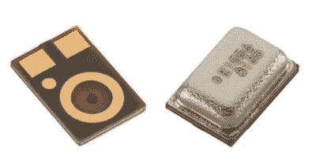

# 语音可控系统上基于激光的音频注入

> 原文：<https://hackaday.com/2019/11/06/laser-based-audio-injection-on-voice-controllable-systems/>

在我们最近看到的一次更酷的黑客攻击中，密歇根大学(University of Michigan)的一群黑客学者研究了以可听音频闪烁激光的能力，看看他们是否可以通过简单地用光照射麦克风来远程操作麦克风。[成绩斐然](https://lightcommands.com)。

虽然大多数黑客都听说过[“The Thing”](https://hackaday.com/2015/12/08/theremins-bug/)——俄罗斯克格勃特工将无线电发射机对准美国大使馆的国玺的一次著名黑客攻击，但我们几乎没有人会想到使用从远处照射进来的激光来攻击 Alexa 或谷歌助手等现代音频设备。以尽职调查的名义，我们在维基百科上查了一下:[‘光声效应’](https://en.wikipedia.org/wiki/Photoacoustic_effect)，确实是真的——1880 年由亚历山大·贝尔首次发现！脉冲光加热麦克风元件，使其随着光束的强度振动。从这样一个系统中获得长距离是望远镜、激光和仔细校准的重要产品，但它是可行的。

深入研究黑客攻击，我们发现易受攻击的实际麦克风是 MEMS 类型的，如 Knowles SPV0842LR5H。这种攻击相对容易防范；制造商只需要安装屏幕来防止光线射到麦克风上。对于已经安装在我们家中的设备，我们建议要么在它们上面放一个纸箱，要么将它们从窗户移开，因为肆无忌惮的邻居或克格勃特工可能会接触到它们。这确实让我们想知道 MEMS 麦克风是否也容易受到无线电波的影响。

就移动电话而言，研究人员能够在 10 米远的地方对着 iPhone XR 说话，这意味着，例如，任何人都有可能手持配备紫外线/红外线的手电筒，在酒吧里近距离侵入我们的手机。应对措施很简单——只需在手机底部的麦克风端口贴上一些黑色电工胶带。或者远离那些危险的酒吧。

 [https://www.youtube.com/embed/ORji7Tz5GiI?version=3&rel=1&showsearch=0&showinfo=1&iv_load_policy=1&fs=1&hl=en-US&autohide=2&wmode=transparent](https://www.youtube.com/embed/ORji7Tz5GiI?version=3&rel=1&showsearch=0&showinfo=1&iv_load_policy=1&fs=1&hl=en-US&autohide=2&wmode=transparent)

 [https://www.youtube.com/embed/ihRAwc24nXw?version=3&rel=1&showsearch=0&showinfo=1&iv_load_policy=1&fs=1&hl=en-US&autohide=2&wmode=transparent](https://www.youtube.com/embed/ihRAwc24nXw?version=3&rel=1&showsearch=0&showinfo=1&iv_load_policy=1&fs=1&hl=en-US&autohide=2&wmode=transparent)

 [https://www.youtube.com/embed/iK2PtdQs77c?version=3&rel=1&showsearch=0&showinfo=1&iv_load_policy=1&fs=1&hl=en-US&autohide=2&wmode=transparent](https://www.youtube.com/embed/iK2PtdQs77c?version=3&rel=1&showsearch=0&showinfo=1&iv_load_policy=1&fs=1&hl=en-US&autohide=2&wmode=transparent)

 [https://www.youtube.com/embed/EtzP-mCwNAs?version=3&rel=1&showsearch=0&showinfo=1&iv_load_policy=1&fs=1&hl=en-US&autohide=2&wmode=transparent](https://www.youtube.com/embed/EtzP-mCwNAs?version=3&rel=1&showsearch=0&showinfo=1&iv_load_policy=1&fs=1&hl=en-US&autohide=2&wmode=transparent)

