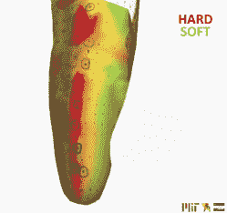

# FitSocket 是更好的假肢的入口

> 原文：<https://hackaday.com/2019/11/11/fitsocket-is-a-portal-to-better-prostheses/>

传统上，假肢的插座是通过制作假肢的石膏模型，然后用碳纤维雕刻而成的。这是一个昂贵而耗时的过程，而本应定制的插座往往会令人失望。虽然修复学家专门设计了这些插座来减轻组织中较硬区域的压力，但这通常会给较软区域带来更多压力，导致疼痛和不适。

 由【Arthur Preton】领导的一个麻省理工团队希望让假肢接受腔更舒适，更好地定制。他们创造了 [FitSocket](https://biomech.media.mit.edu/portfolio_page/socket-fit/) ，一种评估肢体组织硬度的机器。休息之后你可以看到它在运动。

FitSocket 本质上是一个由 14 个致动器组成的环，它们轻轻地刺激肢体，并测试推入组织需要多大的压力。通过在整个肢体上重复这一过程，[Preton]可以创建一个地图，显示组织中不同程度的硬度或柔软度。

我们喜欢看到假肢的进步。这里有一个[电子皮肤](https://hackaday.com/2018/06/24/e-dermis-feeling-at-your-prosthetic-fingertips/)给人造指尖带来感觉。

[https://player.vimeo.com/video/93307423](https://player.vimeo.com/video/93307423)

谢谢你的提示，[亚伦]。