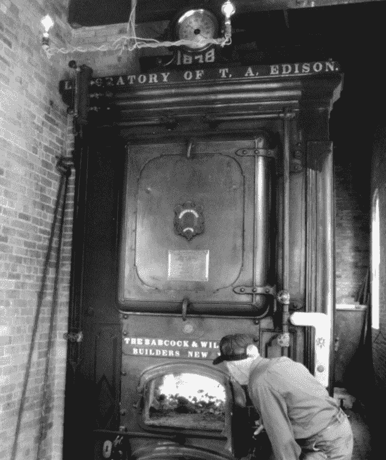

# 铸造艺术

> 原文：<https://hackaday.com/2019/11/27/retrotechtacular-the-art-of-the-foundry/>

提到“重工业”这个词，首先想到的可能是金属铸造。巨大的机器和熔化金属的大锅在起重机和轨道上穿梭，铸造厂的形象就像但丁的*地狱*中的场景，烟雾弥漫在一个巨大的没有人情味的工厂里，火花在空中飞舞。它看起来像一个危险的地方，对灵魂和身体都是如此，因为工人们每天在壁炉和勺子旁无意识地遭受痛苦，消耗在肮脏、疲惫的工作中，即使它消耗了他们。

当然，事情并不总是像表面上那样。虽然在一个铸造厂工作毫无疑问会有风险，比如上世纪中叶 Babcock and Wilcox ltd .的 Renfrew 工厂，正如下面的视频所示，那里的工作一点也不盲目，这个工厂和世界各地类似工厂生产的数百万件产品对今天的技术至关重要。

## 重金属

An Edison-approved B&W boiler, customized for the Menlo Park lab. Source: [Babcock and Wilcox](https://www.babcock.com)

巴布科克和威尔科克斯有限公司，这家公司在下面的公司推广经典中有着迷人的历史。19 世纪中期，当工程师们几乎只制造发动机的时候，他们的朋友斯蒂芬·威尔科克斯和乔治·巴布科克合作制造了一种新的改进的蒸汽锅炉。在正确的时间、正确的地点和正确的设计的情况下，巴布科克&威尔科克斯锅炉被卖给了从水力转换到蒸汽的工厂。托马斯·爱迪生甚至为他在新泽西门洛帕克的“发明工厂”指定了 B&W 锅炉；这位著名的暴躁发明家写了一封信，称赞该公司是“上帝允许人类制造的最好的锅炉。”

到 19 世纪晚期，B&W 在苏格兰的格拉斯哥开设了一个办事处。那时，该公司已进入船用锅炉市场，B&W 锅炉在世纪之交为美国总统泰迪·罗斯福的“大白舰队”提供动力。十年后，Babcock & Wilcox 有限公司成立，在伦敦设有办事处，在苏格兰的 Renfrew 设有铸造厂。这家铸造厂将随着业务的发展而发展，不仅生产成品锅炉，还生产制造锅炉所需的所有零件，并将它们安装到船上或电厂里。

我们在电影中看到的就是这样的配件。铸造的基本过程很简单，在家就可以完成；熔化的苏打罐和包装好的沙模会做得很好。当然，伦弗鲁工厂的经营规模完全不同，生产铸铁零件而不是铸铝。虽然过程很简单，但工艺却一点也不简单。制模者最为突出；凭借细木工的所有木工技能，他们将松木和桃花心木加工成复杂的模型，这些模型是用铸造砂制作模具所需要的。最小的缺陷都会反映在铸造中，因此对木材的加工要特别小心，制模者需要非常聪明才能制作出复杂零件所需的多部分图案。

除了传统的、手动的用于有限运行的特殊零件的上下移动铸造之外，这部电影展示了更多的自动化过程，在这些过程中零件被快速地大规模生产。看着铁水被扔来扔去令人紧张，尤其是知道唯一使用的安全装置是偶尔的香烟。

 [https://www.youtube.com/embed/dqSGTjipFxg?version=3&rel=1&showsearch=0&showinfo=1&iv_load_policy=1&fs=1&hl=en-US&autohide=2&wmode=transparent](https://www.youtube.com/embed/dqSGTjipFxg?version=3&rel=1&showsearch=0&showinfo=1&iv_load_policy=1&fs=1&hl=en-US&autohide=2&wmode=transparent)

看这部电影的时候，我突然想到，从我们的角度来看，铸造厂的技术含量似乎很低，但它们生产的产品却一点也不低。首先，这部电影拍摄于 1953 年，当时世界上第一座商业核电站——英国的考尔德霍尔核电站和世界上第一艘核潜艇“鹦鹉螺号”正在使用 B & W 锅炉建造。为核电站铸造配件和锅炉是尖端的东西，即使它是从沙子和熔化的金属开始的。

第二，该工厂的运营规模意味着物流肯定是不可思议的。考虑规划每一个细节，以便在特定生产线或定制车间的模具中，正确的金属混合在正确的温度下准备就绪。我们只是看到了像 Renfrew 这样的铸造厂的复杂性的一小部分，它在鼎盛时期占地数百英亩。让整个工厂足够高效地运转，从而能够生产出足够高质量的部件，用于核电站，并且在没有计算机和自动化的帮助下做到这一点，这证明了低技术可以达到的高度。

感谢【真理】对这一点的建议。