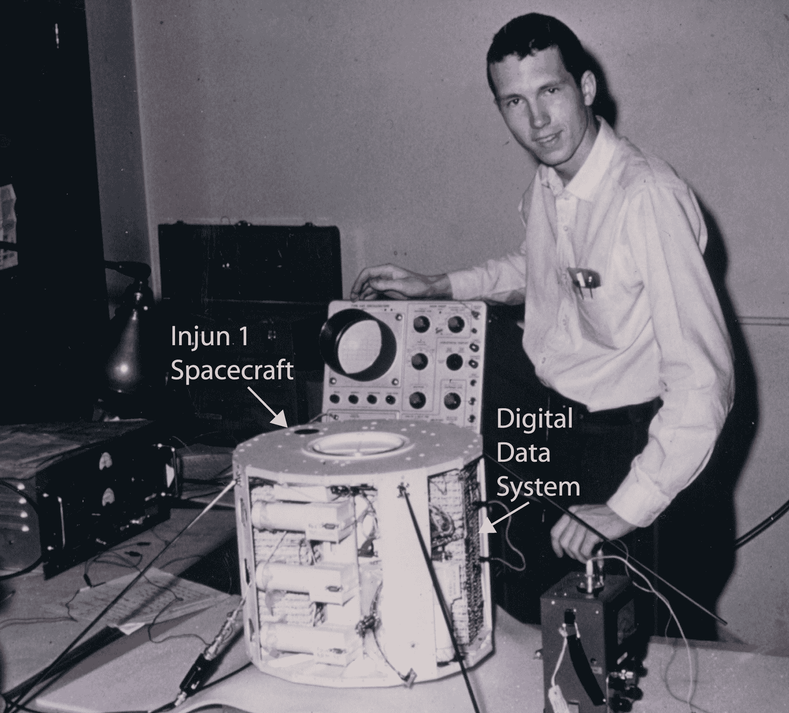
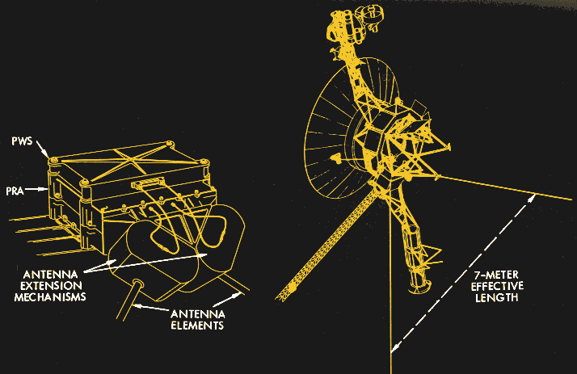
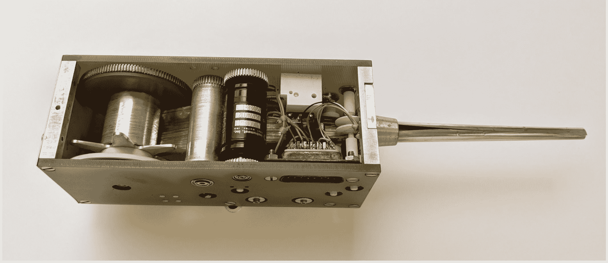
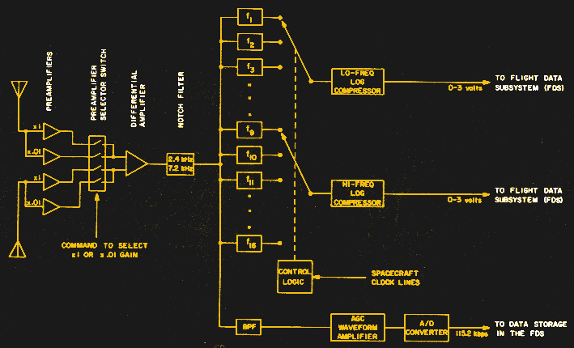
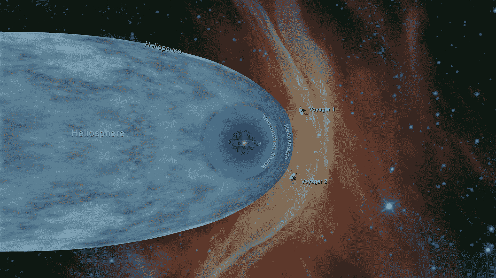

# 这么多年后仍在工作:旅行者等离子体波子系统

> 原文：<https://hackaday.com/2020/12/31/still-working-after-all-these-years-the-voyager-plasma-wave-subsystem/>

美国宇航局总是热衷于强调航天局的许多成功，这是正确的——那些为这些昂贵项目付费的人有权知道他们的钱得到了什么。因此，最近的新闻中散布着[在太阳系边缘](https://www.livescience.com/voyager-finds-electron-burst-at-solar-system-edge.html)发现电子爆发的故事，这是由来自太阳的日冕物质抛射(CME)冲击波反射并加速星际等离子体中的电子引起的。这是一个新颖的机制和令人兴奋的发现，改变了许多关于在太阳影响之外的孤独空间发生什么的假设。

最近的发现本身就令人印象深刻，但当你深入了解它是如何制造的细节时，它更令人惊叹:由 43 岁的旅行者飞船制造，现在距离地球约 17 光时，每个人都携带一个简单有效的仪器，他们在这段时间后仍然工作——并且几乎被遗漏在任务的科学有效载荷之外。

## 能有那样就好了

Don Gurnett in 1961 with one of the University of Iowa’s first satellites, Injun-1\. Source: [U. of Iowa](https://agupubs.onlinelibrary.wiley.com/doi/full/10.1029/2019JA027324%4010.1002/%28ISSN%291944-9208.COMSWSP1).

发现等离子体波子系统(PWS)的仪器至少可以追溯到 1958 年。就在那时，爱荷华大学电气工程专业的大一新生唐纳德·古尔内特加入了詹姆斯·范·艾伦博士的实验室，他最近发现了环绕地球的辐射带，并以他的名字命名。范艾伦和他的团队在美国发射的第一颗卫星“探索者 1 号”上使用了一种特殊的盖革计数器，结果既令人兴奋又令人不安。很明显，地球被高能带电粒子所包围，这是一个真正的新发现，但这也意味着太空旅行很可能是致命的。莫里茨最近发表了一篇关于这个话题的更深入的文章。

需要更多的信息，所以范艾伦让格尼特为未来的卫星开发仪器，以探索地球附近的环境。爱荷华大学的团队提出了创新的数字遥测系统，以取代探索者 1 号和其他早期卫星使用的简单模拟遥测链路。他们还设计了一系列空间无线电和等离子波实验，部分是为了探索自然的极低频(VLF)现象，如哨声和“黎明合唱团”。这些实验于 1962 年搭载在印第安-3 号卫星上，并传回了足够的数据，供 Gurnett 撰写博士论文。

从这些早期实验中吸取的经验教训促进了空间无线电和等离子体波研究这一新兴领域的发展，并为建造更好的仪器提供了信息，这些仪器在 20 世纪 60 年代和 70 年代初执行了多次飞行任务。那时，美国宇航局正处于旅行者任务的规划阶段，旨在利用一种罕见的轨道排列，允许探测器以最小的机动访问先前未探索的太阳系外围。Gurnett 是一组物理学家中的一员，他们提议为 Voyager 进行等离子体波实验，主要是因为他们希望更多地了解环绕木星的强烈辐射带。

该小组为旅行者号进行等离子体波实验的第一个提议被美国宇航局拒绝。这是一个痛苦的失望，但等离子体波社区坚持后，美国航天局包括某种仪器，以探索木星的能量环境。1973 年，随着时间的推移，旅行者号科学有效载荷的设计已经接近尾声，格尼特提出了一个等离子波实验的折中方案。该仪器实际上将搭载一个已经被接受的实验:行星射电天文学(PRA)实验。它将共享为 PRA 制造的“兔耳”天线，一个紧凑的频谱分析仪连接到装有 PRA 接收器的外壳上。主要是基于 Gurnett 的提议，加上等离子体波实验将只使用旅行者号有限的 1.6 瓦功率，并且只增加 1.4 公斤的质量，NASA 接受了这一提议。此后不久，完全由爱荷华大学建造的等离子体波子系统正在飞往外行星及更远的地方。

## 设计简单

PRA/PWS package and the shared antenna system. Source: [“A Plasma Wave Investigation for the Voyager Mission”, F.L. Scarf and D. A. Gurnett](http://www-pw.physics.uiowa.edu/plasma-wave/voyager/ssr/PWSINST.HTM).

PWS 的设计如此简单可能是它成功的关键，也是它在发射近 50 年后仍在两艘航海家号上运行的原因。这些天线是为 PRA 实验设计的，但足以测量等离子体波的电场(被拒绝的原始提案包括一个磁力计，以便研究等离子体波的磁分量)。展开时，天线的每个元件都有 10 米长，相隔 90 度。在 PRA 实验中，天线就像一对单极天线，但是在 PWS 实验中，它们就像一个平衡的偶极天线。

在太空中储存和部署 10 米长的天线元件需要一些巧妙的思考。PRA/PWS 天线基本上使用了与 IMP-6 相同的技术，IMP-6 是 70 年代早期的一颗卫星，它需要长达 45 米的天线。可储存的管状可伸展构件天线，或称杆，用于 IMP-6 和大大缩短的旅行者号。它由卷在卷轴上的铍铜片、驱动电机和成型模具组成。铜片在卷成平卷在卷轴上之前已经形成管，并且当延伸通过模具时，迅速恢复成刚性管。

The STEM antenna from IMP-6, similar to the antenna mechanism used on Voyager. Source: [U. of Iowa](https://agupubs.onlinelibrary.wiley.com/doi/full/10.1029/2019JA027324%4010.1002/%28ISSN%291944-9208.COMSWSP1).

PWS 仪器的设计也很简单。每个天线都连接到一个前置放大器，带有一个可选的 40 dB 衰减器，以防止强烈的木星辐射淹没电子设备。每个前置放大器的输出馈入差分放大器，其输出与两个天线之间的电压差成比例。该信号通过陷波滤波器去除 Voyager 2.4 kHz 开关电源的噪声，然后馈入覆盖 10 Hz 至 56.2 kHz 的 16 通道频谱分析仪。频谱分析仪中的 16 个滤波器产生 0 到 3 伏的输出信号，这些信号被发送到航天器的飞行数据子系统进行编码。

PWS block diagram. Source: [“A Plasma Wave Investigation for the Voyager Mission”, F.L. Scarf and D. A. Gurnett](http://www-pw.physics.uiowa.edu/plasma-wave/voyager/ssr/PWSINST.HTM).

## 漫长的黑暗

在经过火星轨道和小行星带的漫长旅程后，PWS 号终于有机会证明自己。在高速飞越每个气体巨星的过程中，为了给下一个航路点提供引力辅助，PWS 每四秒钟对所有 16 个频道进行一次完整的扫描。由此产生的数据被存储在数据磁带记录器(T1)或 DTR 上，等待传回地球。

一旦旅行者双胞胎在 1989 年完成了他们的外行星调查，旅行者星际任务就开始了。两个航天器现在撞击的孤独的黑色空间的探索计划已经进行了相当长一段时间，很明显，PWS 将在未来的任何发现中发挥重要作用。复杂且耗电的旋光仪、光谱仪和成像系统主要用于在行星相遇期间收集数据，它们基本上都被关闭了，为更简单的粒子探测器和磁力计以及 PWS 留下了更多的电力，以继续探索太空深处。

The Sun’s heliopause and the current position of the two Voyagers. Source: [NASA/JPL-Caltech](https://commons.wikimedia.org/wiki/File:PIA22835-VoyagerProgram%26Heliosphere-Chart-20181210.png), Public domain, via Wikimedia Commons

两艘旅行者号最终都通过了边界，从太阳或太阳风中流出的热带电粒子被星际介质中较冷的等离子体推回。PWS 的数据记录了穿过太阳系边缘稀薄等离子体各层的过渡，以及每个航天器穿过日光层进入星际空间的过程，其标志是等离子体密度增加了 40 倍。PWS 也是最近电子爆发发现的关键。

等离子体波子系统在最后一刻被包括在旅行者号任务中，在过去的 43 年中表现令人钦佩，并为我们提供了太阳系边缘的详细图片。最终，现在很快，旅行者双胞胎放射性同位素热发生器中的钚将衰变到没有足够的能量来保持一切运转的地步，但如果运气好的话，等离子体波子系统将是最后一批进入漫长星际睡眠的仪器之一。