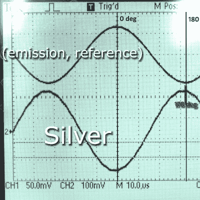

# 渐进还是鞭打？金属检测机如何识别

> 原文：<https://hackaday.com/2019/11/26/progressive-or-thrash-how-metal-detectors-discriminate/>

金属探测是一种有趣的消遣，即使你能找到的只是一点平静和一大堆流行标签。[惠更斯光学]有一个基于甚低频的金属探测器，它提供的反馈远不止嘟嘟声或没有嘟嘟声。这个东西足够奇特，可以区分不同类型的金属，并从相应的电导率范围报告一个数字 ID 值。

 大多数流行标签的 ID 都是 76 或 77，所以【惠更斯光学】开始忽略这些，直到有一天他发现了一个白金结婚戒指，没有看 ID 读数。原来，这枚戒指属于一次性物品。现在探测器的 ID 系统彻底引起了他的兴趣，[【惠更斯光学】建立了一个带有示波器的测试平台，亲自观察这个东西如何区分不同的金属](https://www.youtube.com/watch?v=EcuTsifSgBs)。他的宝贵和全面的视频走查是隐藏在休息后。

甚低频(VLF)探测器使用两个线圈，一个用于发射，一个用于接收。它们的重叠程度刚好让接收线圈看不到发射线圈的磁场。这释放了接收线圈的磁场，仅被第三方金属，即地下隐藏的宝藏中断。

一旦[惠更斯光学]确定了哪个线圈是哪个，他就开始让金属物体经过接收线圈附近，看看在“观测仪”上发生了什么。根据材料类型和物体的大小和形状，它产生的波形显示出与发射线圈波形的相位偏移。这相当直接地转化为 ID 读数——相移值越高，ID 值就越高。

这些年来，我们已经买了各种尺寸的 DIY 金属探测器，但是这个才是最时髦的。

 [https://www.youtube.com/embed/EcuTsifSgBs?version=3&rel=1&showsearch=0&showinfo=1&iv_load_policy=1&fs=1&hl=en-US&autohide=2&wmode=transparent](https://www.youtube.com/embed/EcuTsifSgBs?version=3&rel=1&showsearch=0&showinfo=1&iv_load_policy=1&fs=1&hl=en-US&autohide=2&wmode=transparent)

