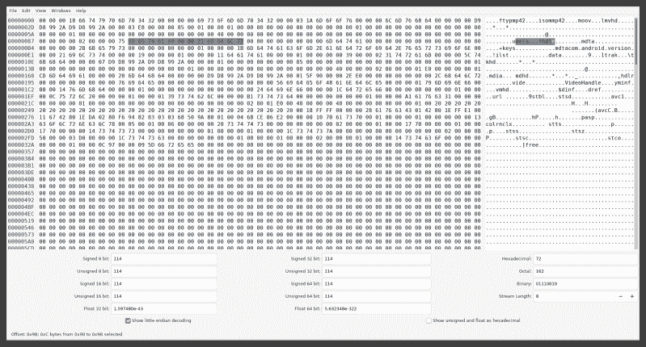
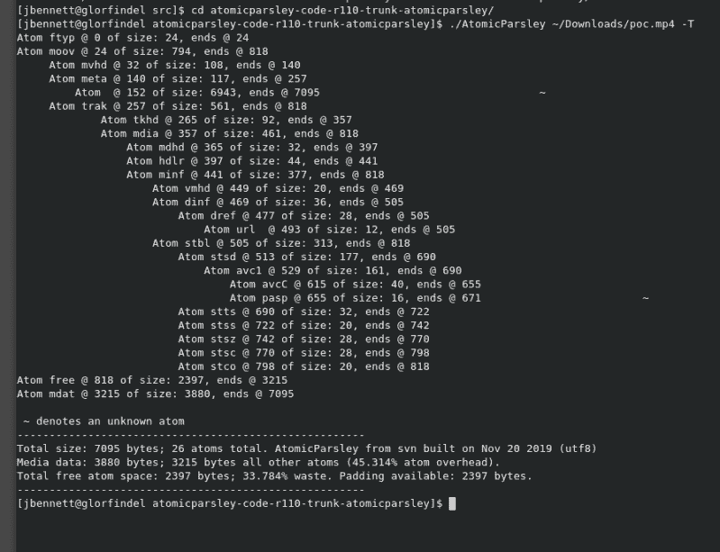

# 本周在安全方面:更多的 WhatsApp，Nextcry，Hover To Crash，Android 权限旁路

> 原文：<https://hackaday.com/2019/11/22/this-week-in-security-more-whatsapp-nextcry-hover-to-crash-and-android-permissions-bypass/>

还有一个 WhatsApp 的漏洞，但这次不是恶意的 gif，而是恶意的 mp4 文件。脸书于上周晚些时候公布了这个漏洞。已经发布了一个更新，所以首先要确保 WhatsApp 已经更新。脸书的建议在细节上有点轻描淡写，只是说“基于堆栈的缓冲区溢出”可能是“解析 mp4 文件的基本流元数据”的结果。

在这个 bug 公布后不久，[一个 GitHub 库](https://github.com/kasif-dekel/whatsapp-rce-patched)弹出来，里面有一个声称是 CVE-2019-11931 的概念证明 mp4 文件。([感谢 Reddit 上【justtransit】的链接。](https://www.reddit.com/r/netsec/comments/dxcyjd/whatsapp_bug_cve201911931/f7pc300?utm_source=share&utm_medium=web2x))我不能轻易测试 PoC 文件，但我们可以看一看它，看看有什么漏洞。我们需要什么工具来看看？十六进制编辑器是一个好的开始。我之所以使用`GHex`，仅仅是因为它在 Fedora 上可用且易于安装。

See the problem? Neither did I, at first.

我们需要的另一个工具是一些关于如何格式化 mp4 格式的文档。Mp4 有着传奇的历史，起源于苹果的 QuickTime 电影格式。苹果的开发者文档对学习 mp4 很有帮助。我还引用了一个[不知名的存档 geocities 网站](http://xhelmboyx.tripod.com/formats/mp4-layout.txt)来回答一个在苹果页面上不清楚的具体问题。

那么 PoC mp4 文件中发生了什么呢？mp4 文件是包含二进制值和 UTF 文本的二进制格式。它通常采用包含字段大小的四字节无符号整数、包含人类可读标签的四字节 UTF 字段以及最后的二进制数据的格式。这些大小/标签/数据集被称为原子。一些原子还包含额外的头信息，比如为标志和版本信息保留的字节。原子字段之一是`meta`字段，用于携带元数据信息。这个原子被定义为包含至少三个子原子，`hdlr`、`keys`和`ilist`。乍一看，PoC 文件似乎具有有效的元原子。我假设 WhatsApp 的解析器被愚弄了，就像我第一次浏览文件时被愚弄一样。

在寻找 mp4 原子的数据时，我发现了一个有用的工具， [AtomicParsley](https://sourceforge.net/projects/atomicparsley/) 。它有点旧了，需要对源代码进行一些修改才能编译。这种努力是值得的，因为在 PoC 文件上运行 AtomicParsley 可以立即发现攻击。你现在明白问题了吗？`meta`原子总共只有 117 字节，但它包含了一个将近 7000 字节长的未命名原子。那个未命名的原子实际上是文件的其余部分。这是怎么回事，为什么在十六进制编辑器中查看文件时不明显？

看起来我们有一个包含一个原子的原子。这是有意义的，一个四字节长度后跟`meta`标签，然后是一个四字节长度和`hdlr`标签。不明显的是`meta`原子被定义为具有额外的头信息。我找到的关于 mp4 格式的信息表明，在`meta`字符串之后，文件应该包含四个空字节，为版本号和三个标志字节保留。这使得对`meta`原子的解析失去了四个字节的同步，看似是另一个标签的内容实际上被解释为字段长度。这个原子的长度不是 33 字节，而是 1.6 GB。这显然比文件本身要大，这就是为什么 AtomicParsley 认为该原子只有 7095 字节长。

该漏洞公告称该漏洞为基于堆栈的缓冲区溢出[。这些通常是由于向堆栈变量中写入过多数据而触发的。让我们推测一下这个漏洞可能是什么样子的。一个负责解析 mp4 文件头的函数声明了一个存储在堆栈上的 char 数组，所以没有使用`malloc`。该数组要么被设置为作者认为“足够长”的长度，要么甚至可以使用可变长度数组。无论哪种方式，数据都在堆栈上。在将数据复制到适当的缓冲区之前，这个解析器可能会对 mp4 文件进行健全性检查。这种健全性检查可能只是信任所述的`meta`原子的长度，或者它可能被几乎正确格式化的文件所欺骗。无论哪种方式，当数据被复制过来时，丢失的四个字节导致文件的其余部分被复制到堆栈数组中，而该数组实际上并不足以容纳它。数据被复制到堆栈上的任何地方，覆盖返回地址并跳转到攻击者想要的任何地方执行程序。](https://en.wikipedia.org/wiki/Stack_buffer_overflow)

一旦 copy 命令到达文件的末尾，它可能会引发一个错误，并试图从当前函数返回。由于攻击者控制返回地址并可以写入堆栈，返回调用可以直接跳转到攻击者的代码中。

不清楚这个问题是由将 PoC 上传到 GitHub 的研究人员[Kasif Dekel]发现并披露的，还是被积极用于攻击。编辑:这一点我已经得到了确认。[Kasif Dekel]、[Ronen Shustin]和[Kobi Hazak]都在积极研究这个漏洞，但在他们完成研究并披露漏洞之前，WhatsApp 独立发现并修补了它。关于这个问题的最初报道来自印度。如果你们中的任何人有任何关于这个漏洞是否已经在野外使用的其他信息，特别是关于如何获得恶意 mp4 的活样本的信息，[请让我知道它](https://twitter.com/jp_bennett)！

### Nextcloud 上的 Nextcry 勒索软件

还记得本月早些时候我们讨论的 NGINX 问题吗？似乎多个 Nextcloud 安装容易受到该攻击，并且针对它们的勒索软件攻击正在积极进行。 [Nextcry](https://www.bleepingcomputer.com/news/security/new-nextcry-ransomware-encrypts-data-on-nextcloud-linux-servers/) 对存储在 Nextcloud 实例上的文件进行加密，解密需要价值 200 多美元的比特币。提醒一下，这不是 Nextcloud 本身的缺陷，但在 NGINX 服务器上遵循官方的 Nextcloud 文档会导致系统易受攻击。

### 鼠标移至崩溃

本月，Windows 8.1 和 10 修复了一个特别严重的问题。当鼠标悬停在资源管理器中的文件上时，发现一个 PE(可移植可执行文件)`dll` [会使 Windows 内核](https://bugs.chromium.org/p/project-zero/issues/detail?id=1911)崩溃。这个 bug 有可能被用来读取受保护的内存，但是这个问题的严重性在于一旦文件被下载就很难清除。试图删除恶意文件也会触发内核崩溃。Tetrane 的人利用这个 bug 作为展示他们工具的机会，然后[深入](https://blog.tetrane.com/2019/11/12/pe-parser-crash.html)这个问题和微软的修复。

### Android 摄像头漏洞

Android 使用活动和意图来启动应用程序，一个应用程序可以发送一个意图来启动另一个应用程序的活动。这项功能在很多情况下都很有用，但可能会产生意想不到的后果，比如[一个应用程序可以请求相机应用程序拍照或录像](https://arstechnica.com/information-technology/2019/11/google-samsung-fix-android-spying-flaw-other-makers-may-still-be-vulnerable/)。

想象一下，你下载了一个应用程序，请求访问你的文件存储。这使得应用程序可以访问你所有的图像、视频等。如果你愿意冒这个风险，上面链接的问题允许恶意应用程序拍摄照片和视频，然后访问这些文件。这不是一个特别微妙的攻击:该设备显然会启动相机应用程序，并在拍照时发出正常的快门声。Checkmarx 的研究人员发现了这个问题，他们认为聪明的攻击者会等到接近传感器被激活。在这种状态下录制视频可能会捕捉到正在进行的通话的音频，用户也更难注意到，因为大多数手机在接近传感器检测到附近的人脸时都会关闭屏幕。

ArsTechnica 文章包括一个 ADB 命令，您可以运行该命令来测试您的设备是否已经被修复。目前还不清楚有多少设备收到了更新，很可能一些旧设备永远不会收到更新。

### 迪士尼加和账户盗窃

迪士尼发布了他们新的流媒体服务 Disney+。大量账户几乎在第一时间被泄露并出售，这也许并不奇怪。许多迪士尼+账户预付了两三年的费用，这使它们成为诱人的目标。

迪士尼表示，他们实际上并没有遭到破坏。很有可能账户是通过几种不同方法中的一种被侵入的。密码重用是最简单的。另一种可能性是网络钓鱼和指向虚假登录页面的广告。或者可能是用户登录到一台已经受损的机器上，获取了他们的凭据。无论如何，Disney+的推出有点艰难，很大程度上可能是因为注册人数超过了预期。

### CP 逃生坞站

Docker 已经证明了它作为一种隔离服务器上进程的方法的价值。有一个面向公众的服务，你担心会受到损害？把它扔进 Docker 容器中，即使它被破坏了，操作系统也是安全的…理论上。[周二宣布，CVE-2019-14271](https://unit42.paloaltonetworks.com/docker-patched-the-most-severe-copy-vulnerability-to-date-with-cve-2019-14271/) 允许攻击者捕获 Docker 映像，并从容器逃入裸机操作系统。

该漏洞的核心概念围绕着在`chroot`环境中运行的管理命令。快速刷新，`chroot`是一个 Unix 命令，用于更改运行命令的有效根文件夹。在许多方面，`chroot`是现代码头工人式集装箱化的先驱之一。需要修复一个不引导的 Linux 系统？`Chroot`允许您设置一个环境，在这个环境中，您可以在一台工作机器上运行命令，但是使用目标根文件系统。

`docker cp`命令使用`chroot`在给定的 docker 容器中运行辅助二进制文件。当二进制文件加载共享的`libnss`库时，问题就出现了。它已经在一个`chroot`中运行，所以它从 docker 容器中加载库！攻击者可以简单地用恶意版本替换容器的`libnss`库，下一次使用`docker cp`从容器中复制文件时，攻击者的代码就会以 root 用户身份在容器外运行。Docker 19.03.1 解决了这个问题，所以请确保您是最新的！