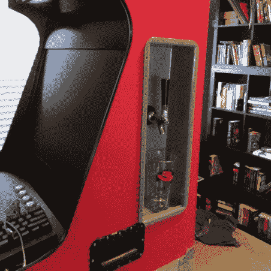
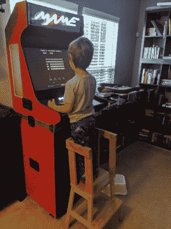

# Barcaderator 是顶部的投币游戏室，下面是 Kegerator

> 原文：<https://hackaday.com/2019/11/25/barcaderator-is-coin-op-arcade-up-top-and-kegerator-down-below/>

在我们的社区里，一个寿命到期的街机柜被改造成一个 MAME 柜，配有最新的屏幕和其他内部部件，这是一个常见的景象。我们中的许多人在某个地方的黑客空间中追求高分时获得了一些乐趣，即使他们没有屏幕烧伤和对原版现金的恼人需求，他们仍然提供了许多乐趣。

但是，如果有一种成年人可以追求的乐趣，而在 20 世纪 80 年代的街机上的孩子却不能，那就是一杯冰啤酒。[Marcus Young]用他的 Barcaderator 将两者结合在一起，[一个定制的 MAME 橱柜，侧面有啤酒龙头](https://marcyoung.us/post/barcade/)，底部有一个小桶冰箱。

  Beer tap built in!  Split cabinet detail

MAME 内部包括一个 Lattepanda Alpha 和一个用于这些发光按钮的 LED 控制器。这个建筑的亮点在于它的定制橱柜，它不是一个一体化的单元，而是采用了可拆卸的底座和上半部分的形式。它似乎从飞行案例的世界中获得灵感和建造技术。在这张图片中，你可以看到两部分结合的细节。这个结果应该会让那些努力移动笨重的传统拱廊橱柜的人感兴趣。

这是我们认为第一个啤酒/街机组合来美化这些页面。但是我们已经有了不止一个街机柜，当然还有不少 T2 酒桶。