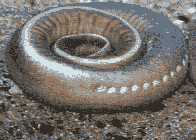
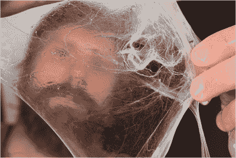
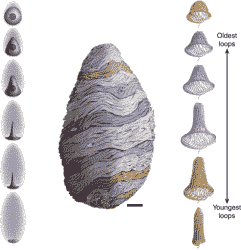

# 奇怪的物质:盲鳗粘液

> 原文：<https://hackaday.com/2019/12/10/weird-substances-hagfish-slime/>

在世界各地寒冷黑暗的海底深处，盲鳗像海蛇一样四处爬行，寻找食物。当盲鳗找到合适的尸体时，它会以两种不同的方式吞食死鱼。当它脸朝前在组织中打洞，用它无颚、有触须的嘴进食时，八目鳗也通过皮肤吸收营养。

黑鱼不是向海洋中倾倒有毒废物的邪恶结果。它们是地球上最古老的生物之一，已经存在了 3 亿多年。它们是如何持续这么久的？

A coiled hagfish reveals its slime ports. Image via [Oregon Coast Aquarium](https://aquarium.org/tag/hagfish/)

这些古老的生物没有眼睛，没有脊椎，也没有鳞片。它们经常被误认为是鳗鱼，也经常被称为“粘液鳗鱼”，但它们确实是鱼。它们只是看起来不像传统的鱼。事实上，当传统的鳃盖鱼追赶八目鱼时，这些家伙会大吃一惊，因为八目鱼有一个令人恶心但巧妙的防御机制。

每当八目鱼受到攻击，甚至只是受到附近鱼类或好奇贪婪的人类的压力，它们就会立即以惊人的速度释放出惊人数量的粘液。与此同时，盲鳗射出丝般的蛋白质，将黏液聚集成一团。任何试图咬下深海中这种柔软的法兰克福香肠的捕食者都会发现它的嘴和腮上覆盖着一团令人窒息的粘液。

为什么盲鳗没有把自己变得不存在？每当他们尝到自己的药，这些无骨面条很快就会把自己扭曲成椒盐卷饼。在同样的动作中，它们用桨状的尾巴刮掉黏液。

## 柔滑、可持续的黏液

关于盲鳗粘液最有趣的事情之一是它的成分。盲鳗粘液的结构[是 99.996%的水](https://jeb.biologists.org/content/208/24/4613)，它有一些有趣的属性，可能导致不同种类的可持续资源。但这只是在科学家能够复制它的情况下。盲鳗实际上不能人工养殖，因为它们不在笼子里繁殖。人们对它们的繁殖习性知之甚少。

Researcher Tim Winegard displays a network of hagfish threads. Image via [PNAS](https://www.pnas.org/content/113/26/7005)

盲鳗粘液由两种不同的蛋白质组成。一种是粘蛋白，它的作用很像人体用来淹没抗体和酶中的细菌和病毒入侵者的粘液。

另一种蛋白质是细丝的形式，比人的头发细 100 倍。这些结实而有弹性的线很像蜘蛛丝。一旦八目鳗释放出这些物质，粘蛋白就会吸收水分，蛋白质线就会相互缠绕在一起，形成一种柔软有弹性的粘液。

研究人员认为，这些线可能会取代尼龙和其他合成材料等化石燃料产品。这种线的强度是尼龙的十倍，因此它们有可能被用于防弹背心和其他防护设备。

这些细丝如此之细，以至于它们使盲鳗粘液成为人类已知的最柔软的材料之一。你最舒适的 t 恤衫上什么也没有，是用盲鳗线做的。哈格菲什的运动服会更上一层楼。

因为盲鳗粘液吸收水分的速度如此之快，如此之渴，一些科学家认为它可以用于制造超级水凝胶，从一次性尿布到组织工程。我们喜欢想象汽车装有八目鱼粘液气囊，或者用大袋脱水八目鱼粘液来吸收洪水。你觉得这东西还能用来做什么？

## Hagfish 中的线程管理

在任何时候，一条盲鳗体内都有大约 20，000 公里长的纤维，随时待命。这个令人难以置信的组织壮举需要一个非常惊人的存储方法。每根线生长在自己的细胞内，称为腺线细胞。它开始生命时是一束野生的、摇摆不定的细丝，夹在细胞的上壁和占据细胞大部分的大细胞核之间。随着线的成熟和变长，它在细胞核周围形成整齐的垂直环。

How the hagfish keeps its threads organized. Image via [Nature](https://www.nature.com/articles/ncomms4534)

随着时间的推移，细胞核收缩并伸展成一个尖峰，位于细胞的一端，像纺锤一样。随着细胞核变长，垂直的线环也变长。一根成熟的细丝大约有 6 英寸(15 厘米)长，但是它被装在一个只有 1/10 毫米长的细胞里。所有这些适应使细胞能够将 15-20 层线组织成一个单独的未缠结的束，准备好跃出并展开到粘液中。

对于一种古老的生物来说，盲鳗表现出了令人难以置信的生物精确性。在韩国，它们被当作美味佳肴食用，自二战以来，它们柔软的外皮被用来制作手袋和钱包。在其他地方，他们基本上被忽视了。截至 2011 年，不同的盲鳗物种正面临不同程度的濒危。希望在我们发现它们的秘密之前，它们不会完全从我们手中溜走。