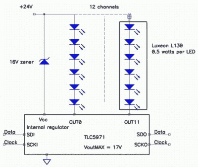

# 迈克·哈里森对发光二极管了如指掌

> 原文：<https://hackaday.com/2019/11/25/mike-harrison-knows-everything-about-leds/>

驱动 LED 并使其闪烁可能是大多数人在学习微处理器控制硬件时尝试的第一个项目。Arduino 和类似的电路板安装了一个 LED，打开和关闭它是一个简单的代码介绍。因此，公平地说，我们中的许多人会认为我们在驱动 LED 方面有相当好的处理；通过一个电阻将其连接到一个 I/O 引脚，就这样。如果这是对你的描述，那么[迈克·哈里森在最近的黑客日超级大会上的演讲](https://www.youtube.com/watch?v=5SQt1f4PsRU)(嵌入下面)将是一次教育。

Mike 多次出现在这些页面上，因为他将 led 和 PCB 技术推向了极限，甚至设计了我们的 2017 年超级大会徽章，他在专业 LED 装置高层的多年工作使他拥有无与伦比的专业知识。他为机场、博物馆和城市建造了巨大的艺术项目。一个被宣传为涵盖了他所了解的关于 led 的一切的演讲将会是一个特别的演讲。

如果说演讲中有什么令人惊讶的地方，那就是他对 led 本身谈得很少。相反，我们需要了解如何驱动大量 led 的基础知识，如何高效地驱动，具有良好的亮度和色彩分辨率，并且不会落入设计陷阱。很明显，他的一些建议，如依靠 DIP 开关而不是软件来配置多部分安装，已经得到了惨痛的教训。

Multiple LEDs at once from your driver chip, using a higher voltage.

我们通过一些背景知识来了解人类视力的感知强度和伽马校正。这很好地引出了分辨率问题，为了使亮度过渡看起来平滑，至少需要 12 位，为了实现这一点，他从自己的微控制器和驱动技巧库中获取了如何以正确的比特率产生 PWM 的信息。他最喜欢的驱动芯片是德州 TLC 5971 T1，所以我们对它的操作有了初步了解。一个有用的技巧是在追求亮度时使用多个较小的 led 而不是单个大的 led，他向我们展示了他如何仅使用 TI 芯片从更高的电压驱动串联的 led 链。

鉴于演讲的内容，这应该不会令人感到震惊，但在结束时，他提醒我们，他没有使用 WS2932 或 APA102 等一体式可寻址 led。这些是许多项目的主要部分，但正如他指出的那样，它们是为玩具类应用设计的，缺乏数千个 LED 安装所需的可靠性。

会议演讲有多种形式，听起来总是很有趣，但很少看到一个从经验的角度涵盖如此广泛的话题。他应该把它写进书里，我们会买的！

 [https://www.youtube.com/embed/5SQt1f4PsRU?version=3&rel=1&showsearch=0&showinfo=1&iv_load_policy=1&fs=1&hl=en-US&autohide=2&wmode=transparent](https://www.youtube.com/embed/5SQt1f4PsRU?version=3&rel=1&showsearch=0&showinfo=1&iv_load_policy=1&fs=1&hl=en-US&autohide=2&wmode=transparent)

