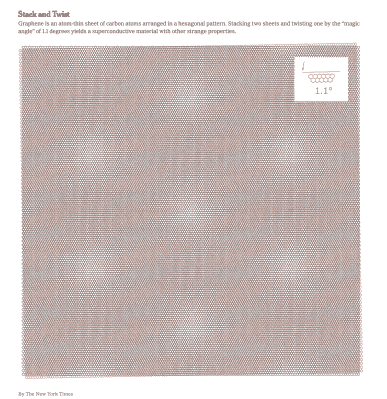

# 魔角扭曲双层石墨烯——是的，这是学名

> 原文：<https://hackaday.com/2019/12/27/magic-angle-twisted-bilayer-graphene-yes-thats-the-scientific-name/>

在物理研究领域，石墨烯在过去 15 年中作为最引人注目的材料之一越来越受欢迎。虽然它在铅笔芯等普通家居用品中看起来不起眼，但这种材料拥有比钢更高的强度和比纸更高的弹性。最重要的是，它还超轻，是电流和热量的良好导体。

最近，来自麻省理工学院的物理学家发现，堆叠两片石墨烯并在它们之间扭曲一个小角度，揭示了材料科学的一个全新领域——扭曲电子学。在[发表在*《自然》*，](https://www.nature.com/articles/s41586-019-1695-0)的一篇论文中，研究人员研究了这种被称为魔角扭曲双层石墨烯的新材料。通过改变石墨烯的温度，他们能够使这种材料从绝缘体转变为超导体。

《纽约时报》*中的一张[图片展示了堆叠和扭曲两张纸所产生的一些有趣特性。科学家们很早就知道石墨烯是一层厚的碳原子蜂窝状图案，但实际上分离一片石墨烯相当困难。曼彻斯特大学的两位物理学家首创了一种低技术方法，使用胶带将石墨烯层拉开，直到只剩下一层。](https://www.nytimes.com/2019/10/30/science/graphene-physics-superconductor.html)*

 *

由稍微错位的薄片引起的小瑕疵表现为一种图案，这种图案允许电子在晶格对齐的区域的原子之间跳跃，但不能在错位的区域流动。因此，移动较慢的电子更有可能相互作用，变得“强相关”。

测量这种新的扭曲石墨烯特性的技术同样也是低技术含量的。在单层石墨烯被胶带分开后，胶带被撕成两半，露出完全对齐的晶格的两半。其中一面旋转约 1.3 度并压在另一面上。有时，这些层会迅速恢复对齐，但其他时候它们会在 1.1 度处停止旋转。

当这些层冷却到绝对零度以上几分之一度时，观察到它们变成了超导体，这对参与实验的物理学家来说是一个令人难以置信的发现。进一步的研究表明，温度、磁场和电子密度的不同排列也能够将石墨烯转变为超导体。除此之外，石墨烯还能够表现出一种源于电子运动的磁性，而不是原子的固有属性。有如此多的可能性尚未探索，可以肯定的是 twistronics 将很快揭示一些非凡的发现。

【谢谢 Adrian 的提示！]*