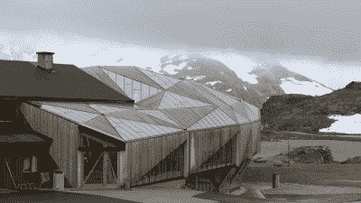

# 先进的木结构建筑赋予木结构建筑新的生命

> 原文：<https://hackaday.com/2020/01/25/advanced-timber-architecture-gives-new-life-to-wooden-structures/>

当谈到建筑材料时，木材并不总是作为一堆材料中最强的而吸引最多的注意力。这一荣誉通常属于混凝土和钢——嵌入混凝土的钢为高层建筑提供支撑和基础，而混凝土增加抗拉强度，并可以在钢筋的帮助下形成各种形状。另一方面，木材会腐烂，容易受潮和着火。

多亏了先进木材的发展，现在情况不一定是这样了。像集成材这样的新材料，或者用防潮结构粘合剂粘合的木材片，可以用比钢铁少两到三倍的能源生产，使它们成为其他建筑材料的环保替代品。诚然，这需要梁在其寿命结束时被烧掉，但与钢相比，集成材仍然具有同等或更好的环境特征，更不用说更低的成本了。

在工程木材中，有一些在爱好者中更常用的品种，例如中密度纤维板、胶合板或刨花板。其他的，像交叉层压木材(CLT)在建筑材料中更常见。虽然 CLT 的建筑已经存在了几十年，但最近像斯德哥尔摩和温哥华这样的大城市已经出现了木结构建筑的复兴。由于木材理论上可以在其整个生命周期中储存碳，每立方米云杉可以储存 0.8 吨碳，一些建筑公司如 [Oslotre](https://www.oslotre.no/about/) 正在建造碳足迹为负的房屋。

像“人行道实验室”和“T2”这样的项目提议用高级木材建造整个街区和摩天大楼。与以灰色混凝土、闪亮金属和玻璃为特征的国际风格建筑相比，这一运动可能是回归自然建筑形式的一步。鉴于城市中绿色空间的[减压效果](https://www.bbc.com/future/article/20170605-the-psychology-behind-your-citys-design)，工程木建筑可以在现代建筑风格和自然林地之间架起一座桥梁。