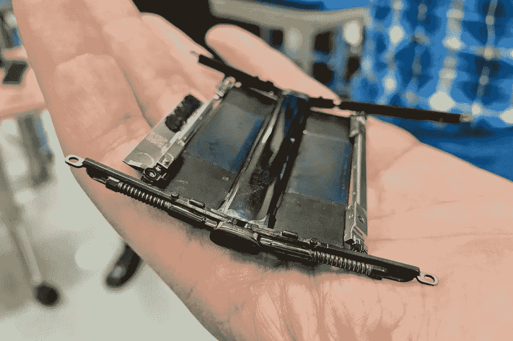

# 翻盖手机正在卷土重来

> 原文：<https://hackaday.com/2019/12/31/flip-phones-are-making-a-comeback/>

如果你是那种讨厌新一代智能手机用户并渴望怀旧的人，那么你离许多商业手机制造商的新目标人群不远了。摩托罗拉和华为等主要手机公司一直在开发传统智能手机设计的可折叠版本，旨在实现更多功能，同时保持与灵活性较差的同类产品相同的功能。

这当然是噱头，但从工程角度来看，像三星 Galaxy Fold、[摩托罗拉 Razr](https://www.fastcompany.com/90428956/motorolas-wild-new-razr-is-basically-an-iphone-that-folds-in-half) 和华为 MateX 这样的手机是优雅的。开发无缝的界面体验，最大化功能表面积，并在利用熟悉的智能手机功能的同时保持相同的怀旧翻盖手机美学，这不是一个简单的设计过程。

Motorola RAZR hinge [shown by CNET’s Patrick Holland](https://www.cnet.com/news/motorolas-razr-2019-folds-in-half-without-crease-the-secret-is-in-the-hinge-design/) during a tour of their labs.

对于 Razr，铰链系统占据了手机内部空间的三分之一，这使得有机发光二极管显示屏没有明显的粘合线。它不是像一张纸一样弯曲，而是形成一个泪珠形状，防止屏幕起皱和被损坏。表面下的弹簧和活塞移动用户将要敲击的下方的小地方——折叠，板滑开。这是一个有趣的效果，虽然你可以在横幅图像中看到，它并没有完全实现视觉上的完美。

为了确保屏幕弯曲时不会过热，它由夹在一起的微层组成。为了平衡重量，电路和电池被分成两半，在设备的每一半上运行，这对智能手机来说是一种不同寻常的设计选择。无线电和天线阵列的放置也是一个挑战，因为它们彼此之间或与处理器之间不能太近，否则会干扰信号传输。

像 Royale Flexpai 这样的其他设备更多的是利用柔性屏幕和电池的概念验证，而不是捕捉翻盖手机一代的美学——但是谁不想他们的智能手机在需要时展开成平板电脑呢？智能手机技术的未来看起来很有趣，我们肯定会在不久的将来看到更多的柔性显示屏。