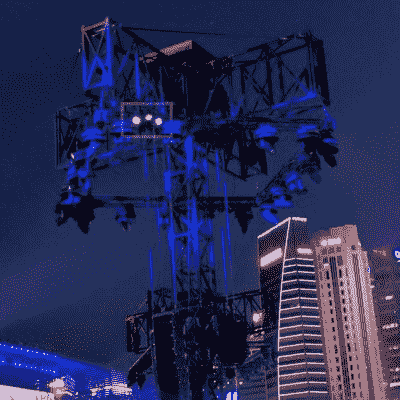

# PixMob LED 腕带拆卸(以及红外发射器和如何发现它们)

> 原文：<https://hackaday.com/2019/11/26/pixmob-led-wristband-teardown-plus-ir-emitters-and-how-to-spot-them/>

PixMob 设备是可穿戴的 LED 设备，用于音乐会等活动的人群。这些设备允许在人群中同步 LED 效果。[yeokm1] [对 2019 年新加坡国庆游行(NDP)预演中获得的一台设备进行了拆解](http://yeokhengmeng.com/2019/08/teardown-of-ndp2019-led-wristband/)，并在此过程中了解了这些设备及其基础设施。

Suspected IR emitter for the PixMob units, mounted on a lighting tower (marked here in white).

众所周知，PixMob 硬件会随着时间的推移而变化。这个版本有两个 RGB LEDs(早期版本只有一个)，一个未标记的 EEPROM，一个未标记的微控制器(怀疑是 Abov MC81F4104)，和一个红外接收器模块。两个串联的 CR1632 纽扣电池为该器件供电。[yeokm1]已经将原理图和其他源文件放在了拆机的 GitHub 库上[，供有兴趣的人近距离观看。](https://github.com/yeokm1/ndp2019-wristband-teardown)

[yeokm1]在事件中发现的一件有趣的事情是控制设备的红外发射器的明显来源。知道要寻找什么，并推断这样的发射器将安装在人群的良好视野中，[yeokm1]怀疑 IR 发射器安装在照明塔上。通过智能手机的摄像头观察这座塔，可以看到肉眼看不到的略带紫色的光芒，这正是人们期待的红外发射器的样子。

可悲的是，没有任何机会记录或以其他方式分析红外信号，供以后分析，但有可能的是，红外协议可能会在某个时候公开。毕竟，[在早期的 PixMob 板上运行定制代码之所以成为可能，](https://hackaday.com/2019/10/15/hacking-pixmob-bands-and-finding-a-toolchain/)部分是因为向合适的人寻求帮助。