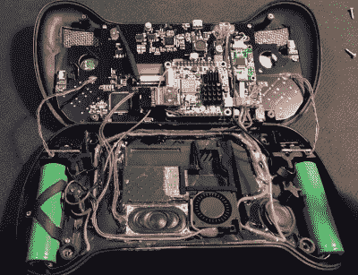

# 构建完美复古手持设备的史诗般追求

> 原文：<https://hackaday.com/2019/11/26/an-epic-quest-to-build-the-perfect-retro-handheld/>

这是一个成为经典电子游戏爱好者的好时机。我们大多数人都带着一部智能手机，它能够模仿 32 位时代以来的几乎所有东西，如果你想要一些更官方的东西，索尼和任天堂等大玩家已经开始推出他们的游戏机的“复古”版本。但即使如此，[癞皮狗]还不满足。为了得到他梦想中的便携式仿真系统，[他意识到他必须自己设计和建造它。](https://imgur.com/gallery/uJYZr3o)

由此产生的系统，他称之为“游戏狗 Blackbone”，无疑是我们见过的最令人印象深刻的 DIY 构建之一。虽然仍有一些问题他计划在硬件的后续版本中解决，但毫不夸张地说，市面上的游戏系统没有 Blackbone 一半多的思想投入其中。

 顺带一提，这就是整件事是如何开始的。最初的计划是买一个廉价的仿真掌上电脑，它总是以 PSP 克隆版的形式出现，并安装一个树莓 Pi。但是[癞皮狗]很快意识到，它们不仅太小了，不能把他想要的东西都装进去，而且拿在手里感觉很糟糕。由于他希望最终产品玩起来舒服，所以他的第一步是设计外壳，并从其他复古游戏爱好者那里获得反馈。

经过几次迭代，他完成了我们今天看到的设计。一旦他在 SLA 打印机上打印出了外壳，他就可以继续将所有的电子设备安装进去。它采用定制 PCB“主板”的形式，一个 Orange Pi Zero Plus2(抱歉，树莓迷)连接到该主板。实际上，机箱内的空间大得惊人，足以容纳双扬声器和风扇等细节，风扇配有管道，可以让主板保持凉爽。

不出所料，[Mangy_Dog]说，很多人问他是否可以购买自己版本的 Blackbone，并建议他开展众筹活动，开始大规模生产。虽然他在寻找树脂或注射成型的可能性，以便他可以生产更多的副本，但总的来说，他的注意力已经转移到新的项目上。坦白说，我们迫不及待想看到。

如果你对稍微现代一点的游戏感兴趣，我们已经看到了一些基于任天堂 Wii 的的[掌机，你可能会感兴趣。虽然它们可能没有黑体光滑的外部线条，但进入电子设备的](https://hackaday.com/2019/01/03/a-practical-portable-wii-emerges-from-the-memes/)[工作绝对是鼓舞人心的](https://hackaday.com/2018/10/08/worlds-smallest-wii-is-also-worlds-worst/)。

 [https://www.youtube.com/embed/oKETolL7fOQ?version=3&rel=1&showsearch=0&showinfo=1&iv_load_policy=1&fs=1&hl=en-US&autohide=2&wmode=transparent](https://www.youtube.com/embed/oKETolL7fOQ?version=3&rel=1&showsearch=0&showinfo=1&iv_load_policy=1&fs=1&hl=en-US&autohide=2&wmode=transparent)

 [https://www.youtube.com/embed/OOzcOe9GYy4?version=3&rel=1&showsearch=0&showinfo=1&iv_load_policy=1&fs=1&hl=en-US&autohide=2&wmode=transparent](https://www.youtube.com/embed/OOzcOe9GYy4?version=3&rel=1&showsearch=0&showinfo=1&iv_load_policy=1&fs=1&hl=en-US&autohide=2&wmode=transparent)

