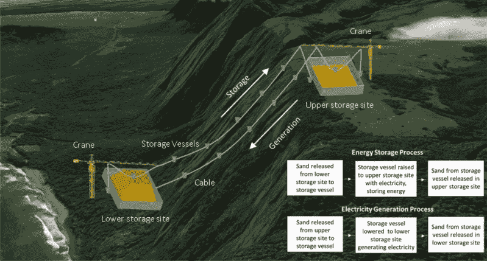
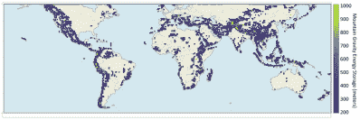

# 你能在一大堆沙砾中储存可再生能源吗？

> 原文：<https://hackaday.com/2019/12/04/can-you-store-renewable-energy-in-a-big-pile-of-gravel/>

随着世界努力摆脱化石燃料，工程师们正在努力将新类型的发电纳入电网。挑战很多，尤其是许多可再生能源的间歇性。储能项目是保持灯 24 小时亮着的关键，即使没有风，没有阳光。

传统的电网级能量存储长期以来一直利用抽水蓄能装置，将水泵送到一个蓄水池中，随后可用于驱动发电机。最近，电池被用来做这项工作。当你考虑这些装置的成本和它们的存储容量时，电池和抽水蓄能是有差距的。最近发布的一份白皮书提出，山区重力储能(在山区使用沙子或砾石的重力储能)是一种可以弥合这一差距的技术。

## 他们现在在山上储存能量

A diagram of an representative example installation in Molokai Island, Hawaii.

山脉重力储能或 MGES 的概念包括通过将沙子或砾石提升到更高的高度来储存电网中的多余能量。这是通过使用一对起重机来实现的，起重机将材料装载到存储容器中，然后通过电缆将它们提升到一定高度。然后，这些材料可以存放在海拔较高的地方，直到电网要求供电。在这个阶段，材料可以被重新装载到存储容器中，并降低到底部存储位置，重力做功将重量拉回来，在这个过程中转动发电机。有趣的是，最初提升砾石的电动机也可以用作发电机。

如果这听起来很熟悉，那么你是对的。这与抽水水电装置的基本理论没有什么不同，在抽水水电装置中，水被泵入大坝，然后在需要能量时通过涡轮机流出。然而，这些装置通常仅在 50 MW 及以上的较大装置中经济可行。MGES 系统旨在作为输出功率为 1-20 MW 的小型装置的一种选择。对于小岛屿或其他偏远地区，MGES 可能是一种结合可再生能源支持当地电网的好方法。

## 你能腾出一座山吗？

A GIS data analysis was used to determine areas around the world that would be viable for MGES installations.

这种装置的可行性取决于是否有合适的山地地形。系统顶部和底部的高差越大，储存的能量就越多。对于自然景观允许海拔在 500-2000 米之间的地区，MGES 可能变得可行。

显然，使用沙子或砾石作为能量存储介质会带来一系列挑战。像液体一样泵送干燥材料是不可能的，因此需要起重机来移动材料。所述起重机将需要被特别设计以承载重负载，并且在快速能量转移期间可靠地工作于高负载循环。沙子或砾石的装载和卸载最好通过自动化系统完成，论文作者建议通过在上下储存区下方传递容器来处理。因此，当需要时，重力可以简单地通过料斗将材料送入容器。这给系统增加了少量的势能损失，但使装载和卸载过程的复杂性最小化。

另一方面，抽水蓄能电站也有自己的问题。一是需要大量的水。另一个原因是蓄水池容易蒸发和结冰。

## 竞争激烈吗？

虽然该系统的基本物理原理是合理的，但这种系统也有缺陷。这涉及到高度的机械复杂性，不仅使设计变得复杂，还增加了维护和运行成本，这可能会破坏全面项目的可行性。在大规模电网中，抽水蓄能可能是更谨慎的选择，因为它是一种成熟的技术，可以很好地扩展到更高的电力水平。对于规模较小的孤立电网，MGES 可能有一席之地，但它被迫与能够提供类似功率水平的电池系统竞争。在这些情况下，电池具有短期储存的优势，而 MGES 可能会在需要一次储存几周或几个月的能量的情况下证明是有价值的。这与度假胜地特别相关，那里的能源使用可能有很大的季节性变化。

如果有一家特别大胆的公司愿意在一个遥远的多山的岛屿上投资一个试验工厂，我们可能会看到这样一个系统在运行。这很可能会很壮观，或者很难看，这取决于你的观点。在这种情况下，我们一定会报道它，但现在，MGES 仍然是一个新奇有趣的概念，还没有完全实现。