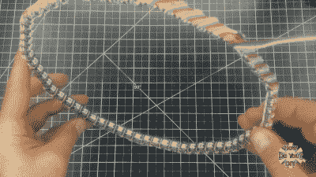

# 是时候我们看到另一个无限镜像时钟了

> 原文：<https://hackaday.com/2019/12/14/its-about-time-we-saw-another-infinity-mirror-clock/>

你做了无限远镜了吗？在这一点上，它们相当于一个项目的通过仪式。但与 DIY 电源不同，大多数电源除了看起来很酷之外没有其他功能(并不是说这有什么错)。还不如让它做*点什么*，对吧？

[How Do-DIY]制作了几面镜子，因为他喜欢在不同位置试验不同反射面的效果。这一次，他从头开始建造了一个时钟。基本的无限远镜规则在这里适用，尽管他在两侧使用了半透明的反光膜以获得更好的效果，并在后面放了一个可调节的翘曲杆，以便轨迹向中心弯曲。实际计时由 Arduino Nano 完成。

 他的灯带上的 RGB 发光二极管相距几毫米，不合他的心意，所以他把灯带拆开，并小心翼翼地把它们放在木头框架周围，从而增加了几十个小时的建造时间。然后，他为连接 led 的每组三根电线挖了一个凹槽，使它们齐平。最终产品非常漂亮，但遗憾的是，这个 LED 支架隐藏在同样做工精良的铝制框架内。

不要再浪费一分钟了——浏览休息时间，看看构建视频。如果它是你想要的便携且实用的谈话用品，[做一套无限镜杯垫](https://hackaday.com/2019/11/21/gaze-deeply-into-these-infinity-mirror-coasters/)。

哦，我们有没有提到我们正在举办一场[时钟竞赛](https://hackaday.com/2019/12/10/new-contest-tell-time/)？提示，提示。

 [https://www.youtube.com/embed/GZtmViBg-K4?version=3&rel=1&showsearch=0&showinfo=1&iv_load_policy=1&fs=1&hl=en-US&autohide=2&wmode=transparent](https://www.youtube.com/embed/GZtmViBg-K4?version=3&rel=1&showsearch=0&showinfo=1&iv_load_policy=1&fs=1&hl=en-US&autohide=2&wmode=transparent)

