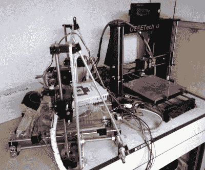
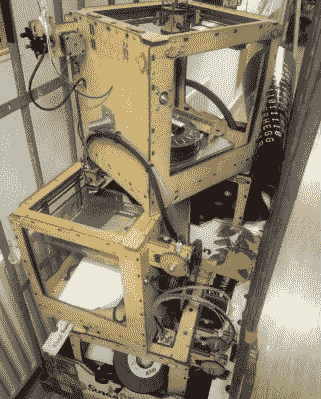
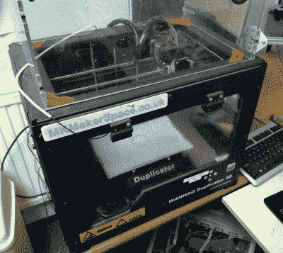

# 问黑客日:你如何防止 3D 打印机变成电子垃圾

> 原文：<https://hackaday.com/2020/01/02/ask-hackaday-how-do-you-keep-the-3d-printer-from-becoming-ewaste/>

在我们的社区中，我们有时会忘记的一件事是，许多我们认为理所当然的技术和机器对许多外人来说仍然是近乎巫术的东西。给你一个建议:下次你带着一群游客参观黑客空间时，让 3D 打印机一直开着，观察他们的反应，看一个钳工从移动的挤压机中慢慢出来。对我们来说，这是风景的一部分，但对他们来说，这是不可能的未来，他们的思想被吹。

Just because something *says* it’s a Prusa i3, doesn’t mean it *is* a Prusa i3.

在 RepRap 项目开始近 15 年后，我们看到了负担得起的 3D 打印机功能的巨大进步，现在一个相对较低的三位数金额就可以从中国获得一台机器，它将生产出质量会让那些早期建设者感到惊讶的打印品。在我们的社区中，许多人已经拥有了第三台或第四台打印机，这带来了意想不到的副作用。曾经一个黑客空间可能只有一台非常珍贵的 3D 打印机，现在在货架上发现一堆多余的旧打印机并不罕见。我的黑客空间都有好几个，这是我在和别人旅行时经常看到的景象。当它变成电子垃圾时，也许这是一种技术成熟的标志，因此看起来负担得起的 3D 打印已经成熟。

## 通过垃圾堆讲述打印机历史

My hackerspace isn’t the only one with a few spare 3D printers! Ultimaker stash photo: Mendel Mobach

你可以通过一个产品的使用时间来了解它的很多信息，例如，与 Yugo 55s 相比，大众高尔夫有更高的百分比存活了 30 年。因此，看看这些成堆的旧打印机，就能知道哪些型号是明星，哪些是柠檬。其中有几条主线，每一条都代表了一系列不同的失败梦想。首先，他们是先驱者，一个 Makerbot 纸杯蛋糕，或者是一个 RepRap 达尔文或孟德尔。我们甚至知道有一个空间有一个工作纸杯蛋糕，但这些不是你在 2019 年使用的机器。相反，它们代表了 3D 打印对我们来说仍是新奇事物的时代。如果你想起你看到的第一台机器，也许它就在这里。

然后是惊喜，体面的工作仍然可以提供一个可信的结果，但只是被忽略了。例如，今年早些时候看到一堆闲置的 Ultimakers 令人震惊，但也许我需要提醒自己，现在已经不是 2015 年了。

然而，到目前为止，数量最多的是下一组，山寨货，证明了仅仅将某样东西作为普鲁萨克隆品出售并不能使它成为普鲁萨。有趣的是，虽然不是所有的克隆都是低质量的，但我能想到不止一个空间仍然愉快地使用多年前的万豪复印机，Makerbot 复制器的克隆。

最后，在黑客空间中，经常会有人买了一台 delta 打印机，并且不可避免地发现它有问题。驱动它的是与众不同的渴望，还是仅仅是对打印花瓶的喜爱，但如果要我猜哪台打印机会落满灰尘，那肯定是某人的 delta 项目。

## 你能用这些垃圾做什么？

因此，我们揭露了一个典型的黑客空间垃圾堆，作为失败的桌面 3D 打印努力的浓缩历史，但这既是一个重大问题，也是一个机会。这是一个问题，因为尽管它已经成为一个电子废弃物的问题，但 3D 打印机本身仍然被认为是有价值的——但这种价值只有在它们做一些事情而不是坐在一堆垃圾上时才能实现。这是一个机会，因为它们仍然是闲置的数控机床的基础。

如果我们能够摆脱旧的 3D 打印机是神圣不可侵犯的观点，那么我们就可以利用它们，把它们变成其他东西的基础。我们都曾在意识到自己犯了一个错误之前[堆积了一堆垃圾，所以重新审视那堆打印机并不丢人。](https://hackaday.com/2016/10/13/too-good-to-throw-away-dealing-with-an-out-of-control-junk-hoard/)

The WanHao Duplicator that’s still one of the workhorse printers at MK Makerspace.

从最基本的角度来说，冗余的 3D 打印机就是一堆等待拆卸的零件。幻灯片，步进电机，挤压，以及相关的电子设备。2012 年左右的挤出机和控制板的尖端技术能否在 2019 年派上用场还值得怀疑，但其余的应该会在其他项目中找到现成的家。然而，拆除一台打印机可能会忽略它的主要事件。带有大量 X、Y 和 Z 轴的现成 CNC 机构和随时可用的控制器应该能够提供无限的可能性。

给它装上一个迷你路由器或者一个雕刻激光器已经是板上钉钉的事情了，但是你还能做什么呢？用注射器和伺服系统制造巧克力和软糖挤压机，并打印糖果？为一些 3D 光绘画附加 LED？一次性的艺术项目或古怪的工具，你是如何重新利用你废弃的打印机来防止它积灰的。

无论你对你多余的 3D 打印机有什么想法，也许在这一切中还有另一个故事。我们的社区并没有发明 3D 打印机，但是我们已经把它当成了我们自己的东西，用它来运行。如果我们已经达到了他们最终成熟的程度，那么部分成功属于我们，属于那些推进他们设计的黑客。我们可以为那堆多余的老式打印机感到自豪，因为它们和取代它们的 200 美元的中国机器代表了我们社区 15 年来的成功故事。问题是，未来 15 年，他们会走向何方？