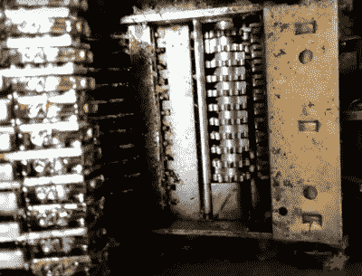

# 逆向工程:大众的机械算术

> 原文：<https://hackaday.com/2019/12/18/retrotechtacular-mechanical-arithmetic-for-the-masses/>

上个月，我们刊登了一篇文章，通过英国目录零售商 Argos 和他们的常年梦想目录的镜头来看 8 位家用电脑市场的发展。作为题外话，我们提到 1975 年的最早版本包含了市场上最后的一些机械计算器和一些早期的电子模型。这个月回到这些设备是值得的，因为虽然它们现在已经被遗忘了，但在本世纪的大部分时间里，它们是典型办公室的风景和杂乱的一部分。

The Summa’s internals, showing the register on the right and the type wheels on the left.

在仓库的某个地方，我有一个目录中的模型，一个 Olivetti Summa Prima。十几岁的时候，我在一个垃圾箱里偶然发现了它，当时我正在寻找坏掉的电视来寻找零件，剪下一对打字机色带卷轴来安装它，玩了一会儿后，我把它添加到了我的随机技术蜉蝣商店中。这是一个大约 1970 年的紧凑而时尚的桌面单元，在其前面是一个数字键盘，顶部是一个打印机，带有一卷收据纸和一个打字机风格的橡胶辊的支架，而在其侧面是一个弹簧加载的手柄，它从中获得动力。它可以用旧的英国货币单位做简单的加法和减法，操作它只需输入一个数字，拉动手柄，然后看着结果在纸带上显示出来。它的记录看起来是一组由手柄推进或减速的转子，用于加法或减法，它的印刷是通过一组印刷杆向上滑动以用墨带排列正确的数字来实现的。1987 年，对我和我的液晶卡西欧科技来说，这是一个有趣的机械好奇心，但对 20 年前的操作者来说，它一定代表了大量的时间节省。

机械计算器的历史可以追溯到几百年前的 17 世纪的布莱士·帕斯卡，在那段时间里，它们通过一系列的发明演变成了惊人复杂的机器，能够以惊人的速度处理复杂的金融问题。Summa 是最后大量供应的机器之一，即使在 20 世纪 60 年代它被推向市场，它的制造商也在生产第一台桌面大小的计算机之一。在 1975 年的 Argos 目录中，它的价格并不便宜，但与电子产品相当，考虑到它包含的零件数量和制造的复杂程度，这本身就是一个小小的奇迹。

我们在休息时间下面放了两个 Summa Prima 视频。第一个是机器的当代广告，第二个是机器的现代介绍，部分由巴西机器人讲述，所以考虑翻译字幕。在第二个视频中，你可以看到它的一些内部结构，因为裸露的机械装置为相机转动，设备的一些机械复杂性变得非常明显。从垃圾箱里拿出一台过时的办公机器，并把它挂了 30 年，这看起来可能有点奇怪，但我真的很高兴一个 80 年代十几岁的我这么做了。你可能不太可能在 2019 年偶然发现一个，但如果你这样做了，这是一个非常值得添加到你的收藏中的设备。

 [https://www.youtube.com/embed/-MpSPnCIv5c?version=3&rel=1&showsearch=0&showinfo=1&iv_load_policy=1&fs=1&hl=en-US&autohide=2&wmode=transparent](https://www.youtube.com/embed/-MpSPnCIv5c?version=3&rel=1&showsearch=0&showinfo=1&iv_load_policy=1&fs=1&hl=en-US&autohide=2&wmode=transparent)

 [https://www.youtube.com/embed/Ht1tb1YqjvY?version=3&rel=1&showsearch=0&showinfo=1&iv_load_policy=1&fs=1&hl=en-US&autohide=2&wmode=transparent](https://www.youtube.com/embed/Ht1tb1YqjvY?version=3&rel=1&showsearch=0&showinfo=1&iv_load_policy=1&fs=1&hl=en-US&autohide=2&wmode=transparent)

标题图片:意大利语维基百科上的 ElioAngelo[[CC BY-SA 4.0](https://commons.wikimedia.org/wiki/File:Olivetti_summa_prima_20.JPG)。