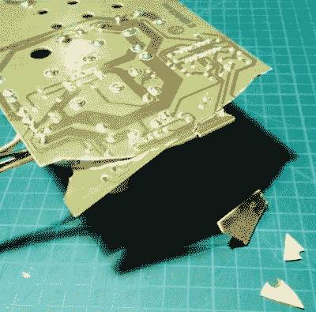

# 修复一个死去的准将 128DCR

> 原文：<https://hackaday.com/2019/12/04/restoring-a-dead-commodore-128dcr/>

又是一天，另一台复古电脑被[Drygol]爱怜地修复到像新的一样。这一次，他关注的主题是 Commodore 128DCR，它完全符合“零件，不工作”的条件。从蜘蛛侵扰到破裂的电源印刷电路板，这台电脑处于相当的状态。但最终他让这台 30 年前的旧机器恢复了工作状态，甚至还教了它一些新技巧。

 显然，破碎的 PSU 是准将面临的最紧迫的问题。有趣的是，这台机器的背面仍然有保修印章，所以无论这台 PSU 发生了什么，似乎都没有人为干预。

[Drygol]不仅仅是更换 PSU，而是首先在氰基丙烯酸酯胶的帮助下将木板拼接在一起，然后在顶部涂上环氧树脂，赋予其一定的机械强度。在背面，迹线或者被修复，或者在损坏太严重的地方用跳线完全替换。

PSU 修好并经过测试后，他开始清洗电脑主板，并对所有塑料外部组件进行增白处理。就连单独的键帽也洗了个澡，让它们看起来像新的一样。这使电脑尽可能接近新的状态。

但是为什么就此打住呢？接下来，他安装了 JiffyDOS 改进版以提高系统性能，并连接了一个适配器，让计算机通过 S-Video 输出清晰的 80 列。可以肯定地说，这款 Commodore 现在的状况比它下线时要好。

虽然最终结果令人印象深刻，但对[Drygol]来说，这仍然是相当温和的。如果你想看到一个真正的挑战，看看为了重现这个被打碎的 Atari 800XL 机箱所做的疯狂的工作。