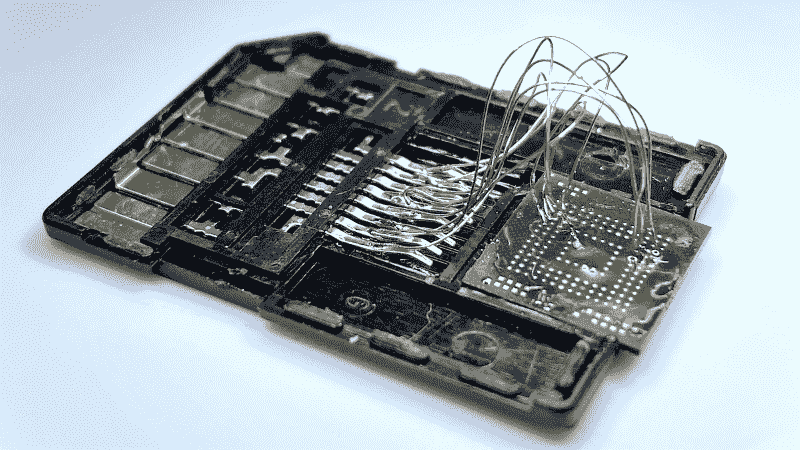

# 黑客日链接:2019 年 12 月 8 日

> 原文：<https://hackaday.com/2019/12/08/hackaday-links-december-8-2019/>

现在 2019 年 11 月已经过去了，很遗憾《银翼杀手》中对未来的一些预测还没有实现。哦，当然，住在洛杉矶的 1.09 亿人会很有趣，但在我们拥有会飞的汽车之前，我们只能用“增强能力”来安慰自己照片。虽然新服务 [AI 图像放大器](https://imglarger.com/Home/Software)不能[梳理出三维信息](https://www.youtube.com/watch?v=hHwjceFcF2Q)，但该应用程序旨在放大低分辨率图像，提高焦点，并显示图像中较暗部分的细节。营销材料声称，该应用程序使用机器学习，并正在寻找志愿者上传高分辨率图像，以改善其训练集。

我们最近在这里有点纳米卫星狂欢，上周的黑客聊天[讨论了立方体卫星的模拟器，](https://hackaday.io/event/168230-amsat-cubesat-simulator-hack-chat)[下周的](https://hackaday.io/event/167508-open-source-satellite-propulsion-hack-chat)专注于 PocketQube 卫星的开源推进器。因此，我们对宣布第一颗公共 LoRa 中继卫星发射的视频时机表示赞赏。这颗 PocketCube 格式的卫星被命名为[fossat-1](https://fossa.systems/fossasat-1/)，与其他六个小型有效载荷一起乘坐从新西兰发射的火箭实验室电子火箭进入太空。Andreas Spiess 有一个 FossaSat 任务的简短视频预览,该任务旨在测试基于空间的物联网链接的能力，几乎任何人都可以使用便宜且容易获得的部件访问该链接；一个地面站应该只需要几块钱，但是你需要一个业余无线电执照来上传。

我们知道 GitHub 已经成为事实上的源代码控制标准，并且已经演变成一个协作和项目管理平台，被黑客社区中的任何人使用。但是，你是否曾经希望有一个更符合硬件设计师需求的协作平台呢？那么 [InventHub](https://inventhub.io/) 可能会让你感兴趣。目前处于有限的测试阶段——我们试图注册早期访问计划，但似乎已被列入等候名单——似乎这将是一个直接为您选择的 ECAD 包带来版本控制的平台。通过 KiCad、Eagle 和所有主要 ECAD 播放器的插件，您将能够与其他设计师合作，并看到他们在原理图上标记的更改，这是一种视觉差异。这似乎很有趣，我们将密切关注事态的发展。

 亚马逊现在提供一款精简版的 Echo 智能音箱，名为 [Input](https://www.amazon.com/Echo-Input-Bring-Alexa-speaker/dp/B07BFRHZLB) ，它与你已经拥有的音箱合作，以超级便宜的价格满足你所有的隐私侵犯需求——仅 10 美元。在这个价格上，很难抗拒购买一个只是为了打开它，这就是布莱恩·多雷对他的所做的。[拆卸](https://www.briandorey.com/post/amazon-echo-input-teardown)相当标准，内部结构与你对现代监控设备的预期非常相似，但这里的巧妙之处在于主板上的闪存芯片。Brian 在试图解开它上面的金属护罩时意外地使它过热，BGA 芯片松脱了。因此，很自然地，他查找了引脚，并用细电磁线将其焊接到微型 SD 卡适配器上。他能够将它放入 USB SD 卡读卡器，并查看整个文件系统的输入。这是一个很好的黑客，和一个很好的拆卸。