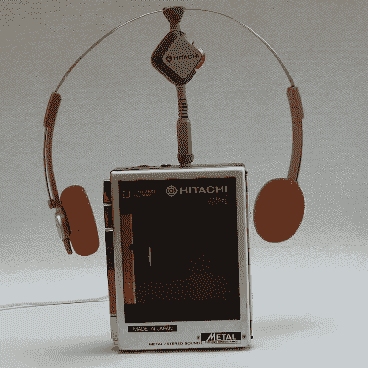

# 1984 年气象员 Pi 展示了 Ch-Ch-Ch-Ch-Ch 的变化

> 原文：<https://hackaday.com/2019/12/05/1984-weatherman-pi-shows-the-ch-ch-ch-ch-changes/>

当[MisterM]的 MIL 送给他一台 rad 80s 便携式磁带放音机时，他高兴得跳了起来。一旦他发现这个窗口和树莓派帽子的标准尺寸完全一样，这种可能性让他晕头转向。一阵想法之后，他选定了一个天气显示屏，上面有一顶皮莫罗尼独角兽帽。

1984 年的天气预报员 Pi 每 1.5 秒从黑暗天空 API 中提取一次数据，使用的是零 w。【MisterM】选择突出显示当前的温度、条件和降雨概率，尽管还有许多其他 API 的好东西仍在桌面上。它以动画的形式显示当前的天气状况，滚动显示温度，并给出一个很好的降雨概率图。

令人惊讶的是，令人眼花缭乱的展示并不是我们最喜欢的部分。看到上面那些海绵耳机了吗？它们不仅仅是为了装饰，尽管它们对帮助卡带播放器保持其特性大有帮助。只要天气有变化，它们就会在 9g 伺服系统上来回摆动。如果伺服系统是连续的，用它们作为风向标可能会更好。

请务必查看[MisterM]在 B 端为您准备的全面演示/构建视频。我们喜欢这里的好天气展示，越丰富多彩越真实越好。

 [https://www.youtube.com/embed/9aZER9OiExg?version=3&rel=1&showsearch=0&showinfo=1&iv_load_policy=1&fs=1&hl=en-US&autohide=2&wmode=transparent](https://www.youtube.com/embed/9aZER9OiExg?version=3&rel=1&showsearch=0&showinfo=1&iv_load_policy=1&fs=1&hl=en-US&autohide=2&wmode=transparent)

通过[指令](https://www.instructables.com/id/1984-WeatherMan-Pi/)