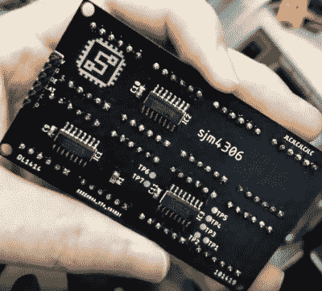

# 将 16×2 气泡 LED 显示屏连接在一起

> 原文：<https://hackaday.com/2019/12/10/chaining-together-a-16x2-bubble-led-display/>

我们最近注意到，人们对所谓的“气泡显示器”的兴趣有所上升:老式字母数字发光二极管可能最容易记住的是，在 LCD 取代之前，它们被用于手表和计算器。今天，它们可以作为剩余品甚至废品以几便士的价格买到，但不幸的是，它们只提供了四到五个字符。或者说，它们确实如此，直到[【sjm 4306】建造了一个电路板，将它们链接成一个 16×2 阵列](https://hackaday.io/project/168425-hpdl-1414-16x2-led-display)。

【sjm 4306】以每台 71 美分的天价买到了 10 台 HPDL-1414 显示器，每台能显示 4 个字符。然后，他设计了一个 PCB，可以同时接受八个显示器，甚至提前考虑使用接头，这样它们可以根据需要拔出和交换。当然，安装它们只是成功的一半，你仍然需要驾驶这些东西。

每个显示器都有自己的专用驱动芯片，但试图单独寻址每个显示器需要太多的引脚。因此[sjm4306]选择使用三个 74HC595 移位寄存器，允许他通过微控制器的 SPI 切换 36 个必要的引脚。他甚至编写了一个小库和一些示例代码，您可以在该项目的 Hackaday.io 页面上找到。

不幸的是，在他努力工作之后，悲剧发生了。鉴于这些显示器的日期代码，它们已经有几十年的历史了，[sjm4306]认为他会在它们首次亮相大型视频之前用一点酒精来清洗它们。但是无论透明面板是由什么塑料制成的，都不适合 IPA，它们都碎了。它们仍然工作，但如果你拿起这些古董展示品自己玩，这绝对是一种怪癖。

在过去，我们已经看到一个小得多的 PCB[允许类似的显示器更容易地与现代微控制器](https://hackaday.com/2019/06/11/new-pcb-revives-ancient-bubble-led-displays/)接口；完美，如果你只是想敲了几个复古的 LED 字符与最小的大惊小怪。

 [https://www.youtube.com/embed/gifwu61a4dM?version=3&rel=1&showsearch=0&showinfo=1&iv_load_policy=1&fs=1&hl=en-US&autohide=2&wmode=transparent](https://www.youtube.com/embed/gifwu61a4dM?version=3&rel=1&showsearch=0&showinfo=1&iv_load_policy=1&fs=1&hl=en-US&autohide=2&wmode=transparent)

