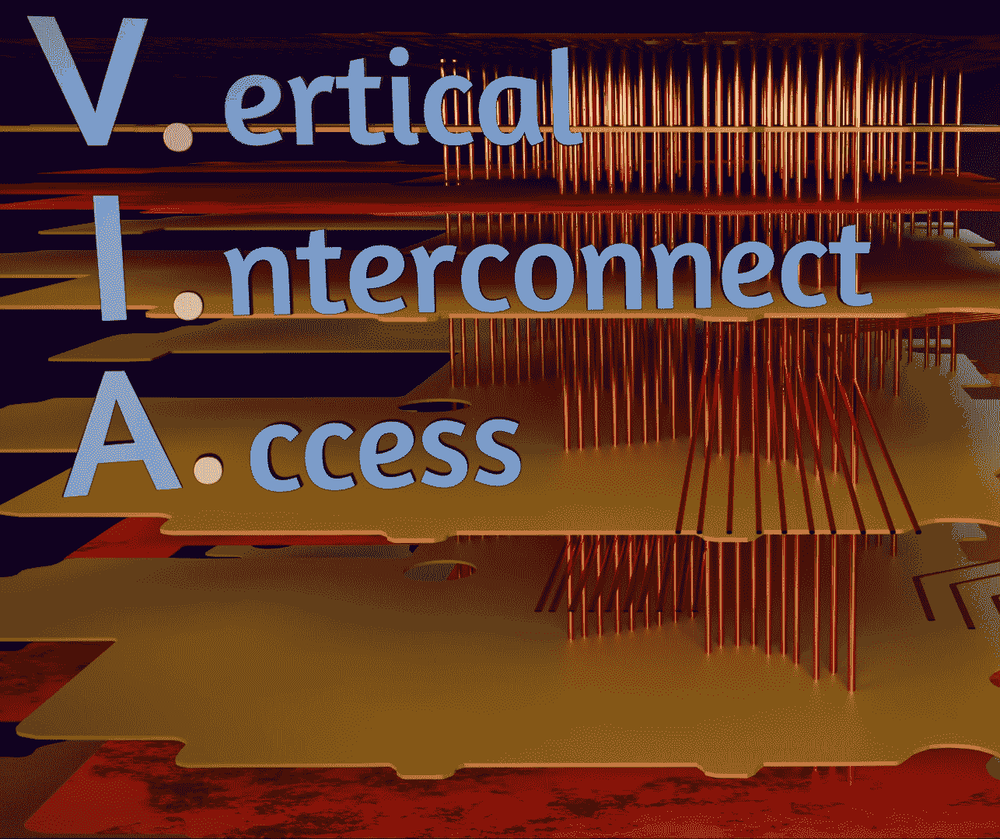

# 了解 PCB 的内部工作原理

> 原文：<https://hackaday.com/2019/12/10/journey-through-the-inner-workings-of-a-pcb/>

我们日常接触的大多数电子产品都是由电路板组成的。没什么好惊讶的，对吧？但是它们是如何工作的呢？这可能看起来是一个简单的问题，但我们都有过这样的经历，那些奇怪的绿色或黑色的床单是一小片魔法。Branch Eduction 的[泰迪·塔布兰特]制作了一个[精心制作的~~穿越~~飞越视频](https://www.youtube.com/watch?v=Z2LgmIGE2nI)，它展示了 PCB(A)如何工作，绝对值得你花时间去做。

[泰迪]的视频专注于通过剥离智能手机的层来揭开 PCBA 的神秘面纱。从完整的组装开始，他将元件从电路板上分离出来，并从那里开始，强调你所看到的背后的制造方法和目的。

这里真正突出的是动画；在每一步[泰迪]已经建立了相关组件的模型，并在 PCBA 上以 3D 形式呈现出来。他没有仅仅依靠难以理解的模糊 X 射线图像和多氯联苯的 2D 扫描，而是说明了它们在空间中的关系，这是理解阻焊膜下发生的事情的一个特别重要的因素。即使你认为你什么都知道，我们打赌还有一颗知识的明珠有待发现；这位作者了解到 VIA 是一个缩写！

如果你不喜欢点击链接，你可以在广告之后找到嵌入的视频。感谢黑客之友[ [迈克·哈里逊](https://twitter.com/mikelectricstuf) ]充当了最佳推荐算法，[找到了这颗宝石](https://twitter.com/mikelectricstuf/status/1201817228787761152)。

 [https://www.youtube.com/embed/Z2LgmIGE2nI?version=3&rel=1&showsearch=0&showinfo=1&iv_load_policy=1&fs=1&hl=en-US&autohide=2&wmode=transparent](https://www.youtube.com/embed/Z2LgmIGE2nI?version=3&rel=1&showsearch=0&showinfo=1&iv_load_policy=1&fs=1&hl=en-US&autohide=2&wmode=transparent)

