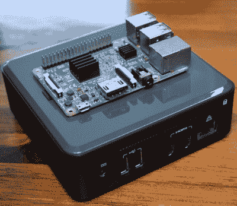
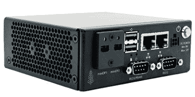
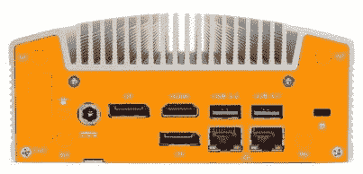
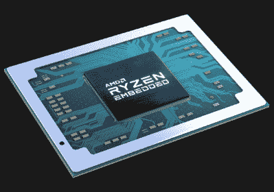

# AMD 推出新的锐龙迷你电脑挑战英特尔

> 原文：<https://hackaday.com/2019/12/24/amd-introduces-new-ryzen-mini-pcs-to-challenge-intel/>

对于大多数黑客和创客项目来说，最近几年选择的微型计算机是树莓派。虽然可用性问题似乎困扰着这些非常受欢迎的单板计算机(SBC)的每一次新迭代，但它们已被证明是执行相对轻量级计算任务的一种简单而经济的方法。取决于你问的是谁，Pi 4 甚至对日常桌面计算来说足够强大。对于一款一贯低于 50 美元价位的设备来说，这已经不错了。

Intel NUC compared to the Raspberry Pi

但是我们都知道有些事情 Pi 不是特别适合。如果您的项目需要大量的计算能力，或者您已经有了一些需要在 x86 处理器上运行的软件，那么您将会想到别处去看看。对于这些树莓派毕业生来说，最好的选择之一就是英特尔下一代计算单元(NUC)。

nuc 的优势在于它是“真正的”计算机，拥有可升级的组件和桌面级处理器。自然，这意味着它们比树莓派大一点，但也不至于不切实际。举例来说，如果你在一个大型的漫游者上工作，两者之间的尺寸和重量差异可以忽略不计。小型集群项目也是如此；十个 nuc 不会比相同数量的 pi 占用更多的空间。

不幸的是，英特尔 nuc 在 Raspberry Pi 上绝对没有任何优势的是价格:这些微型计算机的起价约为 250 美元，根据选项的不同，可以超过 1000 美元大关。价格大幅上涨的一部分自然是硬件的大幅改进，但我们也不能忽视的是，这一领域缺乏任何强有力的竞争也没有给英特尔带来多少削减成本的动力。当你是镇上唯一的游戏，你可以收取你想要的。

但这种情况即将改变。在最近的一份新闻稿中，AMD 宣布了一个“开放生态系统”,这将使制造商能够使用该公司锐龙处理器的嵌入式版本来制造小型电脑。据 AMD 嵌入式解决方案部门总经理 Rajneesh Gaur 称，该公司认为是时候在传统的服务器和台式机市场之外进行更大的扩张了:

> 对高性能计算的需求不仅限于服务器或台式机。嵌入式客户希望获得支持开放软件标准、边缘高要求工作负载、甚至显示 4K 内容的小型电脑，所有这些电脑都采用了计划 10 年内上市的嵌入式处理器。

## 权力在边缘

有许多目前和即将推出的基于锐龙的设备，AMD 显然想称之为“迷你个人电脑”，以远离 NUC 的术语，它们之间的共同目标很简单:将尽可能多的计算能力装入一个小而坚固的外壳中。这些采用 AMD 处理器的第一代机箱有着独特的工业外观，而不是许多英特尔 nuc 拥有的时尚的消费者友好型外观。似乎最有兴趣在他们的小型电脑上安装锐龙芯片的制造商希望他们过上非常艰苦的生活。

  Simply NUC Sequoia  OnLogic ML100G-40

事实上，许多已公布的电脑都是由 ASRock 和 OnLogic 等相对较小的公司制造的，这表明它们不是供消费者使用的。这些机器设计用于商业应用，如驱动高分辨率数字标牌，或用于通信网络。你不应该把这些东西放在你的电视下面，它显示出来了。

所有这些迷你电脑都是日益增长的“边缘计算”趋势的一部分，在这种趋势下，强大的处理器和大量的 RAM 被带到更靠近需要它们的地方，而不是被远程访问。毫不奇怪，在许多应用中，需要始终在线的宽带互联网连接可能是一个问题。如果这听起来非常像我们在“云”接管之前所做的事情，你不会错。

## 专业价格

虽然似乎已经有相当数量的产品进入 AMD 新的迷你 PC 生态系统，但有一样东西似乎令人痛苦地缺失了:一款我们实际上可以负担得起的产品。

 由于这些设备的主要目标是工业和商业应用，不幸的是它们有与之匹配的标价。即使是相对简单的 AMD 迷你电脑，起始价格看起来也在 500 美元左右。几个即将推出的型号的定价和可用性目前还不清楚，但只要看一眼它们的结构和规格，就很明显低级硬件黑客不是目标受众。

这显然让我们这些寻求立即融入项目的人感到失望，但重要的是要记住竞争并不总是在一夜之间形成的。随着他们向小型设备市场的推进，AMD 已经迈出了迟到的一步。第一波机器会瞄准有钱的地方，这是合乎逻辑的，但随着锐龙嵌入式芯片的产量增加，其他公司似乎不可避免地会看到剥离更多面向消费者的产品的机会。