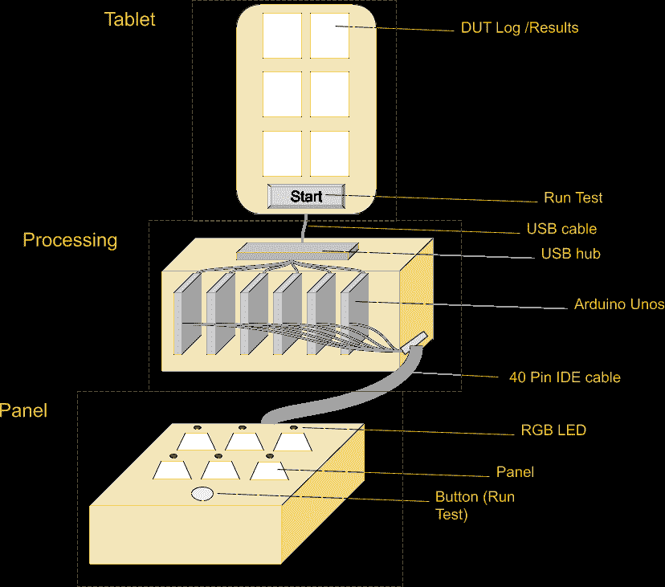
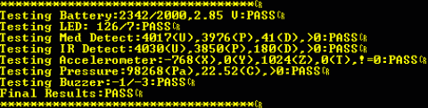
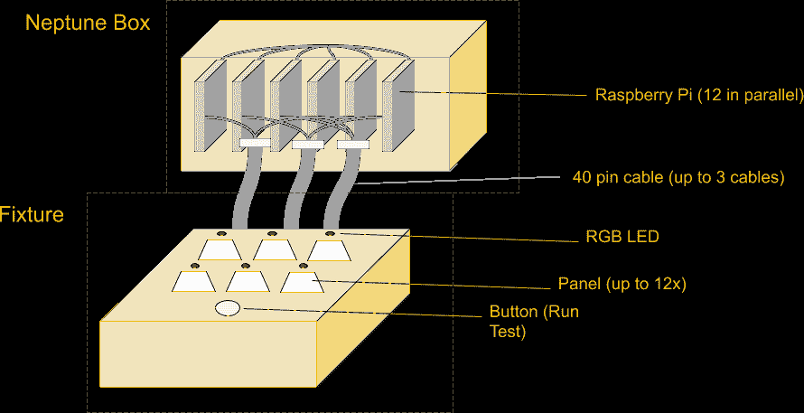
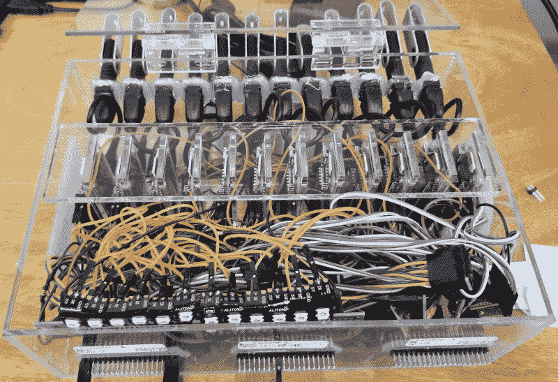
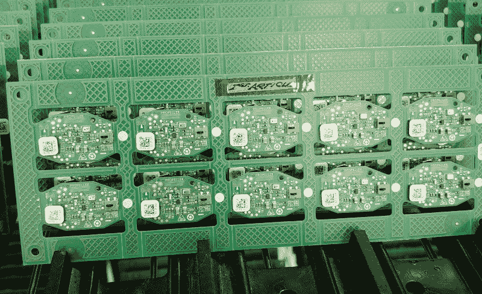
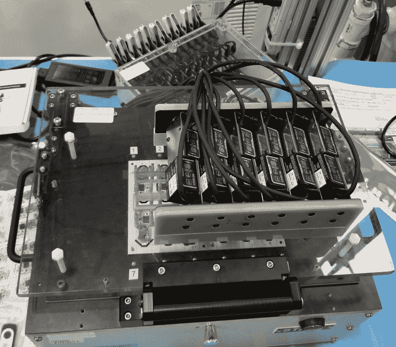
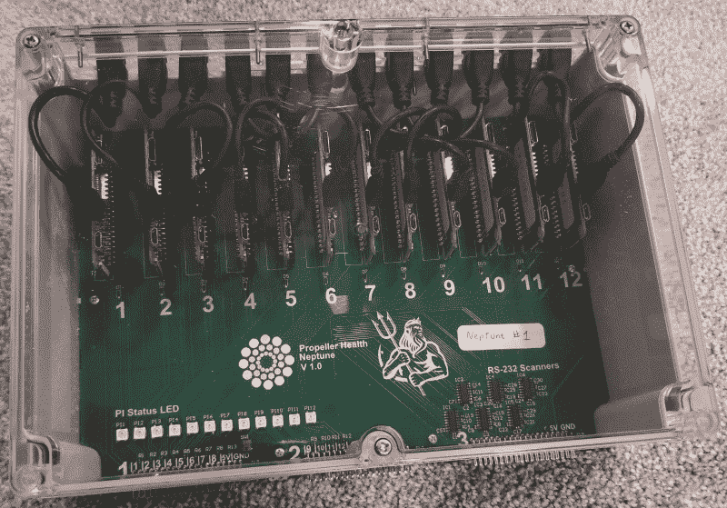
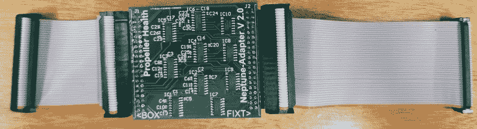

# 生产程序设计的并行 Pis:减少组装时间和成本

> 原文：<https://hackaday.com/2019/12/30/parallel-pis-for-production-programming-cutting-minutes-and-dollars-off-of-assembly/>

电子产品的装配线非常复杂，通常由许多定制工具和夹具组成。典型地，微控制器必须用固件编程，并且电路板在组装到外壳中之前被测试，随后在将其放入盒子之前进行功能测试。这些测试平台可能非常昂贵，很容易就要几万美元。相反，该项目使用一组 12 个并行的 Raspberry Pi Zero Ws 来编程、测试和配置多达 12 个单元，然后再进入下一个组装阶段。

## 修复夹具瓶颈

我工作的公司 [Propeller Health](https://www.propellerhealth.com/) ，开发物联网产品，其组装方式与许多其他公司类似；有一个电路板和一个塑料外壳。裸 PCB 经过两次 SMT(元件在正面和背面)，然后经过 ICT(在线测试),在 ICT 中进行编程，每个测试点上的 pogo 引脚验证电路上的所有元件。基于贴在贴片后电路板上的 2D 条形码标签，它们还被赋予了唯一的蓝牙 MAC 地址。之后，它们被组装到塑料中，并在进入库存模式和装箱之前通过功能测试夹具。我们有大约 12 种不同器件的产品线，每一种都使用不同的 PCB 和外壳。

生产运行需要测试和编程夹具，这是我几年前写的一个话题。为了扩大规模和降低成本，我们开始与我们的合同制造商更紧密地合作，以确定和解决装配线流程中的瓶颈，我们注意到，对于一个由 6 块电路板组成的面板，ICT 阶段需要 6 分钟。信通技术部分本身相对较快，但固件编程和 mac 编程需要很长时间，因为测试平台无法同时连接多个串行端口。

这是一个 3 万美元的设备，有 6 个赛格程序员，6 个是德科技扫描仪，位于 10 万美元的 Teradyne 平台之上，这是我们最大的瓶颈和最大的支出。此外，我们产品线中的每个设备需要不同的夹具。这些昂贵的设备加上缓慢的周期时间使得我们的 [COGS(商品销售成本)](https://hackaday.com/2018/12/06/your-bom-is-not-your-cogs/)难以为继。

在装配线上，时间就是金钱，因为生产线上每个操作人员的每个周期时间都要进行测量，并计入产品成本。缩短一个周期哪怕是一秒钟，都会迅速累积成千上万个周期。超过 10，000 单位，2 秒减少是 6 小时的劳动，在 15 美元/操作员小时是 0.01 美元/单位，和 CMs，特别是美国的，收费超过 15 美元/小时。对于 6 件产品来说，6 分钟的周期时间是可以改进的。

## 第一阶段——Arduino

第一阶段更多的是概念验证。我们能否将昂贵的 ICT 设备上的一些功能转移到更便宜、更快的设备上，以便我们可以串行扩展，而不是购买另一个设备来并行扩展？

在这个阶段，我们在固件中实现了一个我们称之为自测的功能，它类似于 [JTAG 边界扫描](https://en.wikipedia.org/wiki/Boundary_scan)。我们没有在每个网络上放置弹簧针，而是在固件中加入了一个功能，在尽可能多的元件上运行自测，并通过串行方式报告结果。这样，我们就可以只连接电源和 UART 引脚，并快速完整地读出故障所在。八个 Arduinos 通过一个 USB 集线器连接到一台带有自定义 Python 脚本和界面的平板电脑是解决方案。

一个 40 针 IDE 连接器就足以提供电源、一个 RGB LED、RX、TX 和一个可以同时启动所有 8 个开关的按钮。Arduino 将向 DUT(被测设备)请求自检，该设备将测试其组件并返回报告。测试包括验证传感器读数是否在预期范围内，同时打开 LED 和蜂鸣器，测量电压降，以验证输出是否正常工作。

The microcontroller executes a series of tests on its own components and verifies they are within preset ranges, then reports success or failure.

这很有效，证明了创建一个盒子的概念，其中大部分电子设备与面板的简单定制夹具配对，但这还不够。取消一些电路测试不足以显著减少时间。我们需要完成更多的任务。

## 第二阶段——树莓派

ICT 设备中较为昂贵的部分之一是 Segger J-Link 程序员。如果我们可以用更便宜的东西从 ICT 中提取编程，我们就可以大大降低设备成本。许多芯片制造商在工厂提供编程，以便您的微控制器与您的固件预编程在一个卷轴上。当你不信任你的制造商或不想有一个特殊的编程夹具时，这是有用的，但它确实有额外的成本，并且有一个准备时间，改变你的固件更困难，并且你不能在任何其他产品上使用那部分。

内部编程对我们有很大的吸引力，简化了我们的供应链，并给了我们更多的灵活性，可以根据需要更改固件和转移库存。输入树莓 Pi Zero W 和 [OpenOCD](http://openocd.org/) 。Raspberry Pi 不仅能够运行 OpenOCD 来对微控制器进行编程，而且配置和运行起来也非常容易。它还有一个串行端口和 GPIO 来控制 WS2812B LEDs，并且足够小，很容易将一束放在一个盒子里。

连接器扩展到第二个 40 针 IDE 电缆，支持多达 12 个并行单元，大小相当于我们最大的配线架。每个 Pi 完全独立运行，彼此之间不通信。它们唯一的共同点(除了电源)是所有 12 个都连接到灯具前面的同一个按钮上。操作员使用该按钮开始编程循环，但每个 Pi 独立运行其程序。

The prototype box contains all the components, wired together in a giant nest with Dupont cables that easily disconnected, in a custom laser-cut and glued acrylic enclosure for extra fragility.

进一步借鉴 Arduino 的经验，Raspberry Pi 过程将首先对单元进行编程，然后通过 UART 通信验证其编程是否正确，然后在设备上执行自测，测试加速度计、麦克风、IR 传感器、LED、蜂鸣器等，并报告结果和通过/失败状态。我们已经实现了从 ICT 设备中减少大量流程时间和成本的主要目标，但我们还可以更进一步。

## 第三阶段–添加功能

A panel of 10 PCBs with unique MAC address stickers. The MAC address is scanned and programmed into the module.

通过在设备上添加摄像头，我们可以读取标签上的 MAC 地址，并使用串行端口将 MAC 地址编程到设备中。这使我们能够将流程与 MAC 地址联系起来，该地址用于在装配线的其余部分跟踪设备。

如果你想知道为什么我们没有预先分配号码，然后让操作员输入正确的号码，这就减少了操作员出错的机会。给操作员一张贴纸并告诉他们贴在单元上，比让他们在特定单元上贴特定的贴纸更不容易出错，也比一次打印一个单元的条形码更快。

A fixture with 12 cameras for scanning barcodes. Notice the big green button in front of the fixture for starting a cycle.

接下来，我们添加了存储在单元上的唯一密钥，用于认证通信。pi 生成一个 64 字节的密钥，在传感器上编程并验证该密钥，然后加密该密钥并将其存储在日志文件中。那把钥匙在我们的服务器上被解密，让我们可以和传感器交流。

此外，我们添加了全面的日志记录；系统日志跟踪脚本、配置文件和固件文件的版本号，一个单独的文件记录每个周期以及关于该过程每个阶段的诊断数据。这些日志存储在一个拇指驱动器上，但也会定期上传到一个安全的 FTP 上，以便我们可以立即导入日志(和加密密钥)，并在他们运行我们的作业时监视我们的 CM，帮助他们诊断任何问题。

我们还用 u 盘做了这些。在启动时，pi 启动一个 Python 脚本，它唯一的工作就是等待一个拇指驱动器被插入，然后在那个拇指驱动器上运行脚本。拇指驱动器包含主 Python 脚本、配置文件、固件十六进制文件和日志。这样，我们就有了一个与装配线完全无关的盒子，然后我们就有了十几个与特定设备的生产线保持一致的拇指驱动器。我们不需要 pi 接口，因为我们只需将拇指驱动器插入计算机，就可以根据需要进行配置。任何让操作者的工作变得更容易的事情都会让装配线运行得更顺畅，说“把这些插在箱子后面”效果很好。

此时，我们可以对微控制器进行编程，然后执行自测，再对 MAC 地址进行编程，生成唯一的密钥，并向 LED 输出过程的状态(绿色表示成功，黄色表示进行中，红色表示失败)，并将日志保存到文件中。这缩短了几分钟的周期时间。以前，12 个面板被一分为二，然后每一半通过 ICT 设备 6 分钟，12 个设备的总周期时间约为 12 分钟。在改变之后，我们让 12 个人组成的整个小组用了不到一分钟的时间，然后分开，每个人在 ICT 上花了不到 2 分钟的时间。我们从 12 分钟内的 12 个增加到 5 分钟内的 12 个，对流程有了更多的控制和更大的透明度。

## 第四阶段——海王星还活着

The assembled Neptune box contains 12 Raspberry Pi Zero W, 12 LEDs, 12 USB cables, and cost less than $500 total.

在我们的第一个盒子工作后，我们的 CM 要求更多，以便他们可以服务多条装配线，并有备份和一个用于测试/开发。设计是正式的，我们找到了一个新的外壳，可以很容易地修改，并设计了 PCB。所有组件的总成本约为 500 美元，PCB 很容易在几个小时内手工组装。我们称这个项目为海王星，盒子开始组合在一起。现在我们有很多 Neptune 盒子，我们为我们的设备开发人员制定了一个规范，允许他们拥有一个非常简单的电路，可以反复复制。固定物是坚固的野兽，需要特殊的知识和经验，我们没有，也不想开发，所以我们外包那部分。最近的夹具立即工作，没有变化，这通常是几乎不可能的。

## 第五阶段——更换摄像机

贴片后，每个单元上都贴有 MAC 地址标签，但该地址必须编程到微控制器本身中。为此，使用条形码扫描仪。这是一个生产环境，我们将 12 台扫描仪放入一个小空间，扫描仪必须准确可靠地检测关于 1/2in^2 的 2D 条形码，因此不是任何扫描仪都可以。

最初，在我们 CM 的建议下，设备配备了 Keyence 扫描仪。在我们发现每台 1400 美元后，我们意识到了降低成本的巨大潜力。我们的每个灯具每个面板有 10-12 个设备，所以用 250 美元的斑马扫描仪替换 Keyence 扫描仪是一个立竿见影的收获。缺点是，我们的 Neptune PCB 设计用于仅使用 2 个 UART 引脚与 Keyence 扫描仪进行 RS232 通信，而 Zebra 扫描仪需要 5V 逻辑电平和硬件 RTS/CTS 引脚。幸运的是，我们能够建立一个内嵌电路的电缆，包含每个摄像头的 ATtiny84。

The adapter converts RS232 to 5V logic and triggers the Zebra camera.

通过对配置文件做一个小的修改，我们可以告诉系统使用一个稍微不同的通信协议。Pi 发送一个串行信号，该信号在 Neptune box 内部被提升至 RS232，然后在电缆加密狗上被降低至 5V，进入 ATtiny，在那里被解析，如果需要信号，则它向 Zebra 扫描仪的触发引脚发送一个脉冲，然后扫描仪扫描条形码并将结果发送回加密狗，在加密狗处被提升至 RS232 并返回设备。这个加密狗意味着我们不需要改变盒子的任何东西，而且设备也没有任何额外的电路。

## 结果

Neptune 的成果为公司节省了大量的设备和单位成本，提高了我们的可伸缩性，使我们的生产更加透明，增加了功能，并使新功能的开发更加容易。Raspberry Pi 和 OpenOCD 在这方面发挥了重要作用。我们学到了很多东西，并开发了一些技术，这些技术可能对从事电子设备制造的任何人都有价值。我们仍在研究如何在不损害安全或商业机密的情况下分享这些信息，但这是我们的第一步。