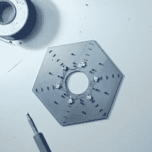

# 不要挂圣诞灯，要嵌入

> 原文：<https://hackaday.com/2019/12/10/dont-hang-christmas-lights-embed-them/>

发现很难融入今年的节日气氛？也许你只是需要一个及时的项目来点亮夜晚，直到圣诞老人(或坎卜斯)造访你的房子。无论谁在这个季节参观，都可以用嵌入 RGB LEDs 的 3D 打印树来取悦或分散他们的注意力。

【MakeTVee】分四个阶段打印了这个树，这样可以更容易地连接所有东西。每一级都有六个 led 嵌在底部 5 毫米的透明层中。顶部阶段有第二个颜色变化，使一个树顶持有一个单一的 LED。PrusaSlicer 2.0 中的颜色变化功能使暂停打印、插入连线 led 和无缝恢复绿色灯丝变得容易。有一个隐藏的似乎是美味的肉桂丝的底座，里面有小饰品 M0 和电源开关。

这种 lil' tree 看起来很棒，尤其是考虑到布线和组装是多么复杂和令人头疼。[MakeTVee]用一个印刷线路模板使自己更容易，当他用电磁线将 led 焊接起来时，它可以保持 led 的星形形状(在我们的书中这是一个可靠的选择)。他深思熟虑地把那个模板放到了 Prusa 网站上的文件中。休息之后，调暗灯光，喝杯热饮料，看看[MakeTVee]的构建视频。

如果你想要一个人们可以一起玩的假日黑客，[邀请他们来画你的可寻址树](https://hackaday.com/2018/12/23/leds-and-pi-let-you-virtually-decorate-this-online-christmas-tree/)。

 [https://www.youtube.com/embed/dhuSzCt0PSc?version=3&rel=1&showsearch=0&showinfo=1&iv_load_policy=1&fs=1&hl=en-US&autohide=2&wmode=transparent](https://www.youtube.com/embed/dhuSzCt0PSc?version=3&rel=1&showsearch=0&showinfo=1&iv_load_policy=1&fs=1&hl=en-US&autohide=2&wmode=transparent)

