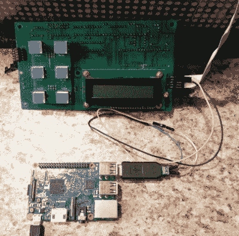

# 逆向工程一个旧的公共汽车显示器

> 原文：<https://hackaday.com/2019/12/11/reverse-engineering-an-old-bus-display/>

当他的 makerspace 被赠予一对你可能在公共汽车前部看到的那种发光二极管标志时，[PWalsh]决定把其中一个拆开，看看是什么让它发出滴答声。在这个过程中，他成功地对它的控制协议进行了逆向工程，并用一个连接 WiFi 的树莓 Pi 替换了它原来的控制板。现在他们可以使用 LED 标志来显示他们想要的任何东西；不需要公共汽车。

因为它们是为汽车使用而设计的，所以这些标志是为 12 伏 DC 电压布线的。所以第一件事就是给它安装一个交流/DC 转换器，这样它就可以插在墙上了。在他测量了显示器的电流消耗后，[PWalsh]估计了它的最大能耗，并确定一个旧的 ATX 电脑电源可以胜任这项任务。

 有了这个不用电池就能愉快运行的标志，他就可以开始想办法和它说话了。注意到 PCB 上有一个 MAX485 RS-485 转换器，很好地了解了它在说什么语言，在他可靠的示波器的帮助下，他能够找出波特率。然后，一个便宜的 USB 转 RS-485 转换器被连接在标牌和控制板之间，这样他就可以嗅到通过线路的数据。

从那时起，难题的最后一块是研究捕获的数据并找出协议。[PWalsh]能够识别数据包报头和 ASCII 字符，并且很快就了解了标志是如何通信的，因此他能够完全移除控制板，只需从 Pi 向其推送文本和图像。他甚至把他的框架提供给任何可能有类似公交标识的人。

即使你不打算在你的实验室里添加这些标志，这个项目也是一个用低成本工具和简单技术进行协议逆向工程的极好例子。我们总是喜欢看到过程像这样一步一步分解，我们为[PWalsh]大规模交付货物脱帽致敬。

这不是第一次[我们看到这种 LED 标志得到“物联网”的待遇](https://hackaday.com/2016/12/26/iot-ifying-an-old-led-signboard/)，如果你满足于稍微缩小的版本，[你总是可以建立自己的显示器](https://hackaday.com/2018/01/24/road-apology-gratitude-emitter-car-led-sign/)，而不是等待当地的公共交通工具被淘汰。