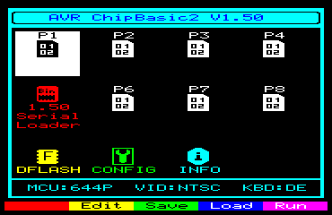

# 用这个计算机工具包捕捉旧学校的基本错误

> 原文：<https://hackaday.com/2019/12/12/catch-the-old-school-basic-bug-with-this-computer-kit/>

现代计算的复杂性曾经让你沮丧过吗？你是否发现自己渴望回到过去，在过去你可以真正了解你的台式机的硬件和软件在任何给定的时刻都在做什么？你并不孤单，但不幸的是，运行一台 40 多年的旧电脑作为你的日常驱动程序并不是一个可行的选择。

但这并不意味着你没有选择。[【Kostas】写信告诉我们关于“CB2 微型”](http://cb2.qrp.gr/index.htm):一个小型的开源逆向计算机套件，由于它的通孔结构和极低的零件数量，它可以在短短 30 分钟内完成。完成后的微型计算机是一个多合一的基本开发平台；只需连接一台显示器和一个 PS/2 键盘，您就拥有了编写自己的程序或运行社区开发的游戏和应用程序所需的一切。您甚至不需要软盘，因为 ATmega644P 供电板有足够的内部闪存来存储八个程序，以便通过其图形菜单系统轻松访问。

Main menu of the CB2 micro

对于观众中的许多人来说，一个可以自己组装并用作独立基本实验平台的廉价小电路板足够吸引人。但由于一系列硬件附加板，CB2 微处理器可以增加一些有趣的功能。

有些是显而易见的，如添加额外的闪存或 RAM，但你也可以使用 AA 或 AAA 电池运行计算机，或添加 S-Video 端口。[Kostas]甚至解释了如何组装一种特殊的串行电缆，使您可以将多个电路板联网在一起。如果你冒险开始构建自己的硬件模块，前途无量。

当然，纯粹主义者可能会犹豫，因为 CB2 微处理器没有使用“真正的”计算机处理器。很公平。对于那些想要更真实的复古体验的人来说，[你可以随时选择 RC2014、](https://hackaday.com/2019/10/02/review-the-rc2014-micro-single-board-z80-retrocomputer/)或全力以赴[将 Z80 塞进 Altoids](https://hackaday.com/2019/09/17/a-curiously-strong-z80-in-your-pocket/) 罐中，这样你就可以随身携带。