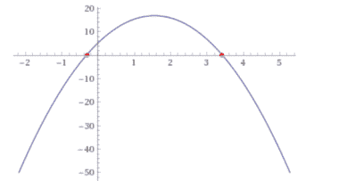

# 二次方程的解酝酿了几千年

> 原文：<https://hackaday.com/2020/01/03/the-quadratic-equation-solution-a-few-thousand-years-in-the-making/>

每个人都学过(有些读者可能还记得)二次公式。它是代数学的一个支柱，允许你解像 Ax ² +Bx+C=0 这样的方程。但是，仅仅因为你使用过它，并不意味着你知道如何得出公式本身。这是一个很难推导的公式，所以我们大多数人只是简单地记住了这个公式。卡耐基梅隆大学的数学家 Loh Po-Shen 在复习中学使用的数学材料以使它们更容易理解时，没有想到会找到一种新的方法来推导出答案。毕竟，人们解这个方程已经有 4000 年了。但那正是[他所做的](https://arxiv.org/abs/1910.06709)。

在看新解之前，先说说为什么要解二次方程。它们被用在许多上下文中。在古代，你可以用它们来决定多种多少作物来支付税款，而不用吃掉你赖以生存的作物。在物理学中，它可以描述运动。用一个二次方程描述的事物似乎是无穷无尽的。

尤其是巴比伦人，他们会解联立方程来寻找二次方程的根。埃及人、希腊人、印度人和中国人使用图形方法来解方程。整个历史有点难以理解，但仍然是一本很好的读物。对于本文，让我们深入了解新的推导是如何被发现的。

## 建立方程式

那么有什么方法呢？你看 Loh 在视频里自己解释，下面。假设你有一个标准的二次方程，看起来像这样:

```
x2-6x+3=0
```

在这种情况下，A=1，B=-6，C=3。注意，为了让 Loh 的方法工作，A 应该等于 1，但是如果它不等于 1，你总是可以将两边除以 A 来使其为真。例如，考虑这个等式:

```
3x2-18x+9=0
```

它和第一个方程有相同的根，因为如果两边都除以 3，就得到第一个方程。

## 多项式因子

为了将一个多项式分解成两个二项式，我们可以使用箔片(第一/外部/内部/最后)。所以我们知道:

```
x2-6x+3=(x-S)(x-R)
```

在那里我们刚刚编了 S 和 r，它们存在，但是我们还不知道它们是什么。然而，如果答案是零，你可以看到，当 x=S 或 X=R 时，方程也是零，这意味着 S 和 R 是方程的根。

## 那么什么是 S 和 R 呢？

这听起来很傻，但是让我们把二项式乘以另一个多项式。记住铝箔:

```
x2-6x+3=x2-(S+R)x+SR
```

如果你看一下，你可能会意识到，S 乘以 R 一定是 3。我们也知道它们加起来是 6。在这一点上，你可能只是猜测根源，但让我们把它正式化。

像这样的多项式的根将会是`U±z`的形式。所以如果`S=U+z`和`R=U-z`，唯一让`(U+z)+(U-z)`等于 6 的方法就是如果 U 是 6/2。因为在这个例子中 B 是-6，所以我们可以直觉地得出在一般情况下 U 一定是-B/2。

## 终点直道

所以我们现在知道根是`-B/2+z`和`-B/2-z`。我们知道 B 是-6。我们还知道，当我们将这些根相乘时，答案一定是 C(例如，3)。所以我们可以写:

```
(-(-6)/2+z)(-(-6)/2-z)=3
```

或者:

```
(3+z)(3-z)=3
```

再次使用箔片法，得到:

```
9+3z-3z-z2=3
```

中间项总是会抵消，所以你得到:

```
9-z2=3
```

两边都减 3，两边都加 z 的平方:

```
6=z2
```

因为根必须是`-B/2±z`，我们知道我们的两个根是`3+√6`和`3-√6`。

## 钥匙和钩子

关键是，这些都不难记，也不难算。请记住，您将零重写为`(x-S)(x-R)`,剩下的就顺理成章了。

唯一真正的问题是没有多少二次方程有 A=1。举个例子，假设你从距离地面 5 米的地方向上直抛一个球，速度为 15 米/秒，我们想知道这个球什么时候落地。

重力将以大约每秒 4.9 米的平方向球下拉(假设重力以-9.8 米/秒的速度加速 ² )。物理公式是`(at²)/2`，所以我们得到第一项-4.8t ² 。第二项将代表球的速度，简单地说就是 15t。我们还从离地面 5 米处开始，所以我们将加上 5，最后得到:

```
-4.8t2+15t+5
```

这个公式会告诉你，假设你在 t=0 时投掷，球在哪里。我们想知道它什么时候落地，所以这是其中一个根:

```
-4.8t2+15t+5=0
```

要使用新方法，只需将其除以-4.8 即可:

```
t2-3.125t-1.04=0
```

所以现在 B=-3.125，C=-1.04。我们知道根将是`-B/2±z`或 1.5625，z ² 将等于`(1.5625)²+1.04`。

[](https://hackaday.com/wp-content/uploads/2019/12/plot.png) 那是 3.48(约)，平方根约为 1.866。那么根是 1.5625 1.866。算出来，我们得到-0.30 和 3.4285。负根在这种情况下是无意义的，但球会在你扔出后 3.5 秒落地。

如果你不信任我们的工作，可以去问 Wolfram Alpha 或把 3.4285 代入原来的公式。Wolfram 说 3.43，而你自己的检查结果说当时是 0.005 米，所以考虑到我四舍五入了几次，那是相当接近的。另外，我忽略了空气阻力之类的东西。这个[专用计算器](https://www.omnicalculator.com/physics/projectile-motion)显示 3.36 秒，还是挺接近的。

## 概括起来

如果你更喜欢算法步骤，你可以这样做:

1.  求二次方程的 A，B，C。
2.  如有必要，除以 A，使 A 现在为 1。
3.  写`-(B/2)²-z²=C`
4.  求解 z(因为你知道 B 和 C)
5.  根是`-B/2±z`

## 一切旧的都是新的

我们明白了。很多人可能之前就想通了这一点。但如果他们知道，他们显然忘记了以任何永久的形式与任何人分享。如果你读了实际的论文，你会发现象征性地推导“旧的”标准公式是多么容易。与传统方法相比。如果你读了证明，它看起来很简单，但是过几个星期再回去试着自己算出来。没那么容易。这也更容易记住，即使你不想每次都推导它。

当然，使 A=1 是诀窍的一部分。例如，众所周知，二次曲线的根的乘积是`C/A`。因为我们知道 A=1，所以用这种方法，S 和 R 的乘积也是 C。将 A 归一化为 1 也是一个老技巧，有时被称为简化的二次方程。然而，直到现在看起来也没有人把所有的碎片拼在一起。

如果你不喜欢 Wolfram Alpha，总有 [Mathics](https://hackaday.com/2019/05/11/mathics-how-to-do-hard-math-when-youre-not-an-mit-janitor/) (提示:用`Solve[-4.8t^2+15t+5==0,t]`)。还有[专用计算器](https://www.mathsisfun.com/quadratic-equation-solver.html)。或者咬紧牙关，把所有事情都记在笔记本上。

 [https://www.youtube.com/embed/ZBalWWHYFQc?version=3&rel=1&showsearch=0&showinfo=1&iv_load_policy=1&fs=1&hl=en-US&autohide=2&wmode=transparent&listType=playlist&list=PLqv4sKOD1bsUoSs-SbzlA2BE1tML4A33u](https://www.youtube.com/embed/ZBalWWHYFQc?version=3&rel=1&showsearch=0&showinfo=1&iv_load_policy=1&fs=1&hl=en-US&autohide=2&wmode=transparent&listType=playlist&list=PLqv4sKOD1bsUoSs-SbzlA2BE1tML4A33u)

