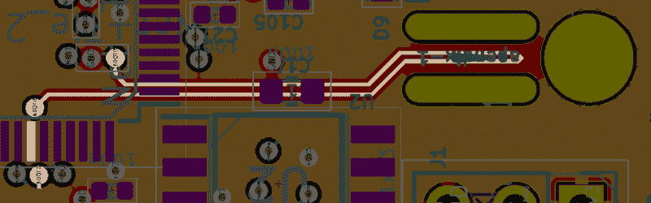
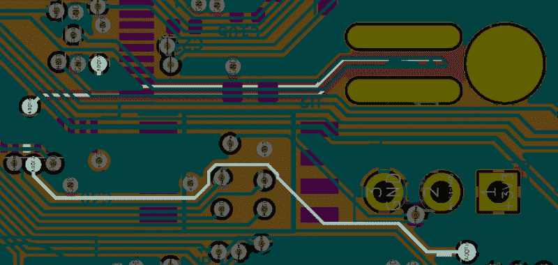

# 普鲁萨敢让你弄坏他们最新的打印机

> 原文：<https://hackaday.com/2019/12/16/prusa-dares-you-to-break-their-latest-printer/>

在 2019 年东海岸 RepRap Festival 上惊喜亮相两个月后，Prusa Mini 开始向第一批早期采用者发货。一如既往，随着硬件正式向公众发布，该公司已经开始将该设计作为开源软件发布。在他们的 GitHub 知识库中，所有者已经可以找到新“伙伴”控制板的 KiCad 文件和机器可打印部件的 STLs 文件。

但即便如此，并不是所有人都觉得 Prusa Research 让 Mini 像它的前辈一样“开放”。[一些关心此事的所有者指出](https://www.reddit.com/r/prusa3d/comments/e98rm2/prusa_mini_void_warranty_if_you_want_to_use/)根据伙伴板的文档，他们需要在物理上折断 PCB 的一部分，这样他们就可以通过设备固件升级(DFU)模式刷新自定义固件映像。一旦这块板被折断，文档称之为附录，Prusa Research 将不再对打印机的电子组件提供任何保修索赔。

对于那些铁杆鼓吹者来说，这个消息可能会让他们感到震惊。以前的 Prusa 打印机享有相当活跃的固件开发社区，事实上，用户开发的修改功能最终进入了官方的上游固件。此外，某些硬件修改需要固件调整才能完成。

Prusa Research 解释了他们的立场，称该公司无法验证社区开发的固件版本的安全性。如果热失控保护被禁用或受到损害，结果可能是灾难性的。我们已经在其他打印机上看到过这种情况，所以很难指责他们在这里的谨慎。该公司也很快指出，非官方固件的安装已经*总是*使打印机的保修失效；从物理上打破 Mini 上的板子只是为了确保用户明白他们即将离开常规。

对于修改了硬件的用户，制造商有义务提供多少支持？这当然是一个我们之前已经报道过很多次的问题。但这里的情况相当独特，因为用户被告知他们必须从设备上取下一部分来解锁某些高级功能。如果 Prusa 想完全阻止用户运行替代固件，他们可以这样做(或者至少尝试这样做)，但相反，他们创造了一个场景，迫使未来的修补者要么放弃，要么完全提交。

那么，Prusa 是如何将这一不同寻常的功能集成到他们全新的 32 位控制板中的呢？也许更重要的是，这将如何影响那些想黑掉他们打印机的人？让我们找出答案。

## 两块土地的故事

看看组装好的 Buddy 板的图片，并不能立即看出所谓的附录是如何工作的。它只是 PCB 的一小块，两边没有元件，甚至没有任何明显的痕迹穿过它。但是只要快速浏览一下前面提到的 KiCad 设计文件，我们就可以把这些碎片拼在一起。

正如我们所看到的，在一个内部铜层上有一条穿过阑尾的痕迹。一端接地，另一端连接到 STM32F407VGT6 MCU 的 BOOT0 引脚。查阅芯片的数据手册，我们可以看到，像这样保持 BOOT0 为低电平会禁用 DFU 模式。所以这解释了为什么它必须消失。

但文档显示，要使能 DFU 模式，需要将 BOOT0 引脚拉高，破坏附录只会使其悬空。这就是第二个痕迹出现的地方。该引脚从 BOOT0 连接到附近三引脚接头的中心引脚。利用任一侧的接地和 3.3 V 引脚，可以使用跳线在低电平和高电平之间切换 BOOT0。附录本质上是一个“安全装置”，防止这种跳线产生任何影响。

细心的读者可能想知道，如果将跳线移至 3.3 V，而阑尾保持不变，会发生什么情况。看起来 Prusa 考虑到了这种可能性，因为电路图实际上显示了接头和 BOOT0 引脚之间的 4.7K 电阻，以避免完全短路。

## Prusa 开发者计划

虽然我们肯定会接近这样一个点，即普通 3D 打印机所有者与拥有钻床或台锯的人没有什么不同，但他们中的很大一部分人仍然花在调整和修改他们的机器上的时间与他们实际打印的时间一样多。因此，固件黑客攻击被排除在外的可能性导致一些反弹也就不足为奇了。

但是，如果有人理解黑客、修改和改进 3D 打印机的愿望，那就是约瑟夫·průša.。未经检查的固件修改的非常真实的危险迫使他采取行动，像保护他的品牌一样保护他的客户，但他明确表示，他的意图永远不会阻止更倾向于技术的用户弄脏他们的手。

在最近的一篇博客文章中， [Josef 解释了公司推出“开发者计划”](https://blog.prusaprinters.org/original-prusa-mini-now-shipping/)的计划，该计划专门针对那些希望参与非官方固件开发的人:

> 此外，我们计划在未来几个月推出一个社区开发者计划。您将从我们这里获得额外的资源，如果您在开发过程中损坏了什么，您将获得新的部件(无论您是否损坏了主板上的“附件”)。我们将很快发布更多信息，敬请关注！

这样一个程序听起来似乎可以解决用户目前提出的所有问题，尽管毫无疑问，如果他们只想修改打印机固件中的几行代码，一些人会对需要注册为“开发人员”感到不满。目前还不清楚该计划是否会产生相关成本，但很难相信该公司会完全支付扩大客户支持和获得更换部件的费用。

## 最终黑客许可协议

像 Prusa Research 这样对黑客友好的公司处境艰难。一方面，他们不想做任何阻止更多技术用户修改他们产品的事情。但与此同时，当用户进行未经批准的修改时，期望制造商更换损坏的硬件是不合理的。作为黑客，我们需要承认，这个领域带来了一定程度的个人责任。

最终，附录的引入应该被看作是对黑客社区的一个积极的影响。它为任何想要探索其硬件的人提供了一条清晰的界限，并确保双方清楚地了解当用户决定自己动手时发生的范式转变。事实上，它的存在表明，硬件的设计不是为了限制用户的权利，而是承认和尊重他们的权利。

如果运气好的话，下次制造商做类似的事情时，他们会在丝网上印上“**在黑掉**之前移除”。