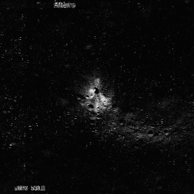

# 黑客日播客 046:给我们带来你的废话，黑客 NES 克隆，抓住 FPGAs，许多音乐黑客，鱼缸充满了随机

> 原文：<https://hackaday.com/2019/12/13/hackaday-podcast-046-bring-us-your-nonsense-hacking-nes-clones-grasping-fpgas-many-a-music-hack-and-fish-tanks-full-of-random/>

Difference of two Vikram moon images, contrast tweaked.

Hackaday 的编辑埃利奥特·威廉姆斯和迈克·斯奇斯重点介绍了过去一周最令人愉快的黑客事件。你的办公室需要一个随机数字展示品吗？看看那个鱼缸就知道了。也许你真正需要的是完成你乐队的舞台表演？你想要一个 Tristan Shone 的许多工业时尚的音频控制器，或者只是一个位于你的吉他和放大器之间的黑客转盘。

另外，公民科学在天文学领域也很活跃，压电元件永远不会给你的电动车充电。

如果你想继续，看看下面的链接，一如既往地在评论中告诉我们你对这一集的看法！

[//html5-player.libsyn.com/embed/episode/id/16571402/height/90/theme/custom/thumbnail/yes/direction/backward/render-playlist/no/custom-color/000000/](//html5-player.libsyn.com/embed/episode/id/16571402/height/90/theme/custom/thumbnail/yes/direction/backward/render-playlist/no/custom-color/000000/)

如果你想继续，看看下面的链接，一如既往，在评论中告诉我们你对这一集的看法！

[直接下载](https://traffic.libsyn.com/secure/hackaday/727159846-hackaday-ep046-bring-us-your-nonsense-hack-nes-clones-grasping-fpgas-music-hacks-fish-tank-of-random.mp3) (60 MB 左右。)

Where to Follow Hackaday Podcast

### 关注 Hackaday 播客的地方:

*   [谷歌播客](https://podcasts.google.com/feed/aHR0cDovL2ZlZWRzLnNvdW5kY2xvdWQuY29tL3VzZXJzL3NvdW5kY2xvdWQ6dXNlcnM6OTM5MTM0NzIvc291bmRzLnJzcw)
*   [iTunes](https://itunes.apple.com/us/podcast/hackaday-podcast/id1447409683)
*   [Spotify](https://open.spotify.com/show/3NRV0mhZa8xeRT0EyLPaIp)
*   [装订机](https://www.stitcher.com/podcast/hackaday-podcast)
*   [RSS](http://hackaday.libsyn.com/rss)

## 第 046 集节目笔记:

#### 本周新消息:

*   Mike 用 MQTT 构建了一些东西
    *   [MQTT Porchlight 是物联网](https://hackaday.io/project/168845-mqtt-porchlight-is-an-intranet-of-thing)
    *   [最小 MQTT:构建代理](https://hackaday.com/2016/05/09/minimal-mqtt-building-a-broker/)
    *   [MQTT 破折号](https://play.google.com/store/apps/details?id=net.routix.mqttdash&hl=en)(手机 app)
    *   [OpenHAB](https://www.openhab.org/)
    *   [Domoticz](https://www.domoticz.com/wiki/Main_Page)
    *   [红色节点](https://nodered.org/)
*   [新比赛:报时](https://hackaday.com/2019/12/10/new-contest-tell-time/)

#### 本周有趣的黑客:

*   [DIY 音乐控制器与机器共舞](https://hackaday.com/2019/12/09/diy-music-controllers-for-raging-with-machines/)
*   [用旧电唱机制作的吉他效果](https://hackaday.com/2019/12/09/guitar-effect-built-from-an-old-record-player/)
    *   [转盘转动波形发生器](https://hackaday.com/2016/08/19/turntable-turns-waveform-generator/)
*   [导电胶带电流容量比较](https://hackaday.com/2019/12/09/conductive-tape-current-capacity-comparison/)
    *   [铜重量、走线宽度和载流量之间的关系](https://www.pcbcart.com/article/content/copper-trace-and-capacity-relationship.html)
*   [用鱼缸产生随机数](https://hackaday.com/2019/12/09/generating-random-numbers-with-a-fish-tank/)
    *   [有史以来最棒的随机数发生器](https://hackaday.com/2018/01/04/the-grooviest-random-number-generator-ever/)
    *   [熔岩灯随机专利](https://patents.google.com/patent/US5732138)
    *   什么是熵，我如何获得更多的熵？
*   [大卫·威廉姆斯对 FPGA 很好奇](https://hackaday.com/2019/12/06/david-williams-is-fpga-curious/)
    *   [Icestudio](https://icestudio.io/)
*   [交换迷你街机柜中的 ROMs】](https://hackaday.com/2019/12/06/swapping-the-roms-in-mini-arcade-cabinets/)
    *   [任天堂做索尼，比索尼好](https://hackaday.com/2018/12/23/nintendo-does-sony-better-than-sony/)
    *   [拆机:168 合 1 复古掌机游戏](https://hackaday.com/2019/12/09/teardown-168-in-1-retro-handheld-game/)

#### 快速破解:

*   埃利奥特的选择:
    *   [gamelab:另一个 FPGA 游戏机徽章](https://hackaday.com/2019/12/06/gameslab-the-other-fpga-game-console-badge/)
    *   [使用 PowerCore 和 FluxLamp，回流是可能的](https://hackaday.com/2019/12/10/with-powercore-and-fluxlamp-reflow-is-possible/)
    *   [没有单个转速脉冲轮的 STM32 转速脉冲轮风琴](https://hackaday.com/2019/12/05/a-stm32-tonewheel-organ-without-a-single-tonewheel/)
*   迈克的选择:
    *   [古董怀表项目更新古董怀表](https://hackaday.com/2019/12/08/antique-pocket-watch-project-updates-antique-pocket-watch/)
    *   [利用夜光鱼肠细菌制作艺术品](https://hackaday.com/2019/12/07/using-glow-in-the-dark-fish-gut-bacteria-to-make-art/)
    *   [用于 ESP8266 模块的简单 Pogo 编程器](https://hackaday.com/2019/12/07/simple-pogo-programmer-for-esp8266-modules/)

#### 不能错过的文章:

*   公民科学家发现月船 2 号；让我们想起冥王星的发现
*   你能给一辆标致压电吗？
    *   【Clif Claven 评论中信封计算的背面
    *   [基于悬臂双压电晶片振动的压电振动采集器:综述](https://www.scirp.org/journal/paperinformation.aspx?paperid=60025)
    *   [太空电梯](https://media.ccc.de/v/33c3-8407-an_elevator_to_the_moon_and_back#t=1475)！