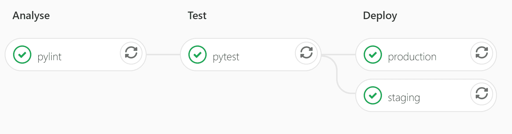
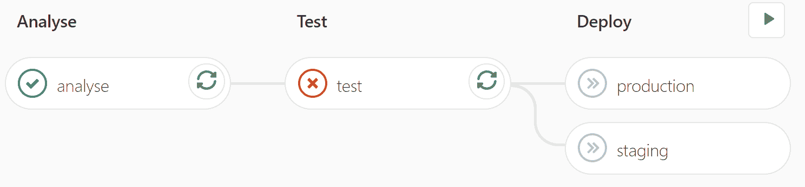

# 持续集成:什么是持续集成，为什么需要持续集成

> 原文：<https://hackaday.com/2020/01/06/continuous-integration-what-it-is-and-why-you-need-it/>

如果你写软件，你可能会遇到持续集成，或 CI。你可能从未听说过它——但你想知道你在网上找到的开源存储库上所有的记号、徽章和神秘的状态图标是什么。你可能会听到朋友们在大谈 CI 的优点，或者抱怨他们的管道又坏了。

想知道这些大惊小怪是为了什么吗？本文将解释 CI 的基本概念，但将重点放在一个示例上，因为这是理解它的最佳方式。让我们开始吧。

## CI 到底是什么？

持续集成的精确定义是指软件开发人员频繁地将他们的代码签入中央存储库的实践，通常是在商业环境中一天多次。当代码被检入时，自动测试和构建被运行，以验证已经做出的小的改变。这比在一个巨大的代码板上工作一周，签入它，发现它没有通过大量的测试，并且破坏了其他人的代码要好。

虽然这是一个有效的定义，通俗地说，CI 已经成为这个过程的自动化部分的同义词；当人们提到 CI 时，他们通常指的是在签入时自动运行的测试、构建和代码覆盖报告。

此外，CI 通常与其姐妹产品持续部署(CD)混为一谈。CD 是自动部署您的应用程序的实践:只要您的代码已经被推到正确的分支并且测试已经通过。我们很快会详细讨论这个问题。

## 案例研究–一个简单的 API

我将把任何关于 CI 优点的解释或讨论留到我们看到一个例子之后，因为这将使我们更容易理解正在发生的事情。

这个例子的目的是创建一个非常简单的 Python 应用程序，然后使用 CI 自动测试它，使用 CD 自动部署它。我们将使用 GitLab CI，因为它是一个简洁的集成解决方案，易于设置。您可以在这里查看包含所有文件[的完整存储库。](https://gitlab.com/bengineer19/ci-demo)

让我们首先创建一个包含主要应用程序逻辑的 Python 文件。在本例中，它是一些字符串处理函数。

```

""" web/logic.py. Contains main application code. """

def capitalise(input_str):
    """Return upper case version of string."""
    return input_str.upper()

def reverse(input_str):
    """Return reversed string."""
    return input_str[::-1]

```

让我们也为这段代码添加一些非常基本的测试:

```

""" test_logic.py. Tests for main application code. """

from web import logic

def test_capitalise():
    """Test the `capitalise` function logic."""
    assert logic.capitalise("hackaday") == "HACKADAY"

def test_reverse():
    """Test the `reverse` function logic."""
    assert logic.reverse("fresh hacks") == "skcah hserf"
    assert logic.reverse("racecar") == "racecar"

```

好了，现在我们已经完成了主要的应用程序代码，让我们通过 API 来公开它。我们将为此使用烧瓶。不要担心仔细阅读这一点，它只是在这里作为一个例子，并显示在这里的背景。

```

""" web/api.py. Expose logic functions as API using Flask. """
from flask import Flask, jsonify

import web.logic as logic

app = Flask(__name__)

@app.route('/api/capitalise/<string:input_str>', methods=['GET'])
def capitalise(input_str):
    """ Return capitalised version of string. """
    return jsonify({'result': logic.capitalise(input_str)})

@app.route('/api/reverse/<string:input_str>', methods=['GET'])
def reverse(input_str):
    """ Return reversed string. """
    return jsonify({'result': logic.reverse(input_str)})

if __name__ == '__main__':
    app.run()

```

注意，我们也应该测试 API(Flask 有一些很好的方法来做这件事)，但是为了简洁起见，我们在这里不做这个。

现在我们有了一个示例应用程序设置，让我们做我们都在这里的部分，并添加一个 CI/CD 管道到 GitLab。我们只需向存储库中添加一个`.gitlab-ci.yml`文件就可以做到这一点。

在这个解释中，我们将一节一节地浏览这个文件，但是你可以在这里查看完整的文件[。下面是前几行:](https://gitlab.com/bengineer19/ci-demo/blob/master/.gitlab-ci.yml)

```

image: python:3

stages:
    - analyse
    - test
    - deploy

```

这设置了运行作业的默认 Docker 映像(在本例中为 Python 3)，并定义了管道的三个阶段。默认情况下，只有在前一阶段结束后，每个阶段才会运行。

```

pylint:
    stage: analyse
    script:
        - pip install -r requirements.txt
        - pylint web/ test_logic.py

```

这是我们第一阶段的工作。我们运行`pylint`作为代码的初始静态分析器，以确保正确的代码格式和风格。这是实施风格指南和静态检查错误的有用方法。

```

pytest:
    stage: test
    script:
        - pip install -r requirements.txt
        - pytest

```

这是我们的第二阶段，在这里我们使用`pytest`运行我们之前编写的测试。如果他们通过，我们继续我们的最后阶段:部署。

```

staging:
    stage: deploy
    script:
        - apt-get update -qy && apt-get install -y ruby-dev
        - gem install dpl
        - dpl --provider=heroku --app=hackaday-ci-staging --api-key=$HEROKU_API_KEY  

production:
    stage: deploy
    only:
    - master
    script:
        - apt-get update -qy && apt-get install -y ruby-dev
        - gem install dpl
        - dpl --provider=heroku --app=hackaday-ci-prod --api-key=$HEROKU_API_KEY

```

我们的目标是将 API 部署到某种服务器上，所以我使用 Heroku 作为平台，使用 API 密钥进行授权。

最后一个阶段与其他阶段略有不同，因为它包含两个部署到两个地方的作业:暂存和生产。请注意，我们在任何提交时都部署到 staging，但是我们只在推入或合并到 master 时才部署到 production。这意味着我们可以在任何代码更改后检查、测试和使用我们的 live 应用程序，但生产应用程序不会受到影响，直到我们的代码被合并到 master 中。(在较大的项目中，在主服务器上部署到 staging 通常更有意义，只有在提交被标记时才部署到 production。)

就是这样！在不到 40 行代码中，我们定义了一个完全自动化的系统来检查和部署我们的代码。我们得到的奖励是我们的管道出现在 GitLab 中，如下所示:



此外，指定要自动化的内容的`.gitlab-ci.yml`配置文件通常也是受版本控制的，因此，如果 CI 管道演进，它会与代码的相关版本一起演进。

## 为什么它有用

所有形式的任务都可以使用 CI 来自动化，并允许您在错误传播到代码库之前及早发现并修复它们。

大型 Python 项目的常见任务可能是测试我们的代码与不同 Python 版本的兼容性，构建一个 Python 模块作为轮子，和/或将其推送到 PyPi。对于使用编译语言的项目，您可以为所有目标平台自动构建二进制文件。对于 web 开发，一旦满足某些条件，就很容易看到在服务器上自动部署新代码的好处。

此外，CI 如此强大的部分原因是它与版本控制的密切关系。每当代码被推送到存储库中的任何分支时，测试和分析都可以运行，这意味着控制主分支或受保护分支的人可以很容易地看到合并代码是否安全。

事实上，虽然 CI 在管道充满刻度时最令人满意，但它在如下情况下最有用:



这意味着测试失败了，结果，被破坏的代码没有被部署。人们可以清楚地看到不要将这段代码合并到重要的分支中。

## 结论:您需要 CI 吗？

CI/CD 在某些情况下肯定比其他情况更有用。但是如果你正在编写任何代码，你可以通过为它编写测试来节省时间。如果您有测试，为什么不在每次提交时自动运行它们呢？

我个人可以说，每次我建立 CI 管道时，它不仅节省了我的时间，而且在某个时候，它通过捕获损坏的代码使我摆脱了困境。我敢打赌你也会这样。