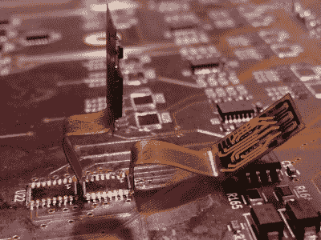

# 整齐的电路板返工使用柔性 PCB，无电线

> 原文：<https://hackaday.com/2019/12/17/tidy-board-rework-uses-flex-pcbs-no-wires/>

为了修复不幸的设计问题而进行的 PCB 返工往往会涉及到某些事情:用细线(可能是蓝色的)连接到用胶带或胶水粘着的元件上，可能还会有一些区域的阻焊膜被刮掉。通常不涉及柔性印刷电路板，但是【保罗·布赖森】[向我们展示了柔性印刷电路板如何被用来完成棘手的返工任务](http://www.brysonics.com/we-dont-need-no-stinking-bodges/)。

 这一切都始于【保罗】用一批重复出错的昂贵印刷电路板；电路板上几处出现的设计错误。用一堆飞来飞去的电线连接一些粘在一起的组件并不是他的整洁理念。一个更有吸引力的解决方案是制作一个小 PCB，可以焊接在电路板上的几个 IC 上，但这种想法有几个问题:可用于填充修复的空间并不总是相同的，要替换的 IC 的尺寸太小，无法容纳具有城堡形安装孔作为焊盘的 PCB。

就在那时，他得到了好主意仙女的拜访，回想起 fab houses 最近以合理的价格提供了“柔性”PCB。通过将替换器件安装在柔性 PCB 上，板级连接可以位于延伸部分的另一端。将一端直接焊接到电路板上，整个柔性部件可以根据具体情况弯曲，并以任何合理的方式固定。将柔性板的焊盘焊接到 PCB 上的焊盘有点棘手，但只要稍加练习就很容易可靠地完成。额外的好处是，柔性 PCB 是透明的，所以焊桥很容易被发现。他甚至为 QFP 包裹设计了一个解决方案，允许轻松访问 pin 码。

爱好者和个人可以获得柔性印刷电路板，这带来了新的想法和对旧想法的新突破，这就是为什么[我们在今年早些时候举办了柔性印刷电路板设计竞赛](https://hackaday.com/2019/06/19/these-projects-bent-over-backward-to-win-the-flexible-pcb-contest/)。修理肯定表现为应用，但没有达到[Paul]所展示的程度。干得好！