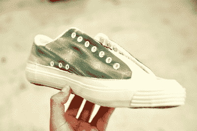

# 使用激光在织物上打印蓝图

> 原文：<https://hackaday.com/2019/12/18/use-blueprint-process-to-print-on-fabric-with-lasers/>

施伟杰制造了一台用于织物的激光蓝字打印机。你懂的，为了艺术！

 你如何在鞋子或沙发上安装喷墨头？大多数印刷过程要求平面印刷。但是回想当初蓝图是[蓝图](https://en.m.wikipedia.org/wiki/Blueprint)的时候，一种铁盐和酸的混合物被混合并应用到一个表面上，当表面暴露在紫外线下时会发生有趣的反应。这些化学物质首先会反应形成普鲁士蓝。在反应发生后，简单地洗掉剩余的化学物质就会留下稳定的印迹。

施伟杰使用两个电流计和一个激光来固化织物。他使用了稍微更新的[工艺](https://www.mikeware.co.uk/mikeware/New_Cyanotype_Process.html)，减少了所需的曝光时间。这使得他可以打印非常大的图片，而且可以在不平坦的表面上打印。正如你在[视频](https://www.youtube.com/watch?v=nkPPH406MA4)中看到的，休息后可以观看，效果非常漂亮。有一种新的方法可以让你拥有这个街区最酷的笔式绘图仪。

 [https://www.youtube.com/embed/nkPPH406MA4?version=3&rel=1&showsearch=0&showinfo=1&iv_load_policy=1&fs=1&hl=en-US&autohide=2&wmode=transparent](https://www.youtube.com/embed/nkPPH406MA4?version=3&rel=1&showsearch=0&showinfo=1&iv_load_policy=1&fs=1&hl=en-US&autohide=2&wmode=transparent)

