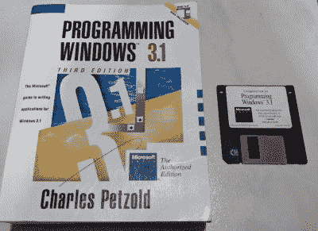

# Slack，现在在 Windows 3.1 上

> 原文：<https://hackaday.com/2019/12/23/slack-now-on-windows-3-1/>

Slack 要么是一个在线协作工具，要么是一种宗教，这取决于你和谁交谈。自然，它可以在各种现代平台上使用，从 Windows 和 MacOS 到智能手机。然而，有些人更喜欢走得更远。在最近的一次公司黑客马拉松上，[【Yeo Kheng Meng】决定为 Windows 3.1 开发一个 Slack 客户端。](http://yeokhengmeng.com/2019/12/building-a-new-win-3-1-app-in-2019-part-1-slack-client/)

This is how you learned to program before the Internet.

为较旧的操作系统(在本例中为 Windows For Workgroups 3.11)编程需要建立一个可行的开发环境。在这种情况下，Visual C++ 1.52 被迫投入使用，成为最后一个能够针对 Windows 3.11 的版本。开发环境运行在 Mac 笔记本电脑上运行的 Windows 2000 虚拟机上。这是因为它能够运行 16 位应用程序，而且它的 Samba 兼容 Windows 3.11 和 Windows 10 以及现代 MAC 电脑。

在前进的道路上，有几个挑战需要面对。老学校的 Windows 根本不能处理 HTTPS，需要一个代理来处理与 Slack 服务器的数据包交换。此外，由于 16 位架构的限制，内存管理也是一个难题。谢天谢地，那个时代的一本老编程手册在这方面帮了大忙。

在黑客马拉松结束时，一个可用的 Slack 客户端启动并运行，并带有早期 Windows 时代的花哨颜色。还缺少一些关键特性，比如解析用户 id 的能力，但是总体来说，这个概念是可行的。[我们之前也看到过【Yeo】用这个老式操作系统做的工作](https://hackaday.com/2018/05/15/windows-for-workgroups-3-11-in-2018/)。休息后的视频。

 [https://www.youtube.com/embed/vuofFUCo2Qc?version=3&rel=1&showsearch=0&showinfo=1&iv_load_policy=1&fs=1&hl=en-US&autohide=2&wmode=transparent](https://www.youtube.com/embed/vuofFUCo2Qc?version=3&rel=1&showsearch=0&showinfo=1&iv_load_policy=1&fs=1&hl=en-US&autohide=2&wmode=transparent)

