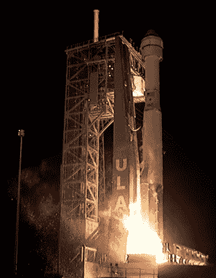
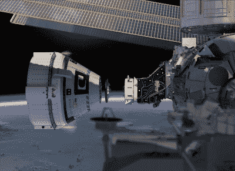

# 波音的 Starliner 未能到达空间站

> 原文：<https://hackaday.com/2019/12/20/boeings-starliner-fails-to-reach-space-station/>

经过十年的发展，波音公司的 CST-100“Starliner”今天凌晨在卡纳维拉尔角空军基地的 SLC-41 发射台起飞，开始了它的首次飞行。官方称为波音轨道飞行测试(Boe-OFT)，这项未经审查的任务旨在验证航天器在轨道上导航和安全返回地球的能力。这也是自主交会对接程序的一次预演，最终将用于向国际空间站运送宇航员；自 2011 年航天飞机退役以来，美国宇航局一直缺乏这种能力。

Liftoff at 6:36 AM Eastern

不幸的是，[其中一些目标现在无法实现](https://starlinerupdates.com/boeing-statement-on-the-starliner-orbital-flight-test/)。由于飞行仅 30 分钟就发生了故障，CST-100 现在无法到达国际空间站。虽然飞船仍保持完全功能并在稳定的轨道上运行，但波音公司和美国宇航局已经同意，在这种情况下，计划的八天任务应该缩短。虽然仍有一些希望 CST-100 将有机会在现已缩短的飞行中展示其轨道机动性，但主要焦点已转移到脱轨和着陆程序上，该程序已暂时提前到 12 月 22 日上午。

虽然来自所有相关方的官方声明仍然是可预见的积极，但这种情况对波音公司和美国宇航局都是一个毁灭性的打击。就在宣布陷入困境的 737 MAX 客机将暂停生产的几天后，波音现在最不需要的就是又一次高调的失败。对于美国国家航空航天局来说，这是又一个令人质疑私营企业是否真的有能力将人类送上太空的挫折。这不是 CST-100 第一次在测试中出现故障，早在 8 月份，[SpaceX 公司的一架载人龙在评估其先进的发射逃逸系统时被撞毁](https://hackaday.com/2019/08/05/spacex-clips-dragons-wings-after-investigation/)。

在 Starliner 降落在白沙导弹靶场和波音工程师登机之前，我们可能不会有所有的答案，但地面控制人员已经开始拼凑出在飞行的第一个关键时刻发生了什么。现在最大的问题是，美国宇航局会要求波音公司在认证 CST-100 载人之前进行第二次轨道飞行测试吗？

让我们来看看今天早上的发布会上发生了什么。

## 时间(和燃料)的问题

重要的是要明白今天早上 CST-100 上没有灾难性的故障。在被称为完美发射的过程中，宇宙飞船和将它送入太空的联合发射联盟阿特拉斯五号运行正常。但在与助推火箭分离并继续独立飞行时，CST-100 未能达到与国际空间站会合的必要高度。虽然飞船仍然功能齐全，但它只是没有足够的推进剂来纠正这种情况。

波音公司目前认为故障在于航天器的任务事件计时器(MET)，这是一种内部时钟，一旦航天器离开发射台就开始运行，用于在任务期间协调自动化系统。由于目前尚不清楚的原因，MET 要么失败，要么没有正确同步，这导致发动机不能按计划点火。更糟糕的是，CST-100 的反应控制系统(RCS)试图进行当时不必要的机动，耗尽了飞行器的推进剂储备。

Starliner shown docking with ISS in a promotional render.

很简单，Starliner 对它与 Atlas V 助推器分离后应该执行什么任务感到困惑。正常情况下，地面控制应该能够发现错误并进行干预，但幸运的是，该事件发生在预期的通信中断期间。

一旦地面控制中心重新建立了与飞船的通讯，并让它回到轨道上，很明显与空间站的计划会合是不可能的了。美国宇航局和波音公司都很快指出，如果这次任务中有人类机组人员，他们可能会切换到手动控制，并自行解决问题。

正因为如此，就 CST-100 的人类飞行认证而言，这种情况将如何发展还存在一些争议。虽然自主系统的问题显然需要解决，但宇航员们受过训练，可以精确地处理这类计算机故障。不管是好是坏，很长一段时间以来，当车辆系统出了问题时，工作人员不得不接管。

在发射后的采访中，美国宇航局局长吉姆·布里登斯汀淡化了这个问题，暗示这次失败并不一定意味着 CST-100 没有准备好开始载人:

> 归根结底是自动化。我们试图做的是确保我们可以端到端地完全自动化地完成整个任务，但这并没有奏效。但重要的是，飞船在轨道上，飞船是安全的。如果我们有宇航员在船上，他们会是安全的。事实上，如果我们有宇航员在船上，他们可能已经手动接管，现在将飞往国际空间站。

## 关键的后续步骤

虽然 Starliner 无法演示关键的会合和对接操作，但测试远非完全失败。作为全新宇宙飞船的首次飞行，飞船能够自行到达轨道并进行机动本身就是一个巨大的成功。事实上，当 SpaceX 在 2010 年进行龙飞船的首次飞行时，该飞行器在返回地球之前只在太空飞行了三个多小时。直到两年后的第二次飞行，“龙”号才试图到达国际空间站。有人可能会说，CST-100 将在轨道上停留几天的事实意味着，就首次任务而言，波音公司仍优于竞争对手 SpaceX 公司。

但这是假设 CST-100 在周日安全着陆。如果飞行器未能完成脱轨燃烧，在重返地球大气层时解体，或者无法安全着陆，美国宇航局将别无选择，只能重新评估航天器的飞行准备状态，并进一步推迟商业乘员计划。目前的情况是，如果下一次 Starliner 任务携带人类机组人员，它将会以未经测试的能力与空间站实际会合和对接；自从哥伦比亚号航天飞机失事以来，该机构一直遵循的安全第一的原则发生了逆转。