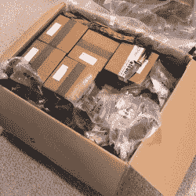

# 建立产品线的故事(和建议)

> 原文：<https://hackaday.com/2020/01/02/tales-and-advice-from-setting-up-a-product-line/>

制造一些必须让别人掌握的东西需要解决许多不同的问题，其中许多与实际制造这些该死的东西毫无关系。[Conor Patrick]在 Kickstarter 上为一个开源 USB 安全密钥成功开展活动时遇到了他们，该密钥不仅被发送给了支持者，还作为一种正在进行的产品出售。有许多原本可以避免的手动和繁琐的工作，因此[Conor] [列出了他希望在第一次建立生产线](https://conorpp.com/blog/things-you-should-definitely-do-when-setting-up-a-product-line)时已经完成的所有事情。

Turning these unprogrammed boards into finished products then shipping them is a big job.

如果整个过程是一条河，那么一个问题越“上游”，它对随后发生的一切的潜在影响就越大。一个例子是产品本身:最简单和最容易管理的产品线是只有一种产品，没有变化。这不仅最大限度地减少了错误，而且使供应、生产和运输更加直接。争取最少数量的产品和变化也是【Conor】*没有*做的事情的一个例子。在他们的众筹活动中，他们提供了 [SoloKeys](https://solokeys.com/) USB 设备——一种 [FIDO2 认证令牌](https://hackaday.com/2019/09/23/fido2-the-dream-of-password-free-authentication-on-the-www/)的实现——作为 USB-A 或 USB-C。还有两种类型的密钥:支持 NFC(用于接入智能手机)和仅支持 USB。到目前为止已经有四种产品了。

为那些想要篡改的人提供解锁状态的钥匙，使其成为八种不同的产品。最重要的是，他们提供了颜色选择，这不仅增加了生产的复杂性，也使跟踪每个人订购的东西变得更加困难。[Conor]还观察到，Kickstarter 平台和后端的设置真的不像一个商店，试图在其中提供(和管理)不同的产品和变体充其量是笨拙的。

另一个要点是履行，在[Conor]看来，除非数量很少，否则订单履行公司是值得合作的。他说，现在有很多这样的公司，找到合适的公司可能非常耗时，但与处理、包装、邮寄和运输数百(或数千)家公司所需的时间和精力相比，这根本不算什么。)亲自下达的命令。他的团队自己完成了总共 2000 多个单元，发现这是一个漫长而乏味的过程，充满了隐藏的成本和挑战。

[康纳]的文章中有很好的建议和背景，这不是他的第一次表演。他还分享了他对电子产品从设计到生产的想法，更普遍的建议仍然是:诚实和开放。承诺不足和交付过多，尤其是在时间估计方面。