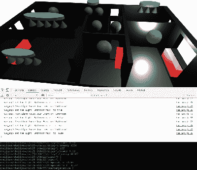

# 智能家居获得了额外的维度

> 原文：<https://hackaday.com/2019/12/29/the-smart-home-gains-an-extra-dimension/>

随着越来越多的智能家居产品上市，它们都有自己的集线器、协议和 API，我们看到了许多旨在为不同设备和服务提供“单一通用接口”的 DIY 项目(以及商业产品)。通常，这些项目允许你使用一系列设备，或者有时是 2D 平面图来控制你的家。[Wassim]的项目旨在通过在浏览器中创建一个[交互式智能家居控制器，迈出提供 3D 界面的第一步。](https://hackaday.io/project/169046-smart-home-3d-webapp)

注意:这不仅仅是静态的 3D 场景的渲染图像；这是一个交互式的 3D 模型，可以环绕和检查，显示灯、加热器和窗户的信息。这个项目有很好的文档，代码可以在 [GitHub](https://github.com/HomeSmartMesh/smart_home_3d_webapp) 上找到。这项技术的工作原理是利用 Blender 制作的 3D 模型和动画，使用。glTF 格式，然后使用 three.js 在浏览器中显示它们。这样就可以与 Hue 灯泡、电表或任何其他所需的设备进行对话。这个项目的技术说明可能对其他想要使用 Blender to three.js/browser 工作流的人很有用，并且包括了这个项目的一些孤立的小的关键概念的有趣演示。

我们注意到在 Blender 中创建的所有网格都是非常低多边形的；有可能很容易地添加细分曲面修改器吗？或者是因为性能原因而故意保持较低的顶点数？

这并不是我们第一个独特的家庭自动化界面，我们之前已经写过关于 [shAIdes 的文章，这是一副人工智能眼镜，让你只需看着它们就可以控制你的设备。](https://hackaday.com/2019/08/15/home-automation-at-a-glance-using-ai-glasses/)如果您想安装自己的家庭自动化系统，我们有充足的资源。Hack My House 系列包含了关于[在这种情况下使用 Raspberry Pis 的有价值的信息](https://hackaday.com/2018/09/26/hack-my-house-raspberry-pi-as-infrastructure/)，我们已经获得了关于[选择正确的传感器](https://hackaday.com/2019/04/16/picking-the-right-sensors-for-home-automation/)的信息，甚至还有[招募旧路由器的信息](https://hackaday.com/2016/10/26/converting-a-tp-link-router-to-mission-control-for-cheap-433mhz-home-automation/)。