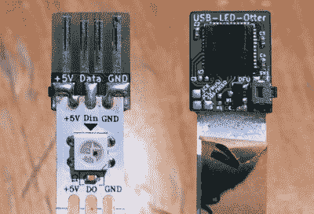

# USB 中的可寻址 LED 灯串

> 原文：<https://hackaday.com/2019/12/24/addressable-led-strings-in-your-usb/>

WS2812Bs，或 NeoPixels，或其他任何你称之为他们的东西，近年来给 maker 项目带来了全彩色 led，每次一米。连接到一个微控制器，他们使创造充满活力的，全彩色 glowables 不在话下。虽然它们不会自己工作，但在某个时候，你会想放弃开发板，让 blinking 自己站起来。[进入 USB LED 水獭](https://github.com/Jana-Marie/USB-LED-Otter)。

 这个小小的方形印刷电路板可以让你将 LED 灯直接插入 USB 端口。PCB 本身的背面有四条迹线，可与任何 USB 端口匹配，还有三个焊盘，用于焊接条带的接地、5 V 线和数据。STM32F072 微控制器充当操作的大脑，具有充足的马力和与 USB 2.0 的完全兼容性。

使用设备固件升级(DFU)将代码通过 USB 闪存到芯片上，一旦写入，就可以通过将该串插入一个合适的强大 USB 壁式充电器来驱动该条。构建背后的女人[Jana Marie]提到过[开放像素控制可以实现](https://twitter.com/_Jana_Marie/status/1205552789948108800)，但这可能是留给读者的练习。

这是一个很有用的小工具，而且只要再多开发一点，就有希望做得更多。对于有回流焊炉和空闲周末的人来说，组装几块电路板应该是一件容易的事情。哦，如果你厌倦了 WS2812？还有其他可寻址的发光二极管！