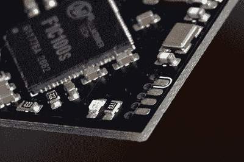

# 现在连你的名片都可以运行 Linux 了

> 原文：<https://hackaday.com/2019/12/24/now-even-your-business-card-can-run-linux/>

要得到一张实用的 PCB 名片需要做大量的工作，这种名片要薄、便宜、足够结实。如果你甚至可以让几个发光二极管闪烁，并且仍然面无表情地把它们分发出去，你已经为自己做得很好了。所以你可以想象当[乔治·希利亚德]写信告诉我们他的 [$3 名片电脑启动到一个正常运行的 Linux 环境](https://www.thirtythreeforty.net/posts/2019/12/my-business-card-runs-linux/)时我们有多惊讶。如果这离四月更近一点，我们可能会认为这只是一个玩笑…

当然，作为一名嵌入式系统工程师，[George]确实以此为生。这并不是说这很容易，但至少他密切关注该行业，以合理的价格找到合适的 ARM 解决方案，即 Allwinner F1C100s。这种小巧的芯片在单个封装中提供 RAM 和 CPU，这大大简化了卡的整体设计和结构。

 根文件系统只有 2.4 MB，至少可以说卡上的环境是最小的。没有网络，有限的 I/O，忘记运行任何沉重的软件。但它确实在大约 6 秒内启动，而且[George]设法装入了一个 MicroPython 解释器和一个经典的 Unix 地牢爬虫`rogue`。

哦，对了，还有他的简历和一些他在船上的照片样本。毕竟，这是一张名片。用户只需将其插入计算机的 USB 端口，然后等待虚拟串行端口弹出，让他们登录卡上运行的系统。对于不太擅长命令行的收件人来说，它还可以作为一个 USB 大容量存储设备。

除了这个项目的高级文档之外，[【George】还准备了一篇更深入的文章](https://www.thirtythreeforty.net/posts/2019/12/designing-my-linux-business-card/)，为那些希望追随他脚步的人提供更多的技术细节。多亏了他提供的所有源代码，下一个人可以更容易地拥有自己的一次性掌上电脑。

这些年来，我们已经看到了各种各样的[电子名片](https://hackaday.com/2016/03/13/ekg-business-card-warms-our-hearts/)，但从来没有像这样的。当然，这才是重点。如果你曾经收到一张名片，上面有一台运行成熟操作系统的电脑，你不太可能很快忘记它。