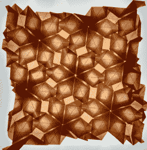
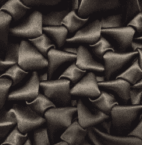
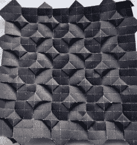

# 织物和纸张的镶嵌和模块化折纸

> 原文：<https://hackaday.com/2020/01/20/tessellations-and-modular-origami-from-fabric-and-paper/>

你可能对折纸很熟悉，这是一种日本的折纸艺术，但你很可能没有遇到过吸烟。这种技术指的是通过缝合将织物捆绑在一起的方式，通常以网格状图案制作，以创造更有组织的设计。通常，用柔软的织物做罩衫，你可能已经注意到它是在丝绸衬衫和棉衬衫上做的。有很多 18 世纪和 19 世纪的绘画作品描绘了吸烟的时尚。

折纸爱好者[麦当娜·约德]记录了她在折纸镶嵌和缝合方面的探索，包括从一张纸折叠成的[几何形状](https://www.instagram.com/p/BtHNbr-jOE_/?utm_source=ig_web_copy_link)和[织物缝合编织图案](https://www.instagram.com/p/B4jMbxqpRLc/?utm_source=ig_web_copy_link)。除了平面图案，她还制作了[链式褶饰围巾](https://www.instagram.com/p/B5Y27y2JqN6/?utm_source=ig_web_copy_link)缝合成圆形图案，以及几个将[折纸镶嵌图案转化为布料褶饰的例子](https://www.instagram.com/p/B4EN-UoJOOE/?utm_source=ig_web_copy_link)。类似于折纸中的折叠，使用的缝线并不复杂。更确切地说，一旦缝线和面料适当地聚集在一起，折痕图案就限定了最终的形状。

这两种艺术形式有什么相似之处？从表面上看，它们似乎涉及完全不同的学科——一个是用纸折叠的设计，而另一个则是处理缝合面料。然而，当谈到模块化折纸和创建镶嵌，有很多重叠。

这两种艺术形式都依靠精确来创造产生图案的精确角度，但如果精确度出了问题，这在蓬松的 smocking piecess 上更加明显。

如果你对创造自己的吸烟模式感兴趣，有很多教程可以遵循，比如这个[蜂巢吸烟教程。](http://tumblingblocks.net/blog/2008/9/22/Honeycomb-Smocking-Tutorial/)