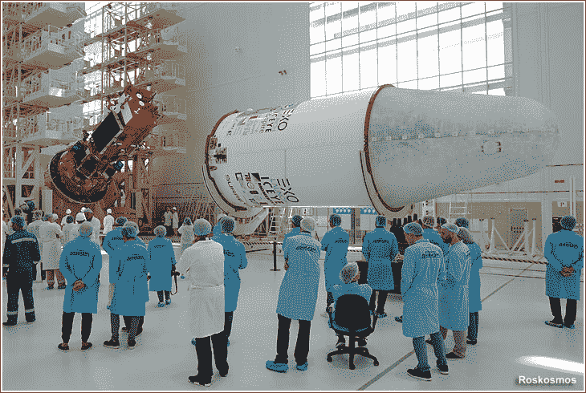
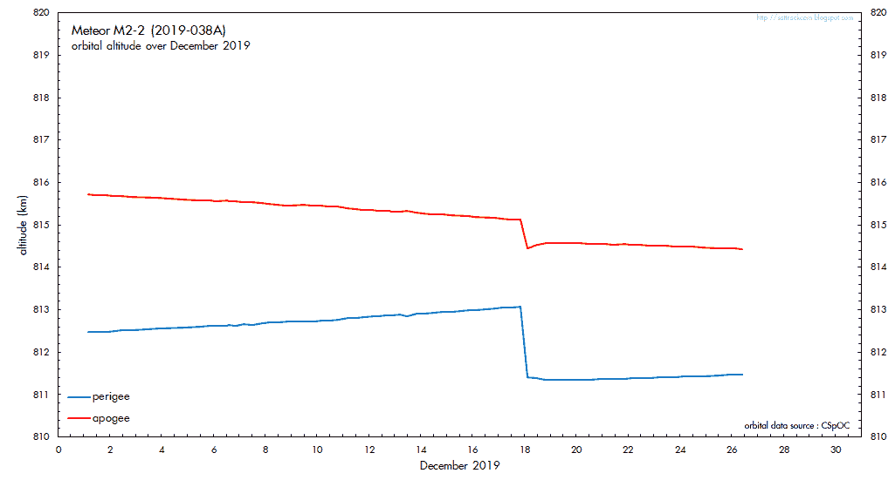

# 俄罗斯最新的气象卫星可能被太空垃圾摧毁

> 原文：<https://hackaday.com/2019/12/27/russias-newest-weather-satellite-may-have-be-killed-by-space-junk/>

对于人类和卫星来说，在太空谋生是很困难的。首先，在短暂但充满活力且容易失败的旅程中幸存下来是个问题，之后，当你以 20 倍于音速的速度在地球上飞驰时，你会交替受到烘烤和冷冻。后一个事实由于一大群太空垃圾而变得更加危险，这些垃圾既有自然的，也有人造的，它们伴随着你呼啸而过，等待着引发事故。

一次这样的事故显然导致了俄罗斯气象卫星的提前报废。就在发射几个月后，Meteor-M 2-2 遭遇了突然的轨道异常([链接](https://www.roscosmos.ru/27891/)到俄罗斯的故事；[英文翻译](https://translate.google.com/translate?sl=ru&tl=en&u=https%3A%2F%2Fwww.roscosmos.ru%2F27891%2F)。对数据的分析清楚地表明发生了什么:卫星被什么东西击中了，尽管一些地面控制人员的英雄行为似乎稳定了航天器，但流星-M 2-2 最终还是会屈服于它的创伤。

## 气象观测员

称流星-M 系列卫星不吉利是一种轻描淡写的说法。最初设想为四颗卫星的星座，这些鸟将配备最新的成像和传感仪器，并被发射到太阳同步极地轨道。它们将为俄罗斯科学家提供每隔几天对这个幅员辽阔的国家的完整覆盖，重点是监测北极地区的状况。

最初的计划要求在 1998 年至 2000 年期间发射一系列名为 Meteor-3M 的卫星，但由于未知的原因，这些卫星从未建造。该计划演变为流星-M 系列，旨在 2010 年服役。第一颗卫星“流星-M1”于 2009 年发射，但在被列为全面服务之前，它处于“实验运行”模式多年。仅仅经过两年的正常运行，仪器开始出现故障，包括一个用于监测海冰的 X 波段雷达和一个关键的红外成像仪。2014 年，卫星的姿态控制系统也出现了故障，导致整个航天器无法使用。

Meteor-M 2-2 being integrated into its fairing in June 2019\. Source: Roscosmos via [RussianSpaceWeb.com](http://www.russianspaceweb.com/meteor-m2-2.html)

为了解决仪器的一些缺陷，设计了一个改进的卫星系列----流星-M2 系列。其中的第一颗，Meteor-M 2-1，于 2017 年 11 月到达东方宇宙基地的发射台，但[没有继续前进](http://www.russianspaceweb.com/meteor-m2-1.html)。导航系统编程中的一个错误导致上面级在指向错误方向时启动引擎，将卫星有效载荷坠入北大西洋。

Meteor-M 2-2 在 2019 年 7 月的发射中表现得更好。这个 2，900 公斤的航天器，连同其他 33 个小型卫星有效载荷，乘坐联盟-2-1b 成功进入轨道。导致其前身失败的编程错误已经得到纠正，Meteor-M 2-2 进入了指定轨道并开始返回数据。看起来这颗卫星正在走向一个漫长而有用的气象观测职业。

## 楼上有麻烦

然而，Meteor-M 2-2 的教科书操作不会持续很长时间，正如经常发生的情况，一名业余无线电操作员是第一个注意到的人。卫星监测爱好者 Dmitry Pashkov (R4UAB)多年来一直在从气象卫星上捕捉图像。但当他在 2019 年 12 月 18 日试图寻找 Meteor-M 2-2 时，得到的只是死寂的空气。卫星似乎已经消失了，一旦他宣布了他的发现，不久其他卫星观察者就拼凑出一个故事，这个故事最终被俄罗斯航天局 Roscosmos 证实。

根据这些数据，似乎 Meteor-M 2-2 是被微流星体撞击的——要么是一块天然的太空岩石，要么是一些人造碎片。这颗 SUV 大小的卫星因撞击而失去控制，剧烈旋转。它立即将自己置于安全模式，以保护其仪器，并给地面控制人员时间来重新控制，他们最终做到了。随后对轨道数据的分析显示，卫星在撞击后立即失去了两千米的轨道高度。

Meteor-M 2-2 quickly lost altitude after the event. Source: [Dr. Marco Langbroek](https://twitter.com/Marco_Langbroek/status/1210224266593128461)

像 Meteor-M 2-2 这样大的卫星受到如此猛烈的破坏，意味着一次巨大的、非常剧烈的碰撞。但那很可能会把卫星打碎成多个碎片，没有证据表明发生过类似的事情。这意味着撞击器很小，这似乎与它对航天器的巨大影响不一致。这让操作人员考虑撞击是否穿透了卫星外壳的加压部分。这可以解释态度和高度的剧烈变化。

不幸的是，这也可能意味着流星-M 2-2 任务的结束。卫星上的许多仪器需要恒温才能工作，控制鸟的电子设备现在可能暴露在太空的真空中。Roscosmos 已经重新控制了航天器，并抑制了其旋转，甚至有报道称，已经检测到来自卫星的 X 波段信号。

由于船体减压，这艘飞船很可能注定要步其前辈的后尘。这是一长串失败或边缘气象卫星中的又一颗，每颗卫星的消逝都让卫星监测界感到悲哀。仍然有大量的卫星在那里提供实时天气和气候图像，但流星-M 2-2 的可能损失表明它在那里有多危险。