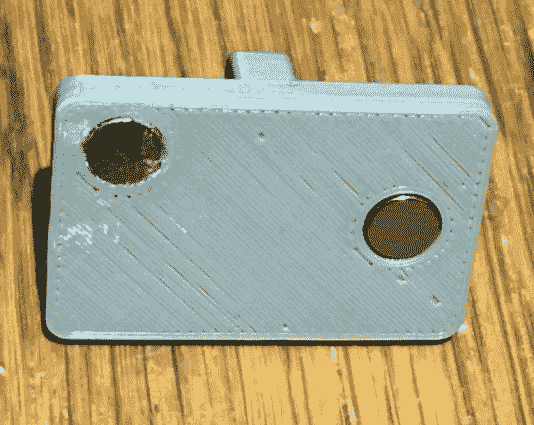

# 定制 3D 打印滑动开关

> 原文：<https://hackaday.com/2020/01/08/making-custom-3d-printed-slide-switches/>

在一年多一点的时间里，我们一直在报道令人难以置信的复制品[迈克·盖迪]从数字时代的黎明开始就一直在建造教育“计算机”。这些迷人的玩具，其中许多现在已经非常罕见，是使用 3D 打印和其他现代技术重新创造的，供新一代人欣赏和学习。

他学会了一两个制作这些复制品的技巧，比如用 3D 打印机制作定制滑动开关的方法[。这种想法不仅允许你控制定制数量的设备，而且正如休息后的视频所证明的那样，打印的滑块听起来绝对是非凡的。正是那种你想在前面板上看到的“沉闷金属声”。](https://www.instructables.com/id/Mostly-3D-Printed-Slider-Switch/)

当然，[Mike]并不指望有人能创造出这种*精确的*开关。他将它设计为他的[工作数字计算机(WDC-1)项目的一部分，他正在 Hackaday.io](https://hackaday.io/project/168833-wdc-1-a-working-digital-computer) 上记录该项目，因此它有一套相当具体的设计参数。但是有了他在文章中概述的步骤，你应该可以根据自己的具体需求调整这个概念。

    

那么它是如何工作的呢？开关的一半是一个轨道，印有用于簧片开关和 6×3 毫米圆盘磁铁的凹痕。另一个是一个小梭子，它本身有空间容纳两个相同的磁铁。当它滑过簧片开关时，它们被一侧的磁铁激活，而另一侧的磁铁会被嵌入轨道的磁铁吸引。这不仅使开关制动，你可以感觉和听到，而移动它，但防止梭子滑下预期的簧片开关。

如果你喜欢这个，你绝对会喜欢他的[主要是 3D 打印的二进制编码器](https://hackaday.com/2019/12/17/simple-computer-from-the-60s-now-3d-printed/)，我们最近展示了它。[有了他的记录](https://hackaday.com/2019/11/10/3d-print-your-very-own-mechanical-computer/)，我们很兴奋地关注 WDC-1 项目的发展，也很高兴【迈克】把它带到了 Hackaday.io

 [https://www.youtube.com/embed/Wm9FojAZTlE?version=3&rel=1&showsearch=0&showinfo=1&iv_load_policy=1&fs=1&hl=en-US&autohide=2&wmode=transparent](https://www.youtube.com/embed/Wm9FojAZTlE?version=3&rel=1&showsearch=0&showinfo=1&iv_load_policy=1&fs=1&hl=en-US&autohide=2&wmode=transparent)

