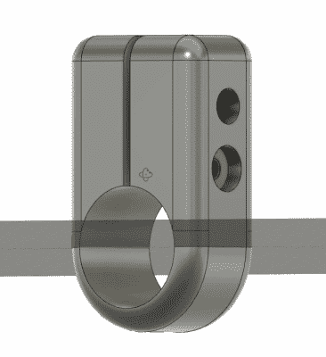

# 登山杖转向轻质八木天线

> 原文：<https://hackaday.com/2020/01/09/hiking-pole-turned-lightweight-yagi-antenna/>

在业余无线电爱好者中，有一部分用户爬上山区，从高处使用他们的设备。任何想要参加被称为空中峰会(SOTA)的人显然都希望他们的设备尽可能的轻和小。对斯图尔特·托马斯来说，这意味着一个可折叠的八木天线，他可以很容易地打包走。

 但是有一天，他想知道为什么他带着一个单独的天线杆，而他的[铝制登山杖是一个非常好的替代品](https://hackaday.io/project/169162-hiking-pole-yagi-antenna)。他所要做的就是找到一种方法，将元件安装到杆子上，这样就可以很容易地在现场组装。他最初试图使用那种用来压住导管的绝缘电夹，但他发现它们并不是他想要的。

[Stuart]最终设计并 3D 打印了他自己的元件支架，使用 M3 螺栓紧紧地夹在登山杖上，防止它们扭曲，同时仍然非常轻便，易于调节。为了进一步减小天线的包装尺寸，他用切管机将每个元件切成两半，并稍微张开两端，这样他就可以在现场用插件重新组装它们。

即使你不是那种拥有登山杖的人，更不用说爬山取乐了，轻质八木天线仍然有很多有趣的应用。我们已经看到[在](https://hackaday.com/2017/02/13/a-lightweight-two-metre-carbon-fibre-yagi-antenna/)之前用碳纤维建造的定制八木，当然[用 PVC 和卷尺拼凑的八木](https://hackaday.com/2014/01/13/tape-measure-vhf-yagi-antenna/)是一个经典的破解，但我们认为【斯图尔特】提出的解决方案在两个极端之间取得了良好的平衡。

 [https://www.youtube.com/embed/lRqxdEUKBO0?version=3&rel=1&showsearch=0&showinfo=1&iv_load_policy=1&fs=1&hl=en-US&autohide=2&wmode=transparent](https://www.youtube.com/embed/lRqxdEUKBO0?version=3&rel=1&showsearch=0&showinfo=1&iv_load_policy=1&fs=1&hl=en-US&autohide=2&wmode=transparent)

