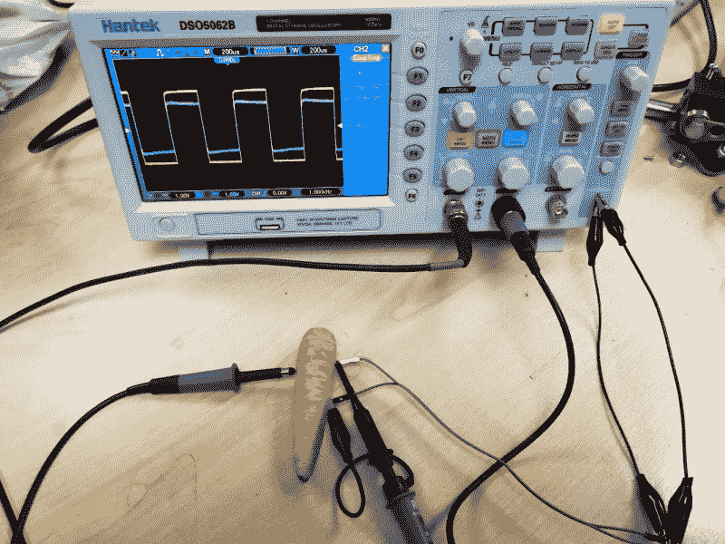
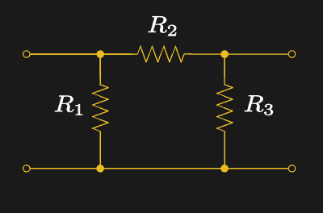
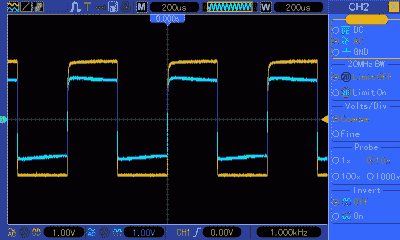

# 有机音频:将胡萝卜作为音频耦合器进行测试

> 原文：<https://hackaday.com/2020/01/06/organic-audio-putting-carrots-as-audio-couplers-to-the-test/>

[![[Boltz999]'s carrot interconnect.](img/dc102b0bb31a9c24622d5b42b7dade58.png)](https://hackaday.com/wp-content/uploads/2019/12/carrot-interconnect.jpg)

【boltz 999】的胡萝卜互联。如果说 Hackaday 有什么让我们开心的话，那就是一个关于音频愚蠢的故事。有大量针对音响发烧友的可疑产品，它们只是*乞求*被取笑，而我们偶尔会满足它们。但是有时一个奇怪的音频设备会有另外的用途。以[Boltz999]的互连为例，当没有母到母的唱机适配器来连接一组电缆时，它就应运而生了。[拿一个小胡萝卜，简单地将唱机插入它的果肉](https://www.reddit.com/r/techsupportmacgyver/comments/ecn5y8/didnt_have_the_necessary_female_to_female/)提供了一个有效的音频连接解决方案。

这是否意味着我们的镀金纳米粒子无氧定向音频电缆是垃圾，我们应该去超市买一袋块根蔬菜？我开始在秘密的 Hackaday 音频实验室测试这种新材料，该实验室位于英国米尔顿凯恩斯的一个匿名的 20 世纪 70 年代工业区。

## 表征块根蔬菜

The high point of an engineer’s life comes as they measure the electrical properties of a root vegetable.

快速搜索一下胡萝卜的成分就会发现，胡萝卜含有 88%的水分，另外 12%主要是碳水化合物，其次是少量的脂肪、蛋白质和一种维生素和矿物质的混合物，这是我们的父母如此热衷于让我们年轻时吃胡萝卜的原因。特别地，溶液中约 0.4%的胡萝卜由钾、钠和钙离子组成，使得蔬菜类似于浸泡在弱电解质溶液中的海绵。因此，你会期望它是导电的，将线路电平音频信号传递到高阻抗负载，如音频放大器。对我们的测试胡萝卜进行的快速 DC 电阻测量显示，在长达约 10 毫米的距离内，电阻从约 50K 开始，在其约 80 毫米的长度内缓慢上升至近 100K。描述胡萝卜的复阻抗可能超出了本文的范围。

[Attenuator Π-section circuit by SpinningSpark](https://en.wikipedia.org/wiki/File:Attenuator,_Pi-section.svg) CC-BY-SA 3.0\. R2 represents the width of the carrot, R1 and R3 each represent the carrot distance between pin and outer of a phono plug.

然而，促成这一切的黑客并不是简单地用胡萝卜制成的铜线代替了那对铜线。通过将唱机插入抽头根部，在它的两个导体之间以及它和另一个唱机之间产生了一个额外的 50K 电阻，结果是一个电阻网络。因为这不是一个不合理的假设，在同一个机架上的两个高保真设备可以共享一个地球，而不是消失在无限网状电阻的兔子洞里，相反，它可能是安全的，可以认为它更接近于我们熟悉的 [Pi 网络衰减器](https://en.wikipedia.org/wiki/%CE%A0_pad)。有很多在线计算器可以给你一个给定网络的性能数字，但在这种情况下，有这么多的近似和胡萝卜相关的猜测，他们的结果将是毫无意义的。我们需要知道的是，任何输入胡萝卜的音频都会有一些衰减。

## 清脆的高音和脆脆的中音

The square wave performance of a carrot

讨论了理论之后，是时候进行实践了。代表高端音频源的是我播放 YouTube 视频的手机，代表高端高保真的是一套放大的电脑扬声器。令人惊讶的是，它起作用了，但不出所料的是，这样做有明显的衰减，音量减少了一半左右。正如预期的那样，但是有一个更进一步的步骤，用“范围”来查看它。

应用一个方便的 1kHz 方波，30%的衰减是显而易见的(也可能是秘密实验室的示波器探头需要调整)。我们缺少一个音频分析器来测量耦合的谐波失真，但是必须有一个点来描述一种蔬菜的结束。

所以，我们已经证明了原来的故事是真实的，你可以在音频互联中使用胡萝卜。但是我们该如何描述它的声音呢？如果你喜欢音响发烧友的评论，答案是它给更广阔的音场增添了一种有机的感觉，有清脆的高音，脆脆的中音，深沉朴实的低音。与此同时，如果你只是在寻找连接两根电缆的东西，我们建议胡萝卜放在烤盘里听起来更好。

标题图像:Sajetpa [ [CC BY-SA 3.0](https://commons.wikimedia.org/wiki/File:Carrots_without_stems.JPG)