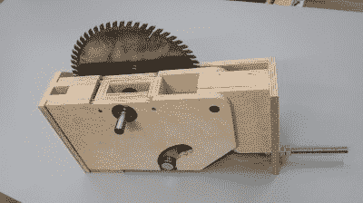

# 制作一个真正的木制台锯

> 原文：<https://hackaday.com/2020/01/11/building-a-real-wooden-table-saw/>

台锯是那些工具中的一种，严格来说并不是必须要有的，但是如果你身边有一个的话，它会非常有用。[I Build It]的人制作了一个[三个](https://ibuildit.ca/projects/making-a-wooden-table-saw/) [部分](https://ibuildit.ca/projects/making-a-wooden-table-saw-part-2/) [系列](https://ibuildit.ca/projects/making-a-wooden-table-saw-part-3/)，其特点是自制的台锯制作，所以你终于可以在你的 makerspace 中添加一个了。

该建筑使用真正的台锯乔木，由波罗的海桦木胶合板和实木制成，用一些塑料片制作耳轴和顶部。叶片安装在由木板制成的叶片升降机中，该升降机带有一个枢轴点和用于提升机构的槽。轴承允许刀片自由移动，而弯曲的切口允许它在刀片提升机构移动时平靠在槽壁上。

与此同时，以前的台锯的重复使用的电机被除尘、清洁，并重新布线以反向运行。虽然大多数台锯只需要两个耳轴，第三个用于支撑电机，因为它必须随着提升和倾斜而移动。一旦提升/倾斜机构完成，台锯的框架就更简单了，有许多步骤涉及夹紧、测量、切割、装配和油漆组件。在最后几个步骤中，开关安装在台锯外部的一个小盒子中，该盒子连接到电源和电机，以及用于处理从锯收集的灰尘的车间真空吸尘器。虽然外壳不是金属盒，但只要连接牢固，电线就不会松脱。

如果你想看看其他自制台锯的例子，看看这个[极小的台锯](https://hackaday.com/2019/10/10/minature-table-saw-gets-the-teeny-jobs-done/)和这个[适合孩子的台锯](https://hackaday.com/2018/09/14/behold-a-diy-kid-friendly-table-saw/)。

 [https://www.youtube.com/embed/3UcutZWL40M?version=3&rel=1&showsearch=0&showinfo=1&iv_load_policy=1&fs=1&hl=en-US&autohide=2&wmode=transparent](https://www.youtube.com/embed/3UcutZWL40M?version=3&rel=1&showsearch=0&showinfo=1&iv_load_policy=1&fs=1&hl=en-US&autohide=2&wmode=transparent)

