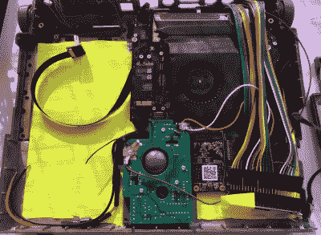

# 复古 PowerBook 获得 Mac Mini 移植

> 原文：<https://hackaday.com/2020/01/10/retro-powerbook-gets-a-mac-mini-transplant/>

在这些地区，看到经典的笔记本电脑或台式电脑因树莓派而复兴是相当常见的。虽然我们不会拒绝执行良好的 Pi 注入，但我们知道它们有时会引起争议。给人的印象是，这样的项目是低努力的，并且由于 Pi 本身的可用性怪癖，新旧技术的结合在可用性方面几乎没有收益。

但我们认为，即使是最挑剔的观众也会同意，[Tylinol]的这一构建完全是另外一回事，它看到了大约 1993 年 PowerBook 165c 的内部被 2014 年 Mac Mini 的内部所取代。首先，毫无疑问，将一个现代的(相对)台式电脑主板装入笔记本电脑的机身，比将相对较小的 Pi 热粘合到相同的空间需要更多的规划和努力。此外，作为一个额外的奖励，任何认为自己是 Mac 崇拜者的人都会很高兴看到这款老式机器保留其库比蒂诺血统。

 那么，如何在 PowerBook 里面装一台 Mac Mini 呢？*非常小心的*。正如[Tylinol]所解释的，PowerBook 外壳的内部涂有石墨，导电性足以成为一个问题。所以把原来的硬件拆下来之后，加了一层胶带绝缘；尽管我们认为如果你没有那种耐心，也可以使用适当厚度的喷涂层。

一旦外壳被掏空并绝缘后，[Tylinol]增加了新的支架来安装 Mac Mini 主板和硬盘驱动器。对于任何想知道的人来说，使用 2014 型号是因为电路板的形状几乎完全适合轨迹球 PCB。可以使用新款 Mac 电脑的主板，但这可能意味着要使用外置鼠标。

这对[Tylinol]来说是个问题，因为这个构建的主要目标之一是让原始输入工作起来。这意味着让苹果桌面总线(ADB)设备适应 USB，这被证明是一种黑暗的艺术。但在一些关于长期被遗忘的协议和一个 Teensy 3.5 的当代信息的帮助下，[这两款设备现在都被选为标准的 USB HID](https://github.com/Tylinol/ADBtoUSB/blob/master/PowerBookADBandKB.ino) 。

但是，当然，这只是皮毛。[Tylinol]还必须想出如何将原来的显示器换成现代面板，然后让整个系统依靠内部电池供电运行。即使你对复古的苹果硬件不是特别感兴趣，这确实是一个值得通读的非凡构建。

对于那些不介意在 PowerBook 中获得 Pi 的人来说，我们最近看到了*黑客*对尼康勋爵笔记本电脑的[重新制作，走的是这条路线](https://hackaday.com/2019/10/15/recreating-lord-nikons-laptop-from-hackers/)。