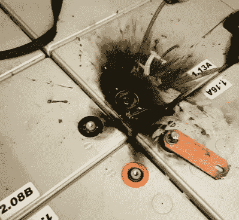

# 数据中心 UPS 向离网供电解决方案进军

> 原文：<https://hackaday.com/2020/01/04/datacenter-ups-heads-home-for-off-grid-power-solution/>

新闻网站似乎永远不会没有埃隆·马斯克和他的最新冒险的故事，无论是部分真空的快速运输管道，太空飞行，还是个人的非火焰喷射器。马斯克的特斯拉以电动汽车闻名，它也有一系列太阳能产品，并提供 Powerwall 家用电池供电系统。这些对任何有太阳能电池板的人来说都是诱人的，但一个的价格标签并不完全是一个梦想。

[Nathann]的预算不够买一个 Powerwall，但他确实有一个巨大的前数据中心不间断电源(UPS)和大量的铅酸电池。以此为基础，他在家里的地窖里建立了自己的离网电力。他声称，它没有 Powerwall 优雅，但在适度使用的情况下，它可以为房子供电长达十天。

在某种程度上，安装更像是一项布线工作，而不是一项高科技，但处理近 100 个铅酸电池的后勤工作相当繁重。UPS 采用四个电池组，每个电池组的电压为 288 V。电池由铜带连接，涉及的电压和电流不适合胆小的人。一次意外的短路蒸发了一个螺丝和一个电池端子；如果这是我们的房子，我们会把保险丝放在电池组中间。

电池存放在砖柱顶上的木托盘上，以防地窖被淹。地下室现在可以安装太阳能和风能的离网电源。也许你的电池供电解决方案不会那么令人毛骨悚然，但它不太可能更便宜。同时，这不是我们看到的第一个这样的项目，尽管其他人通常选择 18650 锂离子电池，铅酸的使用仍然是一个可行和经济的解决方案。