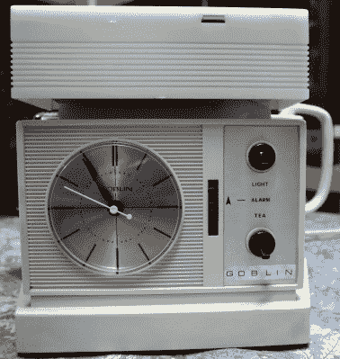
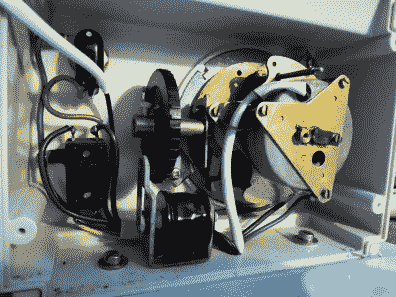
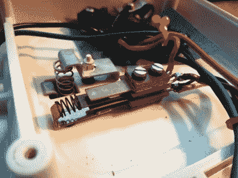
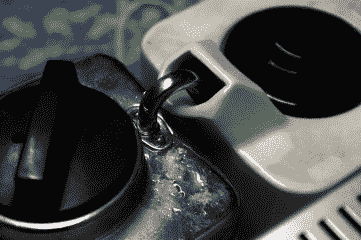
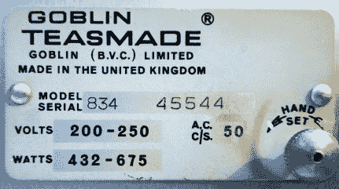
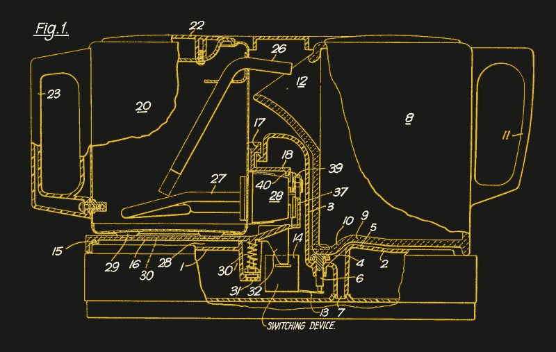
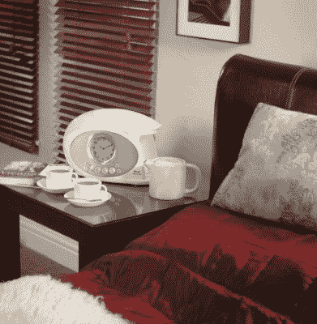

# 反技术:茶叶制作

> 原文：<https://hackaday.com/2020/01/30/retrotechtacular-teasmade/>

我们已经习惯了我们的家用电器在 2020 年完全自动化，但在不久前，它们还是简单得多的事情。虽然不是所有的东西都需要人来操作，但是在英国的卧室里可以发现一个意想不到的机电自动化。这是一个关于小妖精 Teasmade 的故事，一个多了一点点的闹钟。

## 但是它能泡茶吗？

The height of late-1960s sophistication.

所有国家都有自己的奇怪之处，每个来自这些国家的人都知道，当他们发现世界上没有其他地方听说过这些奇怪之处时，会感到惊讶。我不能代表英国以外的读者，但对我们来说，这些东西包括圣诞饼干和马麦酱。

还有一个除了英国人没人听说过的东西，那就是 Teasmade。闹钟和茶壶意想不到地结合在一起，可以在床边用一杯热茶叫醒它的主人，你的阿姨或祖母可能在 20 世纪 70 年代就有一个了。这是一个辉煌的 naff 件世纪中期的蜉蝣，不是 21 世纪 20 年代的典型房子的一部分，但另一方面，它是一个机电的好奇心，有第二个外观。在我们最喜欢的网上拍卖行，我花了几十英镑买了一个茶壶——一个 20 世纪 60 年代末的 834B 型——并开始在工作台上摆弄它。

我打开的是一叠精装书大小的单元，前面有一个棱角分明的 60 年代风格的时钟和灯组件。时钟后面是一个平台，上面放着一个奇怪的立方体状茶壶和一个电水壶。茶壶完全是常规的，但水壶和你日常用的不一样。壶嘴是一根伸入壶身的管子，一直伸到壶体的上方，它的盖子不是松配合，而是接合并转动，形成一个紧密的密封。该装置后部的最后一个特点是水壶位于一个弹簧平台上，下面有一个开关，只有当里面有水时，它才会稳定下来并关闭。

  Satisfyingly low-tech brains of the unit, an AC clock and buzzer.  The kettle full switch cuts power to the element when the tea is made.

## 那时候他们不需要微控制器

从电气方面来说，这是一个非常简单的设计。时钟是一种交流同步机械装置，是当时世界上数百万家庭中常见的典型装置。当它的警报被触发时，它通过水壶平台开关(确保它没有加热空水壶)闭合电路，并通过跨线连接到水壶元件。一旦水壶烧开，它就通过蒸汽压力迫使热水流出壶嘴。当水离开水壶时，平台上的开关打开。这关闭了元件，并依次完成了触发蜂鸣器并给灯供电的电路。前面的一对开关允许控制蜂鸣器和灯。

  There’s nothing to stop a careless user from forgetting to place the teapot spout under the kettle spout, and having boiling water gushing all over their bedside table.  This appliance was made in the days before mandatory safety certifications, the unit doesn’t even bear a British Standard Kitemark.

设置它是一个充满水壶的情况，将一对茶叶袋放入茶壶中，并将它们放在装置背面各自的位置。确保两个开关都在正确的位置，然后进入睡眠状态，直到闹钟响起，茶壶里有一杯新茶等着你醒来。

还有一个更有趣的设计特征在起作用。这是一个只有 600 瓦元件的小水壶，大约是标准英国水壶的四分之一。因此，它煮得非常慢，最重要的是安静，所以它可以让你睡得很香，直到茶准备好。唉，这种效果已经失去了，因为蜂鸣声是一种响亮而沙哑的嗡嗡声，很难让人在醒来时感到放松。

## 那么，所有的茶叶都到哪里去了？

The workings of one of the final iterations of the classic Teasmade, from UK patent [GB1597834A](https://patents.google.com/patent/GB1597834A/), 1978.

茶叶制造可能在二战后的几十年里达到了全盛时期，但类似机器的历史可以追溯到 19 世纪晚期。一项专利搜索发现了过多的自动泡茶机和咖啡机，但后来成为 Teasmade 的那台却起源于 20 世纪 30 年代。英国专利号 [414088A](https://patents.google.com/patent/GB414088A/) 于 1933 年提出申请，此后对设计进行了细化和改进。虽然它不再像半个世纪前那样受欢迎，但仍然有可能买到茶壶，尽管它的设计略有不同。

The Teasmade in its current form, [the Swan Teasmade](https://shop.swan-brand.co.uk/products/swan-teasmade-1).

在 21 世纪，由于微控制器的容易获得，我们被自动化设备所包围，因此很容易忘记，在过去的几十年里，像这样一个简单的机电设备似乎是未来奢侈品的最后一个词。有趣的是，所有微控制器的前身德州仪器 TMS1000 在 20 世纪 70 年代早期就将家用电器作为其核心目标市场之一。

那么，为什么我们放弃了 Teasmade 承诺的全自动唤醒，为什么我没有一个现代硅的*华莱士和格罗姆*风格的开始呢？我想答案就在我之前提到的那种古板的形象中，那是你中年或老年亲戚的床头装饰品的选择，而不是任何一个很酷的人。茶会被倒进哥布林作为配件出售的骨瓷茶杯组里，而不是倒进一个有缺口的杯子里，杯子上有一个滑稽的标语，谁会想要 T2 80 年代的那个 T3 呢？也许哥布林在他们的广告口号中说得最好:“ [*仅次于睡眠*](https://www.youtube.com/watch?v=rXG8t7iP01U) ”。

我做的茶将被传给一个复古爱好者朋友，我欠他一个人情，我希望它能补充她这个令人敬畏的中世纪住宅的其余部分。与此同时，我将继续每天早上跌跌撞撞地下楼，用现代方式泡茶；用手。