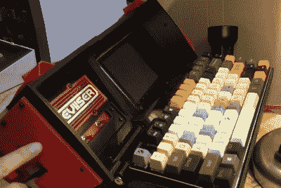

# 树莓派时代的便携式电脑

> 原文：<https://hackaday.com/2020/01/10/a-luggable-computer-for-the-raspberry-pi-era/>

今天，计算机基本上分为两类:台式机和笔记本电脑。但是回到 20 世纪 80 年代早期，当这种意识形态的界限还有点模糊的时候，消费者有第三种选择。这些机器在当时被称为“便携式电脑”,并且经常被现代收藏家亲切地称为 luggables，它们在技术上足够小，可以随身带上飞机或汽车。

小型化的进步最终使便携式电脑过时，但这并不意味着有些人仍然不想要一台。[[Dave Estes]一直致力于他自己的现代观点，他称之为 reviser](https://reviiser.com/reviiser-v1-cyberdeck-update.html)，到目前为止，它看起来符合所有的条件。由于增加了一个相当沉重的电池组，它甚至比激发它的老式野兽更实用。

 在广告之后的视频中，【戴夫】向我们展示了他的便携产品的一些亮点，如折叠式机械键盘、华丽笨重的机械电源开关和集成触摸屏。我们也非常喜欢侧面安装的触摸板，考虑到[Dave]在内部 Raspberry Pi 4 上运行的主要由键盘驱动的软件环境，它看起来非常有用。机器背面装有一个可拆卸的 30，000 mAh 电池组，他将有足够的电力进行他的复古冒险。

[Dave]提到，最终他希望添加对“盒式磁带”的支持，这将允许用户轻松地插入连接到 Pi 的 GPIO 引脚的新硬件。这将允许许多有趣的扩展可能性，并与 Reviiser 的复古美学完美契合。这也将有助于证明这台机器体积庞大的合理性；由于硬件黑客们想要一个拥有各种花哨功能的移动工作站，这甚至可能为便携式电脑带来某种复兴。

现在还没有很多关于如何建立你自己的 Reviiser 的细节，但是[Dave]说更多的信息将很快添加到他的网站上。与此同时，[你可以看看我们最近看到的一些类似的项目](https://hackaday.com/2019/12/01/building-a-faux-retro-portable-computer/)来为你自己的便携式 Pi 获得一些灵感。

 [https://www.youtube.com/embed/ANFFAjXacP8?version=3&rel=1&showsearch=0&showinfo=1&iv_load_policy=1&fs=1&hl=en-US&autohide=2&wmode=transparent](https://www.youtube.com/embed/ANFFAjXacP8?version=3&rel=1&showsearch=0&showinfo=1&iv_load_policy=1&fs=1&hl=en-US&autohide=2&wmode=transparent)

